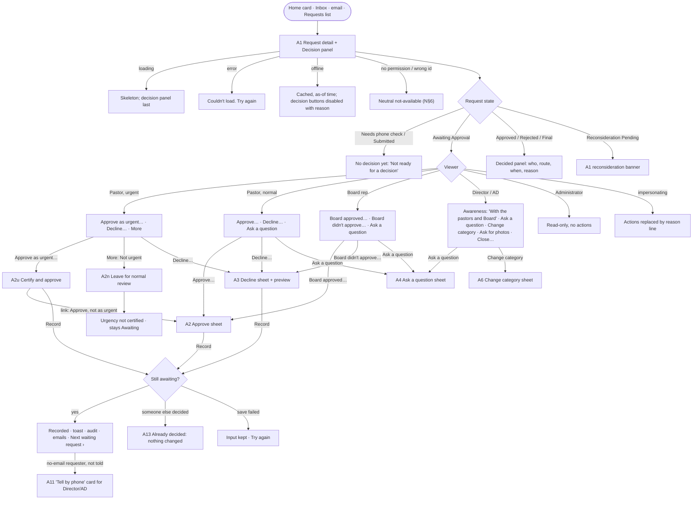

# Approvals: deciding on a request, urgent certification, questions to the requester, and reconsideration

Build-order step 3 (Approvals). Owner: ham-ux-designer. Draft 2026-09-28, written in parallel with the architect's step-3 plan; where the two differ, the owner's reconciliation box in the architecture doc wins, as in step 2.
Personas: [personas.md](personas.md). Navigation, global states, requester status wording and the access table: [navigation.md](navigation.md) (**N§n**). Step-2 conventions reused: [intake.md](intake.md) (**I§n**; screens L1–L11, R1–R12, emails E1–E7 and L-E1–L-E4). Components: `design-system/components.md` (**C§n**); patterns: `design-system/patterns.md` (**P§n**). Scope split: `docs/architecture/intake.md` §1 and its owner box ("Moved to step 3").

Implements PRD §3.1, §3.2, §3.3, §4.2, §4.3, §4.4, §4.5, §5, §7.2 ("responses to HAM questions"), §8 (§8.1 Board route, §8.2 pastoral route, §8.3 rejection, §8.4 reconsideration), §9 (reasons appear in the earlier-request panel), §10 (certification, urgent approval, alerts), §35 (approval, rejection, request for additional information), §52 (Approved, Rejected, Reconsideration Pending), §57/§58 (audit), §59 (impersonation), §60.1, §60.3, §63/§68 (privacy), §64 (requests awaiting approval), §66 (Approval, Reconsideration), §70.4, §77 step 4.

> **Section references in the brief.** The brief cites "§11 rejection/reconsideration" and "§60 requester portal". In the PRD, rejection and reconsideration are **§8.3–§8.4** (§11 is the site assessment), and the secure request page is **§7.2**, with link-based access in **§60.3**. This spec cites the PRD's real numbers.

Conventions carried over from step 2:
- Rule values are written `{rules.X}` and live in the rules module. They are never literals in copy.
- The sample "today" is **Tuesday, Oct 6, 2026**, America/New_York. All names, addresses and numbers are fictional.
- Leadership lists, cards and email subjects show **HAM # + category only** (Q-132). Names, streets and circumstances never appear there.
- Product questions this spec raises are **gap candidates G3-1 … G3-20** (§12.3). They have no Q numbers yet; the coordinator should log them. Each has options and a recommendation. Screens that depend on one are marked *(G3-n)*.
- Decisions that belong to the architect are marked **[ARCH]** and listed in §11.

Contents
1. Jobs, personas, devices
2. Key decisions (read this first)
3. User journeys
4. Screen flows
5. Leadership screens (A1–A13)
6. Requester screens (R13–R19)
7. Emails and notifications (E8–E15, L-E5–L-E12)
8. Microcopy reference
9. Accessibility
10. Privacy in the UI
11. Data and architecture dependencies
12. Success measures, PRD trace, gap candidates, hand-offs

---

## 1. Jobs, personas, devices

| Persona | Goal this step | Job to be done | Device and context |
|---|---|---|---|
| **Pastor Ruth Alvarez** (§4.3, §8.2, §10) | Decide quickly and with confidence. Never be the reason an urgent need waits. | "Show me what someone needs and why, let me say yes or no kindly, and let me certify an urgent one in seconds." | Phone between visits. Often an evening urgent alert. Trusted phone, so there's no MFA prompt each time (Q-010). |
| **Elder Samuel Okafor**, Board rep (§4.2, §8.1, §8.4) | Record what the Board already decided, accurately, without retyping context. | "After the Board meeting, let me record each decision and its reason, one after another, and be sure I have the right request." | Laptop during or after the monthly meeting. Phone for notifications. |
| **Marcus Bell**, HAM Director (§4.4) | Know what's decided and what's stuck, get ready for the site visit, and keep requests tidy. He does **not** approve (§5, §8). | "Tell me the moment something is approved, especially if it's urgent. Let me ask the requester a question or fix a wrong category without a fuss." | Desktop in the evening. Phone for urgent alerts. |
| **Andre Whitfield**, Assistant Director (§4.5) | Same as Marcus for this step. | Same. His reveals of contact details are logged (Q-024). | Desktop + phone. |
| **Doris Pennington**, requester (§4.1, §7.2, §8.3, §8.4) | Know the answer, answer any question easily, and if the answer is no, understand why and know she can ask once more. | "Tell me kindly and clearly what you decided and what happens next. If you need something from me, make it one step." | Older Android phone, large font. Taps the link in the email. |
| **Mrs. Hall**, no email (Q-025) | Hear the answer by phone and not be forgotten. | "Call me and tell me." | Landline. |
| **Nadia Pierre**, Administrator (§4.11, Q-124) | See that approvals work, for troubleshooting only. | "Show me the state and who acted, but not people's private details." | Desktop. View only. |

What each role may do in this step (§67, §8, §10; server-side enforcement is the real control):

| Action | Pastor | Board rep | Director | Asst Dir. | Administrator |
|---|---|---|---|---|---|
| Approve / decline a request awaiting approval | ✓ (pastoral route) | ✓ (records the Board's decision) | – | – | – |
| Certify urgency (with approval) | ✓ | – ("Only a pastor can certify urgency") | – | – | – |
| Decide a reconsideration | The pastor who declined, or another pastor who takes it over (§8.4) | Board-route declines only | – | – | – |
| Ask the requester a question | ✓ | ✓ | ✓ | ✓ | – |
| Record a phone answer / a reconsideration asked by phone / "told by phone" | ✓ | ✓ | ✓ | ✓ | – |
| Change category (Q-109) | – | – | ✓ | ✓ | – |
| Ask for more photos (step 2, L11) | ✓ | ✓ | ✓ | ✓ | – |
| Close before a decision (step 2, L10) | – | – | ✓ | ✓ | – |
| View decision, reasons, questions | ✓ | ✓ | ✓ | ✓ | View only; leadership note hidden *(G3-19)* |

---

## 2. Key decisions (read this first)

1. **The decision lives on the request detail you already know (L2).** Step 3 adds a **Decision panel** (A1) to it: a side card on desktop, and a status card plus a sticky bar on the phone. There is no new "approval screen" to learn.
2. **Approve and Decline carry equal visual weight.** Humans decide (§3.2), and the UI shouldn't nudge the outcome. Each button opens a short sheet whose own primary button records the decision. The one exception is urgent requests, where **Approve as urgent…** comes first because speed is the point (§10).
3. **Whoever decides first settles it** (§8.2: "Only one authorized final approval is required"). Everyone else then sees who decided, when, by which route, and why. If two people decide at the same moment, the second is told kindly and nothing changes (A13).
4. **The route comes from the role.** A pastor's decision is the pastoral route. The Board rep's decision is the Board route and is labelled "The Board's decision, recorded by Elder Samuel". Someone who holds both roles picks the route each time *(G3-4)*.
5. **Urgent certification is part of approving** *(G3-6)*. On an urgent request a pastor chooses **Approve as urgent** (certify + approve, which sends the immediate alerts of §10), **Approve, not as urgent**, or **Not urgent: leave for normal review**. The Board rep can approve an urgent request, but only as not urgent. Certification is a pastor's act.
6. **Declining asks for one thing: what we'll tell the requester.** A short list of reasons pre-fills a kind, editable sentence. Doris sees that sentence inside fixed compassionate wording. A preview shows exactly what she'll read (§8.3) *(G3-1)*. An optional note for HAM leadership stays internal.
7. **"Ask a question" is a conversation of one question and one answer.** The requester answers on her page (a card under "Things we need from you"). The request shows **Waiting on requester** until she answers, but this is a marker, not a §52 status. Deciding while a question is open is allowed; the question is then withdrawn *(G3-8)*.
8. **Reconsideration is one button for Doris, once** (§8.3, §8.4). It goes back to the same route: the Board, or the pastor who declined. Another pastor may take it over if that pastor is unavailable. Every reconsideration decision needs a short reason. A second "no" is final, and Doris is told she may send a new request later.
9. **How long Doris can ask to reconsider** is a rules value, `{rules.RECONSIDERATION_REQUEST_WINDOW}`, proposed at 30 days *(G3-2)*. After that the decline becomes final, and her link ends `{rules.REQUESTER_ACCESS_AFTER_CLOSE}` later (Q-116).
10. **No undo** *(G3-7)*. The confirmation sheet with its preview is the safeguard. A wrong "no" is fixed by reconsideration. A wrong "yes" is caught by the mandatory site assessment and the Director's feasibility decision (§11, §12).
11. **People without email hear by phone.** Any decision, question or reconsideration outcome on a no-email request creates a **Tell them by phone** to-do for the Director and Assistant Director, unless the decider ticks "I've already told them by phone". Leaders can record a phone answer, and a reconsideration asked by phone, on the requester's behalf *(G3-10)*.
12. **The requester never sees who decided** *(G3-11)*. She reads "we", "HAM" or "our pastors and Board". Leaders always see the name (§3.3).
13. **Emails to requesters stay neutral in the subject and complete in the body.** The subject is "Update on your HAM request #047". The body gives the news, including a decline reason, so she never has to click through to learn bad news. Every email carries **Open my request page** (Q-102) *(G3-20)*.
14. **Decision actions are blocked while impersonating** *(G3-13)*. Approving, declining, certifying, deciding a reconsideration, taking one over, asking a question and recording on the requester's behalf all speak for a real person's judgement (§59).

---

## 3. User journeys

### 3.1 Pastor Ruth approves an urgent request at 8 PM (phone)
Email / in-app urgent banner "Urgent request needs a pastor · HAM #048 Plumbing or water" → tap → (signed in on her trusted phone) → **A1** on HAM #048: Urgent chip, **Why it's urgent: "Water is coming in or damage is getting worse"**, the description and 3 photos, Safety: none known, "Earlier request: none" → sticky bar **Approve as urgent…** → **A2u** sheet: the urgent reason again, the consequence line "Marcus and Andre are alerted right away. Doris gets an email." → **Certify and approve** → toast "Approved as urgent · 8:04 PM" → the Decision panel shows "Approved as urgent · Pastor Ruth Alvarez · 8:04 PM".
- Result: HAM #048 moves to Approved with `urgency certified`. The Director and AD get the urgent alert on every channel (§10, §35), and Doris gets E9u.
- *Hesitation:* "Is it really urgent?" The reason, the requester's own words and the photos sit above the button. "Does the Board need to see this?" The sheet says "Urgent approval lets HAM go ahead without waiting for the Board (§10)."
- *Give-up:* she's not sure. **Ask a question** is on the same card. She can also call Doris, since contact details sit one tap away behind **Show contact details** (logged, Q-125).
- **3 taps** from the notification: open → Approve as urgent → Certify and approve.

### 3.2 Pastor Ruth thinks it isn't urgent
Same start → overflow **More ▾ → Not urgent: leave for normal review** → **A2n** sheet: "HAM #048 will stay with the pastors and Board as a normal request. The Urgent label comes off. Doris isn't told." Optional note for HAM leadership → **Leave for normal review**.
- Result: `urgency not certified`, still Awaiting Approval, sorted with the normal requests. History: "Urgency not certified · Pastor Ruth Alvarez". The urgent banner clears for every pastor.
- Or she approves it as normal: **Approve as urgent…** sheet → link "Approve, but not as urgent" → **Approve HAM #048**.

### 3.3 Pastor Ruth approves a normal request (phone, daytime)
Home card "3 requests waiting for a decision · oldest 6 days" → **Open list** → HAM #047 · Roof or ceiling → **A1** → reads the need and photos, opens the Earlier-request panel ("HAM #031 · Same address · Completed Mar 2025 · Approved: 'Grab bars for a widow on a fixed income'…"; §9 context only) → **Approve…** → **A2**: optional "Note for HAM leadership" → **Approve HAM #047** → toast "Approved · 2:15 PM · Next: Open the next request ›".
- Result: Approved. Doris gets E9. Marcus and Andre get L-E6 (they own the site visit, §11). The other approvers get an in-app Update. The open photo batch closes, and any open question is withdrawn.

### 3.4 Pastor Ruth declines a request
A1 on HAM #046 · Yard or outside ("please mow my lawn every week; my son usually does it but he's traveling") → **Decline…** → **A3**:
1. "Why can't HAM help?" She picks **Family or others may be able to help**.
2. The editable message pre-fills: "From what you've shared, it sounds like family or others may be able to help with this, and HAM's volunteers focus on repairs and safety work people can't manage any other way."
3. She softens it and adds "We hope your son is home soon."
4. Preview "What Doris will read" shows the full message with the reconsideration line.
5. **Decline HAM #046**.
- Result: Rejected (can be reconsidered until Nov 5). Doris gets E10 with the same wording. History: "Declined · Pastor Ruth Alvarez · Reason: Family or others may be able to help".
- *Hesitation:* "Will this hurt her?" The preview answers it: she sees the exact kind wording. The sheet also carries a tip: "If you know Doris, a call first can be kind. The email goes when you record this."
- *Give-up:* unsure. **Cancel** keeps the text for this page view. Nothing is recorded.

### 3.5 Elder Samuel records the Board's decisions after the meeting (laptop)
Requests → **Awaiting approval** (split view) → HAM #044 → **A1** Decision card "Record the Board's decision: **Board approved…** / **Board didn't approve…**" → **A2b**: "Date the Board decided" (prefilled today; he sets Sun Oct 4) → **Record Board approval** → toast with **Next waiting request ›**, which opens HAM #046 in the same pane → ... four requests in about 6 minutes.
- If a pastor already decided one: the Decision card reads "Already decided · Approved by Pastor Ruth Alvarez on Oct 5". There are no buttons, so he moves on. The Board's view is not recorded (first decision settles it, §8.2).

### 3.6 Andre asks the requester a question
A1 on HAM #047: the description doesn't say whether the leak is in the roof or a pipe → **Ask a question** → **A4** sheet: "What would you like to ask Doris?" → "Does the water come in only when it rains, or also on dry days?" → consequence line "Doris gets an email and a card on her request page. You'll hear when she answers." → **Send question** → toast; the marker **Waiting on requester · 0 days** appears on the row and the Decision card.
- Doris answers (§3.8) → Andre gets L-E7 "Answer received · HAM #047" (in-app; email per preference) → A1 shows the Q&A in "Questions and answers".

### 3.7 Doris hears the decision
- **Approved:** E9 "Update on your HAM request #047" → "Good news: your request is approved." → **Open my request page** → **R14**: chip "Approved", "Next, someone from HAM will call you to arrange a visit to look at the work. You don't need to do anything right now."
- **Declined:** E10 → **R15**: chip "Not approved", "We're sorry. After looking carefully at your request, we aren't able to help with this one." → the reason in a quote block → "If you think we've missed something, you can ask us to look at it again, once." → **Ask us to reconsider** → "You can also call us at (305) 555-0100."

### 3.8 Doris answers a question
E8 "A question about your HAM request #047" (the question is in the body) → **Open my request page** → **R10** "Things we need from you (1)" → **R13** card "HAM has a question for you" → types or dictates "Only when it rains. The ceiling stain gets bigger after storms." → **Send answer** → "Thank you. We've got your answer." Her answer shows on the card with the date. The card moves under "Your request" as "Questions and answers".
- *Hesitation:* "Did it send?" The confirmation replaces the button. "I want to add a photo." A helper line explains that HAM will ask if it needs photos, or she can call.
- *Weak signal:* the text stays in the box, with "We couldn't send your answer. It's still here. Try again."

### 3.9 Doris asks us to reconsider
R15 → **Ask us to reconsider** → **R16**: "Is there anything you'd like us to know? (optional)" → "My son moved to Ohio in August. There's no one else." → **Send my request to reconsider** → **R17**: chip "Taking another look", "We've received your request to reconsider. We'll let you know what we decide." E11 confirms.
- On the leader side: Pastor Ruth declined it, so it returns to her. She gets L-E8 and a Home card "Asked to reconsider · HAM #046 · you declined it Oct 6". Other pastors see it in the **Reconsideration** tab with "Goes to Pastor Ruth. If she's unavailable, another pastor can take it over."

### 3.10 A reconsideration is decided
Pastor Ruth → A1 on HAM #046, with the reconsideration banner showing Doris's new note → **Approve…** / **Decline…** → **A9** sheet. **Reason** is required both ways (§8.4). Approve: "Her son moved away; no family nearby." Decline: pick + message as in A3, with the final-decline wording.
- Approved on reconsideration → Doris gets E12 ("Good news: after taking another look, we've approved your request.") → R18a.
- Declined on reconsideration → the request closes permanently (§8.4) → E13 → R18b: "We're sorry, we're still not able to help with this one… You're welcome to send a new request in the future if things change." There is no second reconsideration.
- *Pastor Ruth is away for 3 weeks:* Pastor David Kim opens HAM #046 → the Decision card says "This goes to Pastor Ruth Alvarez, who declined it." → **Take this over…** → **A10**: tick "Pastor Ruth isn't available to decide this" → **Take over** → he decides as above. Ruth gets an in-app Update (L-E10). History: "Taken over by Pastor David Kim · Pastor Ruth unavailable" *(G3-3)*.
- *Board-route decline:* only Elder Samuel sees the decision buttons, labelled "Record the Board's reconsideration". Pastors see "The Board is reconsidering this. Elder Samuel will record the outcome."

### 3.11 Mrs. Hall (no email) is approved
Pastor Ruth approves HAM #050 → the A2 sheet shows "Mrs. Hall doesn't use email. HAM leaders will call her with the news." plus an optional tick "I've already told her by phone" → (not ticked) → **Approve** → Marcus and Andre get a Home card "Tell by phone · HAM #050 decision" (A11) → Marcus reveals the number (not logged, Q-024), calls, and taps **Mark as told** → History "Told by phone · Marcus Bell · Oct 7, 6:40 PM".
- If declined, the same card appears with the reason to read out. If she asks to reconsider on the call, Marcus uses **Record a request to reconsider** (A12) with her words.

### 3.12 Nadia checks why an approval "didn't send"
Requests → All → HAM #047 → A1 read-only: the Decision card shows "Approved · Pastor Ruth Alvarez · Oct 6, 2:15 PM" with no buttons, and the leadership note is hidden ("Not shown to the Administrator role"). She uses Integrations status for email delivery. No contact reveal (Q-124).

---

## 4. Screen flows

### 4.1 Leadership: deciding a request



### 4.2 Leadership: questions and reconsideration

```mermaid
flowchart TD
  A4["A4 Ask a question"] -->|Send| QO["Question open · marker 'Waiting on requester'"]
  QO -->|requester answers R13| QA["Answer shown in A1 · asker notified (L-E7)"]
  QO -->|no email: leader phones| A5["A5 Record their answer"] --> QA
  QO -->|a decision is recorded| QW["Question withdrawn automatically · card leaves R10"]
  QO -->|asker or Dir/AD| QX["Withdraw question"]

  REJ["Rejected (can be reconsidered)"] -->|requester R16| RP["Reconsideration Pending"]
  REJ -->|no email: A12 Record a request to reconsider| RP
  REJ -->|window ends {rules.RECONSIDERATION_REQUEST_WINDOW}| FIN["Rejected · final (closed)"]
  RP --> RT{Original route}
  RT -->|Board| RB["Only Board rep: A9 'Record the Board's reconsideration'"]
  RT -->|Pastor| RPR{Viewer}
  RPR -->|the pastor who declined| A9["A9 Reconsideration decision (reason required)"]
  RPR -->|another pastor| TO["'Goes to Pastor Ruth' · Take this over…"] --> A10["A10 Take over (tick: unavailable)"] --> A9
  A9 & RB -->|Approve + reason| APR["Approved · E12"]
  A9 & RB -->|Decline + reason| FIN2["Rejected · final · E13 · link ends later (Q-116)"]
```

### 4.3 Requester

```mermaid
flowchart TD
  EM([Email with Open my request page]) --> R10["R10 Secure page"]
  R10 -->|question open| R13["R13 'HAM has a question' card"]
  R13 -->|Send answer| R13D["Thank you · answer shown"]
  R13 -->|offline / failed| R13E["Text kept · Try again"]
  R13 -->|question withdrawn meanwhile| R13W["'We don't need this anymore' (no error)"]
  R10 -->|Approved| R14["R14 Approved: what happens next"]
  R10 -->|Rejected, window open| R15["R15 Not approved: reason + Ask us to reconsider"]
  R15 -->|Ask us to reconsider| R16["R16 Anything you'd like us to know? (optional)"]
  R16 -->|Send| R17["R17 Taking another look"]
  R16 -->|already asked in another tab| R17
  R10 -->|Reconsideration Pending| R17
  R17 -->|approved| R18A["R18a Approved after another look"]
  R17 -->|declined| R18B["R18b Still not able to help · final"]
  R15 -->|window passed| R18C["R18c Not approved · final (no button)"]
  R18B & R18C -->|link end + {rules.REQUESTER_ACCESS_AFTER_CLOSE}| R11A["R11a Link expired (step 2)"]
```

---

## 5. Leadership screens (A1–A13)

Signed-in app shell (N§3). Every leadership screen follows step-2 rules: HAM # + category in headings and lists, contact behind **Show contact details** (logged except for the Director, Q-024), local times, and statuses using the §52 names on staff screens.

**Lessons from step 2 applied here:**
- Plain labels, with no raw codes (reason codes are shown by their labels).
- At 1280 the detail uses two columns instead of one stretched column.
- Everything must reflow at 200% text (no `min-width` in `em` on cards; sticky bars stack under 22em, as in step 2).
- No PII in lists or cards.
- Sheets on the phone are full-screen without the bottom nav, so the primary is never covered (step-2 N-M2).

### A1. Request detail with the Decision panel (extends L2)

- **Purpose:** Understand the need and decide, or see who decided and why.
- **Primary persona:** Pastor Ruth on a phone. Also Elder Samuel and Marcus on a laptop.
- **Primary action by viewer and state** (one filled button at most, except for the paired decision buttons):

| State | Pastor | Board rep | Director / AD | Administrator |
|---|---|---|---|---|
| Awaiting, normal | **Approve…** · **Decline…** (equal, Secondary lg) · Ask a question | **Board approved…** · **Board didn't approve…** · Ask a question | none; "With the pastors and Board since Oct 6" · Ask a question · More ▾ (Change category, Ask for photos, Close…) | none |
| Awaiting, urgent | **Approve as urgent…** (Primary) · **Decline…** · More ▾ (Not urgent: leave for normal review, Ask a question) | Board approved… (sheet says "not as urgent") · Board didn't approve… · note "Only a pastor can certify urgency" | as above + "Waiting for a pastor to certify" | none |
| Awaiting, question open | as above; marker "Waiting on Doris's answer · asked by Andre W. · 2 days" (Doris's first name is allowed on the detail page, which is PII-allowed) | as above | as above + **Withdraw question** | none |
| Reconsideration Pending, pastoral route | decider: **Approve…** · **Decline…** (A9). Others: **Take this over…** | read only | read only | read only |
| Reconsideration Pending, Board route | read only | **Board approved on reconsideration…** · **Board still didn't approve…** | read only | read only |
| Approved | none. "Next: site assessment (HAM leadership)" | none | none (step 4 adds the assessment actions) | none |
| Rejected, window open | none | none | Close… (withdrew) *(G3-18)* | none |
| Rejected final / Cancelled | none | none | none | none |
| Needs phone check / Submitted | not visible to approvers (step 2) | same | step-2 actions | read only |

- **Content (priority order).** These are the step-2 L2 sections plus four step-3 additions (★):
  1. Header: HAM # · category · Urgent chip · status chip · sent time · contact state.
  2. ★ **Decision panel** (its content is below).
  3. ★ **Reconsideration banner** (only in Reconsideration Pending): "Doris asked us to reconsider · Oct 10" + her note in a quote block, or "(no note)".
  4. Earlier-request alert (L5). Its rows now include the decision and reason of each prior request (§9).
  5. What's needed. ★ For urgent requests, **"Why it's urgent"** comes first as its own `attention`-toned block: the reason chip label + the requester's own words (step-2 fix N-M1: shown separately, never merged).
  6. Safety at the home.
  7. Photos.
  8. ★ **Questions and answers** (thread; A4/A5).
  9. The home.
  10. Visits and contact preference.
  11. Requester & contact (masked).
  12. History (now with decision entries).
- **Decision panel content:**
  - *Awaiting:* h2 "Decision" → a line on who can decide: "Any pastor, or the Board rep for the Board. One decision is needed." → urgent: "Urgent: needs a pastor to certify." → open question marker → buttons.
  - *Decided:* outcome chip (Approved / Rejected / Rejected · final) → "By Pastor Ruth Alvarez · pastoral route · Oct 6, 2:15 PM" or "The Board's decision · recorded by Elder Samuel Okafor · Board decided Oct 4 · recorded Oct 6, 9:10 PM" → urgency line ("Urgency certified" / "Urgency not certified") → **What we told Doris** (the message, in a quote block) → **Note for HAM leadership** (if any) → for Rejected (window open): "Doris can ask us to reconsider until Thu, Nov 5." / final: "Final. The request is closed."
  - *Reconsideration Pending:* "Doris asked us to reconsider on Oct 10. **Goes to Pastor Ruth Alvarez**, who declined it. If she's unavailable, another pastor can take it over." (Board route: "Goes to the Board. Elder Samuel will record the outcome.")

```
390 · Pastor Ruth · HAM #048 urgent, awaiting
┌──────────────────────────────────────┐
│ ← Requests                     (🔔 2)│
├──────────────────────────────────────┤
│ (⚡ Urgent) (⧗ Awaiting Approval)     │
│ HAM #048 · Plumbing or water         │ h1
│ Sent today 6:12 PM · 1 h 50 min ago  │
│ Email confirmed · Updates by email   │
│ ┌──────────────────────────────────┐ │
│ │ DECISION                         │ │ h2, card
│ │ Urgent: needs a pastor to        │ │
│ │ certify. Any pastor can approve  │ │
│ │ it directly (§10).               │ │
│ │ [ Ask a question ]  [ More ▾ ]   │ │ Secondary sm
│ └──────────────────────────────────┘ │
│ ⚠ WHY IT'S URGENT                    │ attention block
│ Water is coming in or damage is      │
│ getting worse                        │
│ "Pipe under the kitchen sink burst,  │
│ water on the floor, I shut the valve │
│ but can't use the kitchen."          │
│ WHAT'S NEEDED                        │
│ "The pipe under my kitchen sink…"    │
│ SAFETY AT THE HOME                   │
│ 🛡 None that they know of.            │
│ PHOTOS (3) [▢][▢][▢]                 │
│ ⧉ No earlier requests.               │
│ ▸ The home · Visits · Contact ·      │ collapsible h2 regions
│   History                            │
├──────────────────────────────────────┤ sticky bar, offset to sit
│ ┌────────────────────┐┌────────────┐ │ above the bottom nav
│ │ Approve as urgent… ││ Decline…   │ │
│ └────────────────────┘└────────────┘ │
├──────────────────────────────────────┤
│  ⌂ Home  ▤ Requests  ▦ Proj  ✉  ◯    │
└──────────────────────────────────────┘
```
- **390 layout rules:** the Decision card sits directly under the header, so the state is visible on first paint. The sticky bar holds the two decision buttons (8px or more apart, 48px tall), offset above the bottom nav (the step-2 N-M2 lesson). Under 22em (200% text) the bar stacks the buttons and **Decline…** moves into the flow under the Decision card, so the bar never takes more than about 18% of the viewport. "Why it's urgent", What's needed, Safety and Photos are open by default; the rest collapse.
- **768:** the same order, with the list full width and the detail pushed full page. The bar has no bottom nav under it (rail).
- **1280 (split view, list 400px | detail ~840px):** the detail uses **two columns**. Main (≈520px): Why it's urgent, What's needed, Safety, Photos (5-up), Questions and answers, History. **Side (≈300px, sticky at the top of the pane):** Decision card with the buttons stacked full width, then the reconsideration banner, Earlier requests, The home, Visits, and Requester & contact. There is no bottom sticky bar on desktop.

```
1280 · Elder Samuel · split view, HAM #047 awaiting
┌──────────┬───────────────────────────┬─────────────────────────────────────────────────────────┐
│ SIDEBAR  │ Requests                  │ (⧗ Awaiting Approval)                                   │
│          │ [Awaiting approval 4]     │ HAM #047 · Roof or ceiling          Sent Oct 1 · 5 days │
│          │ [Waiting on requester 1]  │ ┌──────────────────────────────┐ ┌────────────────────┐ │
│          │ [Reconsideration 1]       │ │ WHAT'S NEEDED                │ │ DECISION           │ │
│          │ [Decided]                 │ │ "Water comes through my      │ │ Any pastor, or you │ │
│          │ ───────────────────────── │ │ bedroom ceiling when it      │ │ for the Board. One │ │
│          │ ▌HAM #047 · Roof or       │ │ rains…"                      │ │ decision is needed.│ │
│          │   ceiling · 5 days        │ │ SAFETY AT THE HOME           │ │ ┌────────────────┐ │ │
│          │   ⧉ Earlier · ▢ 4 photos  │ │ ⚠ Dogs or other animals:     │ │ │Board approved… │ │ │
│          │ HAM #046 · Yard or        │ │   "friendly but loud"        │ │ └────────────────┘ │ │
│          │   outside · 4 days        │ │ PHOTOS (4) [▢][▢][▢][▢]      │ │ ┌────────────────┐ │ │
│          │ HAM #044 · Electrical     │ │ QUESTIONS AND ANSWERS (1)    │ │ │Board didn't    │ │ │
│          │   · 6 days · ? Answered   │ │ Andre W. asked · Oct 2:      │ │ │approve…        │ │ │
│          │                           │ │ "Only when it rains, or also │ │ └────────────────┘ │ │
│          │                           │ │ on dry days?"                │ │ Ask a question     │ │
│          │                           │ │ Doris answered · Oct 3:      │ ├────────────────────┤ │
│          │                           │ │ "Only when it rains…"        │ │ ⧉ EARLIER REQUEST  │ │
│          │                           │ │ HISTORY                      │ │ HAM #031 · Same    │ │
│          │                           │ │ • Sent · Oct 1 9:14 AM       │ │ address · Approved │ │
│          │                           │ │ • Question asked · Andre W.  │ │ Mar 2025 · View ›  │ │
│          │                           │ │ • Answer received · Oct 3    │ │ THE HOME · VISITS  │ │
│          │                           │ │                              │ │ CONTACT 🔒 [Show]  │ │
│          │                           │ └──────────────────────────────┘ └────────────────────┘ │
└──────────┴───────────────────────────┴─────────────────────────────────────────────────────────┘
```

### A2. Approve (sheet). Variants: A2 normal, A2b Board, A2u urgent, A2n not urgent

- **Primary action:** **Approve HAM #047** (A2) · **Record Board approval** (A2b) · **Certify and approve** (A2u) · **Leave for normal review** (A2n).
- **Fields:**

| Field | Shown to | Required | Default / prefill |
|---|---|---|---|
| "Record this as" radio: **My decision as a pastor** · **The Board's decision** | only people who hold both roles *(G3-4)* | Yes | none selected |
| "Date the Board decided" (date) | Board route | Yes | **today**; editable, not in the future *(G3-5)* |
| "Note for HAM leadership (optional)" 3-row textarea | all | No | empty; hint "Only HAM leadership sees this. Don't include anything Doris shouldn't read later." |
| "I've already told her by phone" tick | no-email requests only | No | unticked |

- **A2u content:** h2 "Approve HAM #048 as urgent?" → a repeat of **Why it's urgent** (chip label + requester words, in a quote block) → "By approving as urgent, you certify that this is urgent. HAM can go ahead without waiting for the Board." → consequence line → **Certify and approve** → Link **Approve, but not as urgent** (switches the sheet to A2 in place, keeping the note) → **Cancel**.
- **A2b on an urgent request:** "The Board can approve this, but only a pastor can certify it as urgent. It will be approved as a normal request, without the urgent alerts." Once approved, it's recorded as **urgency not certified**, and the chip changes to "Urgent (not certified)" *(G3-6)*.
- **A2n content:** "HAM #048 will stay with the pastors and Board as a normal request. The Urgent label comes off and it moves into the normal order. Doris isn't told." Optional note → **Leave for normal review**.
- **Consequence lines** (live text, the line above the button):
  - Normal: "Doris will get an email, and her page will say it's approved. Marcus and Andre are told so they can arrange the site visit."
  - Urgent: "Marcus and Andre are alerted right away on every channel. Doris gets an email saying HAM will contact her soon."
  - No email: "Mrs. Hall doesn't use email. HAM leaders will get a to-do to call her, unless you've already told her."
  - Open question: "Andre's question to Doris will be withdrawn, because it's no longer needed."
- **Result:** toast (`role="status"`) "Approved · 2:15 PM" + Link **Next waiting request ›** (it opens the oldest remaining awaiting request in the same pane or page) · the Decision panel switches to Decided · History "Approved · Pastor Ruth Alvarez · pastoral route" · audit **[ARCH]**.
- **390:** full-screen sheet without the bottom nav; primary in the sticky bar; **Cancel** as the app-bar ✕ and a Ghost button. **1280:** a 560px side sheet over the detail's side column. The list stays visible.

### A3. Decline (sheet; also Board "didn't approve")

- **Primary action:** **Decline HAM #046** / **Record Board decision** (Board).
- **Fields:**

| Field | Required | Control | Notes |
|---|---|---|---|
| "Why can't HAM help?" | Yes | Radio cards *(G3-1 list)*: **Family or others may be able to help** · **The owner or landlord is responsible for this repair** · **This is more than, or different from, what HAM can do** · **We couldn't confirm what we needed** · **Something else** | The label is stored as a code for reports and the §9 panel |
| "What we'll tell Doris" | Yes | Textarea 5 rows, **prefilled** from the chosen reason, fully editable; soft max 600 characters | Hint: "Kind and plain. Doris reads this in the email and on her page. Don't include anyone else's details." Changing the reason after editing asks "Replace your message with the suggested one?" [Replace] [Keep mine] |
| "Note for HAM leadership (optional)" | No | Textarea 3 rows | Internal (C-class); hidden from the Administrator *(G3-19)* |
| "Record this as" / "Date the Board decided" | As in A2 | | |
| "I've already told her by phone" | No | Tick | No-email requests only |

- **Suggested messages** (the owner and pastors should review these; each ends where the fixed wording picks up):
  - Family or others: "From what you've shared, it sounds like family or others may be able to help with this. HAM's volunteers focus on work people can't manage any other way."
  - Owner or landlord: "Because you rent your home, this repair is the responsibility of the owner or landlord. We'd encourage you to ask them first."
  - More than HAM can do: "This work is larger than, or different from, what our volunteer teams are able to do safely."
  - Couldn't confirm: "We weren't able to confirm the details we needed to go ahead."
  - Something else: empty, with the placeholder "Tell Doris why, kindly and simply."
- **Preview "What Doris will read"** (always visible under the message on desktop; a disclosure open by default on the phone): the fixed wording of R15 with her message inserted, and the reconsideration line.
- **Tip line (quiet):** "If you know Doris, a call first can be kind. The email goes when you record this."
- **Consequence line:** "Doris will get an email with this message and can ask us to reconsider once, until Thu, Nov 5." (Board: "…and the Board will reconsider if she asks.")
- **Errors:** "Choose why HAM can't help." · "Write what we'll tell Doris." (inline + error summary, focused).
- **Result:** toast "Declined · 2:21 PM" · Decision panel · History "Declined · Pastor Ruth Alvarez · Family or others may be able to help" · audit **[ARCH]**.

```
390 · A3 full-screen sheet
┌──────────────────────────────────────┐
│ ✕  Decline HAM #046                  │
├──────────────────────────────────────┤
│ Why can't HAM help?                  │ legend
│ ◉ Family or others may be able to    │ 56px cards
│   help                               │
│ ○ The owner or landlord is           │
│   responsible for this repair        │
│ ○ This is more than, or different    │
│   from, what HAM can do              │
│ ○ We couldn't confirm what we needed │
│ ○ Something else                     │
│                                      │
│ What we'll tell Doris                │
│ Kind and plain. She reads this in    │
│ the email and on her page.           │
│ ┌──────────────────────────────────┐ │
│ │From what you've shared, it sounds│ │
│ │like family or others may be able │ │
│ │to help… We hope your son is home │ │
│ │soon.                             │ │
│ └──────────────────────────────────┘ │
│ ▾ What Doris will read               │
│ ┌ ─ ─ ─ ─ ─ ─ ─ ─ ─ ─ ─ ─ ─ ─ ─ ─ ┐ │
│   We're sorry. After looking         │
│   carefully at your request, we      │
│   aren't able to help with this one. │
│   "From what you've shared…"         │
│   If you think we've missed          │
│   something, you can ask us to look  │
│   at it again, once.                 │
│ └ ─ ─ ─ ─ ─ ─ ─ ─ ─ ─ ─ ─ ─ ─ ─ ─ ┘ │
│ Note for HAM leadership (optional)   │
│ [                                  ] │
│ If you know Doris, a call first can  │
│ be kind. The email goes when you     │
│ record this.                         │
├──────────────────────────────────────┤
│ Doris will get an email and can ask  │
│ us to reconsider once, until Nov 5.  │
│ ┌──────────────────────────────────┐ │
│ │        Decline HAM #046          │ │ Primary (neutral tone, not red)
│ └──────────────────────────────────┘ │
└──────────────────────────────────────┘
```
- The Decline button uses the normal Primary style, not a danger colour. Declining is a legitimate pastoral decision, not a destructive system action.

### A4. Ask the requester a question (sheet)

- **Who:** Pastors, Board rep, Director, AD *(G3-8)*. Blocked while impersonating.
- **Primary action:** **Send question**.
- **Field:** "What would you like to ask Doris?" (required, 4-row textarea, soft max 500). Hint: "One clear question works best. Doris sees exactly what you write. Don't include anyone else's details. Need photos? Use Ask for more photos instead."
- **Consequence line:** "Doris gets an email and a card on her request page. You'll hear when she answers." (No email: "Mrs. Hall doesn't use email. Call her and record her answer here." The primary becomes **Save question**, and A5 opens next.)
- **When a question is already open:** a line at the top: "Andre asked Doris a question 2 days ago and she hasn't answered yet." + the question. Sending another is still allowed; Doris sees each as its own card.
- **Result:** toast "Question sent · 3:02 PM" · marker **Waiting on requester** on the row, Decision card and L1 tab · a thread entry "Andre Whitfield asked · Oct 6, 3:02 PM" · E8 · audit **[ARCH]**.
- **Questions and answers thread (in A1):** each item shows who asked + when, the question, then either "Waiting for Doris's answer · 2 days" with **Withdraw** (asker, Director, AD) or "Doris answered · Oct 7, 9:12 AM" + the answer (or "Answer taken by phone · Marcus Bell"). A withdrawn item shows "Withdrawn · no longer needed" (automatic, on a decision) or "Withdrawn by Andre W.". Questions and answers can't be edited or deleted: they are part of the decision record, and a wrong question is withdrawn and asked again.

### A5. Record their answer (phone; sheet)

- **When:** a no-email requester, or any requester who phoned in the answer. Available on any open question.
- **Fields:** "What did they say?" (required textarea) + tick "I spoke with Mrs. Hall by phone" (required). The contact reveal inside the sheet follows L9 rules (logged except for the Director).
- **Primary:** **Save answer** → thread "Answer taken by phone · Marcus Bell · Oct 7, 6:40 PM" · audit with the method `staff_phone_call`.

### A6. Change category (sheet; Director, AD; Q-109)

- **Entry:** A1 More ▾ → **Change category**.
- **Field:** the 9 category radio cards from R2, prefilled with the current one. No reason is needed (§3.1).
- **Primary:** **Save category**. It's disabled until the choice differs.
- **Consequence line:** "Lists, notices and emails to leaders will use the new category. Doris's page will show it too. She isn't emailed." *(G3-17)*
- **Result:** toast · History "Category changed from Roof or ceiling to Plumbing or water · Marcus Bell" · audit.
- **Allowed in:** Submitted, Needs phone check, Awaiting Approval, Reconsideration Pending, Approved. Not on closed requests.

### A7. Requests list changes (extends L1)

- **Tabs** (P§3 saved views, each with a count; a tab never disappears when its count is 0, so the layout doesn't shift):
  - Pastors, Board rep: **Awaiting approval** · **Waiting on requester** · **Reconsideration** · **Decided**.
  - Director, AD: **Needs a phone check** · **Awaiting approval** · **Waiting on requester** · **Reconsideration** · **Decided** · **All**.
  - Administrator: **Awaiting approval** · **Decided** · **All** (view only).
- **Awaiting approval** includes requests with an open question, marked `?` **"Question open · 2 days"**. **Waiting on requester** is the same requests filtered. Sort: urgent first, then reconsiderations assigned to me, then oldest.
- **Reconsideration:** for a pastor, rows assigned to her carry a **"Yours"** chip and come first. Others carry "Goes to Pastor Ruth A." or "Goes to the Board".
- **Decided:** newest first; outcome chip (Approved · Rejected · Rejected · final · Approved on reconsideration); "Pastor Ruth A. · Oct 6"; filter by outcome. It shows the last 12 months by default, with **Show older**.
- **Row markers (added):** `?` "Question open" · `message-circle` "Answered" (a new answer the viewer hasn't opened) · `rotate-ccw` "Reconsideration" · `phone` "Tell by phone".
- **Empty states:** Waiting on requester: "No questions are waiting for an answer." · Reconsideration: "No one has asked us to reconsider." · Decided: "No decisions yet. Approved and declined requests will show up here."

### A8. Home attention and Inbox (extends L7 and N§4)

Home is the to-do list; Inbox mirrors it under **Needs response**. Resolving an item anywhere clears it everywhere (N§4). Rows show HAM # + category + age only (Q-132).

**Pastors** (fixed order):
1. **Urgent**, one card each: "Urgent · HAM #048 · Plumbing or water · waiting 2 h" [**Review**] (the first is Primary). The app-wide urgent banner (step 2) clears when any pastor decides or leaves it for normal review.
2. **Reconsideration for you**, one card each: "Asked to reconsider · HAM #046 · Yard or outside · you declined it Oct 6" [Review].
3. **Answer received** (to the asker), one card each: "Answer received · HAM #047 · Roof or ceiling" [Open]. It clears when the asker opens the request.
4. **Waiting for a decision**, one summary card: "4 requests waiting for a decision · oldest 6 days" [Open list]. When it holds only 1 or 2 requests, they are listed as rows instead.
- Header: "Hi Ruth · {n} things need you." (n = actionable cards; a summary card counts as its number of requests).
- Empty: "Nothing needs a decision right now. We'll let you know when a request comes in."

**Board rep:** the same, without group 1 (he sees urgent requests only in the list, not as cards, because he can't certify) *(see G3-6)*. Group 2 shows only Board-route reconsiderations: "Asked to reconsider (Board) · HAM #045 · Board declined it Sep 30".

**Director, AD** (N§8.3 group 4):
- Actionable: **Tell by phone** "Tell by phone · HAM #050 · Ramps, rails or grab bars · decided Oct 6" [Open]; **Answer received** (if they asked); the step-2 phone-check cards.
- Urgent approved: an app-wide urgent banner "Urgent request approved · HAM #048 · Plumbing or water. Arrange the site visit." [Open] [Got it]. It uses every channel regardless of preference (§10, §35).
- Awareness (muted, not counted, no button): "Waiting for a decision (4) · oldest 6 days · owner: pastors & Board" · "Reconsideration (1) · owner: Pastor Ruth A." · "Approved, waiting for a site visit (2)". That last row becomes actionable in step 4 **[ARCH: step-4 seam]**.

**Inbox Updates** (no badge; each row links to the request, step-2 M13):
- To other approvers and Dir/AD: "HAM #047 approved · Pastor Ruth A." · "HAM #046 declined · Pastor Ruth A." · "HAM #048 left for normal review (not urgent) · Pastor Ruth A." *(G3-16)*.
- To the original pastor: "Pastor David K. took over the reconsideration of HAM #046".

### A9. Reconsideration decision (sheet)

- **Who:** the pastor who declined, or the pastor who took it over; for the Board route, the Board rep.
- **Two buttons on A1:** **Approve…** / **Decline…** (Board: "Board approved on reconsideration…" / "Board still didn't approve…"). Each opens this sheet in its mode.
- **Approve mode fields:** "Reason (required)", 3 rows, hint "A short reason for the record, for example 'No family nearby after all.' Leaders see this. Doris doesn't." (§8.4). Board: plus "Date the Board decided". Optional "I've already told her by phone" (no email).
- **Decline mode fields:** as A3 (reason card + "What we'll tell Doris", prefilled, required) + the preview in its **final** wording (R18b) + the optional leadership note. The consequence line is in `attention` tone: "This is final. The request will close, and Doris can't ask again. She can send a new request in the future."
- **Primary:** **Approve HAM #046** / **Decline HAM #046 (final)**.
- **Result:** Approved → Doris gets E12 and the flow continues as a normal approval (alerts to Dir/AD; urgent if urgency was certified originally, *(G3-6)*). Declined → Rejected · final, closed, E13, and the link ends `{rules.REQUESTER_ACCESS_AFTER_CLOSE}` after closing (Q-116).

### A10. Take over a reconsideration (sheet; pastors, pastoral route only; §8.4)

- **Content:** "This reconsideration goes to Pastor Ruth Alvarez, who declined HAM #046. If she isn't available, you can decide it instead." → required tick **"Pastor Ruth isn't available to decide this."** → consequence "Pastor Ruth will be told you've taken it over." → **Take over**.
- **Result:** the decision buttons appear for him and disappear for Ruth (she sees "Taken over by Pastor David Kim · Oct 12") · Ruth gets L-E10 · audit *(G3-3)*.
- Not offered to the Board rep, or on the Board route.

### A11. Tell by phone (no-email requesters; Director, AD) *(G3-10)*

- **Where:** a Home card and a Decision-panel line: "Mrs. Hall doesn't use email. **Tell her by phone:** approved on Oct 6." It shows what to say:
  - Approved: "Your request has been approved. Someone from HAM will call you to arrange a visit."
  - Declined: the message from A3, to read aloud, plus "You can ask us to reconsider once."
  - Question: the question, and a link to **Record their answer** (A5).
- **Actions:** **Call {phone}** (it reveals the number with the L9 logging rules) → **Mark as told** (tick "I told Mrs. Hall by phone") → History "Told by phone · Marcus Bell · Oct 7, 6:40 PM" · audit. If the decider ticked "I've already told her by phone", no card is created, and History says "Told by phone · Pastor Ruth Alvarez".
- No answer: close the sheet. The card stays, with its age.

### A12. Record a request to reconsider (phone; any leadership role in A1's table)

- **When:** Rejected, window open, and the requester asked by phone (a no-email requester, or anyone who calls).
- **Fields:** "What did they say? (optional)" + required tick "Mrs. Hall asked us by phone to reconsider." → **Record request to reconsider** → Reconsideration Pending, routed exactly as R16. History: "Asked to reconsider (by phone, recorded by Marcus Bell)".

### A13. Leadership states for step 3

| State | Behavior | Copy |
|---|---|---|
| Someone decided first (concurrency) **[ARCH]** | On submit, nothing is recorded. The sheet closes and an inline alert (`role="alert"`) sits above the Decision panel, which now shows the decision. The typed message is kept in a disclosure so it isn't lost. | "Pastor Ruth Alvarez approved HAM #047 at 2:15 PM, while you were looking. Nothing was changed. [See what you wrote]" |
| Status changed underneath (closed, or a question withdrawn) | Same pattern | "HAM #049 was closed at 7:58 PM (the same request sent twice). Nothing was changed." |
| Impersonating | Decision, certification, question, record-on-behalf and take-over controls are replaced by one line | "Decisions and questions can't be recorded while acting as someone else." |
| Offline | Cached detail with the as-of time; decision buttons disabled with the reason; a sheet already open keeps its text | "You're offline. You can decide when you're connected. Your text is kept on this page." |
| Save failed | Input kept; auto-retry once; then **Try again** | "That didn't go through. Your decision hasn't been recorded yet. Your text is still here. **Try again**" |
| Reconsideration window just ended | Take-over and decision are unaffected (it's pending). For Rejected, A12 is no longer offered | "Doris could ask to reconsider until Nov 5. That time has passed, so the decline is final." |
| Not ready for a decision (Submitted, Needs phone check) | Director/AD only; no decision panel buttons | "Not ready for a decision yet: {reason}." |
| Loading | Skeleton; the Decision panel renders last, never as a flash of enabled buttons | — |
| No permission / wrong ID | Neutral page (N§6) | step-2 copy |
| Validation | Error summary focused; inline errors; values kept | "Choose why HAM can't help." · "Write what we'll tell Doris." · "Add a short reason. Every reconsideration decision needs one." · "Choose whether this is your decision as a pastor or the Board's." · "Enter the date the Board decided. It can't be in the future." · "Write your question." |

---

## 6. Requester screens (R13–R19)

These build on R10 (I§5). The same frame applies: no nav, church logo, single column on phone, `body-lg`, `control-lg`, 32px chips, grade-6 wording, and first-name greeting. At ≥1280 the page is two columns in a 960px container: left = status, things we need, and decision; right = your request, questions and answers, and how to reach us (the step-2 desktop lesson).

**R10 status table, step-3 rows** (these replace the N§5 "Rejected" and "Reconsideration Pending" rows):

| §52 status (staff) | Chip (icon + word) | Sentence | What happens next | Things we need from you |
|---|---|---|---|---|
| Awaiting Approval + question open | Being reviewed | "Our pastors or Board are reviewing your request." | "We have a question for you below. Your answer helps us decide." | **Answer a question** (R13) |
| Approved | ✓ Approved | "Good news: your request is approved." | "Next, someone from HAM will call you to arrange a visit to look at the work. You don't need to do anything right now." | — |
| Approved, urgent certified | ✓ Approved · Urgent | "Good news: your request is approved." | "Because it's urgent, HAM's leaders have been told right away and will contact you soon. If anyone is in danger, call 911." | — |
| Rejected, window open | Not approved | "We're sorry. After looking carefully at your request, we aren't able to help with this one." | reason + reconsider block (R15) | **Ask us to reconsider** |
| Reconsideration Pending | ↻ Taking another look | "We're taking another look at your request." | "We'll let you know what we decide, by email and on this page." | — |
| Approved after reconsideration | ✓ Approved | "Good news: after taking another look, we've approved your request." | as Approved | — |
| Rejected · final (after reconsideration) | Closed | "We looked at your request again, and we're sorry, we're still not able to help with this one." | reason + "You're welcome to send a new request in the future if things change." | — |
| Rejected · final (window passed) | Closed | "We weren't able to help with this request." | reason + "You're welcome to send a new request in the future if things change." | — |

### R13. HAM has a question (action card on R10)

- **Primary action:** **Send answer**.
- **Content:** h3 "HAM has a question for you" → the question in a quote block, labelled "From HAM · Oct 6" (no leader name, *G3-11*) → textarea "Your answer" (required, auto-grow, 4 rows, soft max 1,000) with the helper "Tip: tap the microphone on your keyboard to speak instead of typing." → **Send answer** → "Prefer to talk? Call {church.hamPhone} and mention HAM #047."
- **Offline:** the text stays in the box (session storage), and **Send answer** is disabled with its reason: "You're offline. Your answer is saved on this device. You can send it when you're connected."
- **After sending:** the card shows "✓ Thank you. We've got your answer." + her answer + "Sent Oct 7, 9:12 AM". It then moves out of "Things we need from you" and into a **Questions and answers** section under "Your request". Focus moves to the confirmation.
- **Can't edit** *(G3-8)*: "Want to add something? Call us at {church.hamPhone}."
- **Withdrawn while she was typing** (a decision was made): on submit, "Thanks. We don't need this answer anymore, because we've made a decision. See the update above." Her text isn't sent. No error styling.
- **Several open questions:** one card each, oldest first.

```
390 · R10 with R13 card
┌──────────────────────────────────────┐
│ [church logo]                        │
├──────────────────────────────────────┤
│ Hi Doris                             │
│ Your request · HAM #047              │ h1
│ ┌──────────────────────────────────┐ │
│ │ (⧗ Being reviewed)               │ │
│ │ Our pastors or Board are         │ │
│ │ reviewing your request.          │ │
│ │ We have a question for you below.│ │
│ │ Your answer helps us decide.     │ │
│ └──────────────────────────────────┘ │
│ THINGS WE NEED FROM YOU (1)          │ h2
│ ┌──────────────────────────────────┐ │
│ │ HAM has a question for you       │ │ h3
│ │ ┃ "Does the water come in only   │ │
│ │ ┃ when it rains, or also on dry  │ │
│ │ ┃ days?"                         │ │
│ │ ┃ From HAM · Oct 6               │ │
│ │ Your answer                      │ │
│ │ ┌──────────────────────────────┐ │ │
│ │ │                              │ │ │
│ │ └──────────────────────────────┘ │ │
│ │ 🎤 Tip: tap the microphone on    │ │
│ │ your keyboard to speak.          │ │
│ │ ┌──────────────────────────────┐ │ │
│ │ │         Send answer          │ │ │ Primary lg
│ │ └──────────────────────────────┘ │ │
│ │ Prefer to talk? Call             │ │
│ │ (305) 555-0100 and mention       │ │
│ │ HAM #047.                        │ │
│ └──────────────────────────────────┘ │
│ YOUR REQUEST …                       │
└──────────────────────────────────────┘
```

### R14. Approved (status card on R10)

- **Primary action:** none. There is nothing to do. The page says so plainly.
- **Content:** a success chip and sentence + "What happens next" (see the table). Photo uploads close (step 2: "Photo uploads are closed for now. If HAM needs more, we'll ask."). Footer link line unchanged.
- **Welcome moment:** on the first visit after approval, the status card gets a check icon at 48px. No confetti; the tone is warm and plain.

### R15. Not approved (status card + reconsider block)

- **Primary action:** **Ask us to reconsider** (Secondary lg, not Primary). She should feel free to ask, but it isn't pushed as "the thing to do".
- **Content:**

```
┌──────────────────────────────────────┐
│ Your request · HAM #046              │ h1
│ ┌──────────────────────────────────┐ │
│ │ (Not approved)                   │ │ neutral chip, not red
│ │ We're sorry. After looking       │ │
│ │ carefully at your request, we    │ │
│ │ aren't able to help with this    │ │
│ │ one.                             │ │
│ │ Here's why:                      │ │
│ │ ┃ "From what you've shared, it   │ │
│ │ ┃ sounds like family or others   │ │
│ │ ┃ may be able to help… We hope   │ │
│ │ ┃ your son is home soon."        │ │
│ │ We know this isn't the answer    │ │
│ │ you hoped for.                   │ │
│ └──────────────────────────────────┘ │
│ ASK US TO LOOK AGAIN                 │ h2
│ If you think we've missed something, │
│ you can ask us to reconsider, once.  │
│ You can ask until Thu, Nov 5.        │
│ ┌──────────────────────────────────┐ │
│ │      Ask us to reconsider        │ │ Secondary lg
│ └──────────────────────────────────┘ │
│ Or call us at (305) 555-0100.        │
│ We're glad to talk it through.       │
│ …Your request · How to reach us      │
└──────────────────────────────────────┘
```
- The date is the real end of the window (`decided_at + {rules.RECONSIDERATION_REQUEST_WINDOW}`, church local date).

### R16. Ask us to reconsider (page)

- **Primary action:** **Send my request to reconsider**.
- **Content:** h1 "Ask us to reconsider" → "We'll look at your request again. You can only ask once, so if there's anything new or anything we may have missed, please tell us." → textarea "Anything you'd like us to know? (optional)", 5 rows, microphone tip *(G3-12)* → **Send my request to reconsider** → Ghost **Not now** (back to R10).
- No second confirmation screen: the page itself is the confirmation step. The button is locked after one tap (double-send guard); a second submit from another tab lands on R17.

### R17. Taking another look (status on R10 + confirmation)

- After sending: the h1 receives focus → "Thank you. We've received your request to reconsider." → chip "↻ Taking another look" → "We'll let you know what we decide, by email and on this page." → her note, if any, under "What you told us". E11 confirms by email.

### R18. Outcome after reconsideration, and final states

- **R18a Approved:** as R14, with the sentence "Good news: after taking another look, we've approved your request."
- **R18b Still not approved (final):** chip "Closed" → "We looked at your request again, and we're sorry, we're still not able to help with this one." → "Here's why:" + the message → "You're welcome to send a new request in the future if things change." → Link **Ask for help** (Ghost; R1) → "Questions? Call us at {church.hamPhone}." → footer "This page will stay available until {date}." (closing + `{rules.REQUESTER_ACCESS_AFTER_CLOSE}`, Q-116).
- **R18c Window passed:** as R18b with the sentence "We weren't able to help with this request." There is no reconsider button.

### R19. Requester states for step 3

| State | Behavior | Copy |
|---|---|---|
| Answer send failed | Text kept; auto-retry once; then inline **Try again** | "We couldn't send your answer just now. It's still here. Please try again." |
| Reconsider send failed | Same | "We couldn't send your request just now. Please try again, or call us at {church.hamPhone}." |
| Asked to reconsider twice (another tab) | Lands on R17 | (R17 copy; no error) |
| Reconsider after the window (a stale page) | R18c | "The time to ask us to reconsider has passed. You're welcome to send a new request, or call us." |
| Question withdrawn | Card removed; if she was typing, the soft message in R13 | see R13 |
| Offline | Cached page with the as-of time; buttons disabled with the reason | step-2 copy |
| Link expired after a final close | R11a (step 2) | step-2 copy |

---

## 7. Emails and notifications

Step-2 rules hold:
- The sender is "{church.shortName} HAM".
- Subjects and previews carry the HAM # at most, never a name, address, description, category, hazard or reason. Decision emails use the same neutral subject whether the answer is yes or no *(G3-20)*, so the inbox list and a lock-screen preview give nothing away.
- Every requester email carries **Open my request page** (Q-102).
- Bodies greet by first name.
- Leadership emails carry only HAM #, category, the urgent flag and a deep link, with no sign-in token (Q-033). Reasons, questions and answers **never** go in leadership emails.
- Phone numbers print in national format. If the church phone is unset, the "call us" line is left out (step-2 F-m3).

| # | To | Trigger | Subject | Body essentials |
|---|---|---|---|---|
| E8 | Requester | Question asked (A4) | "A question about your HAM request #047" | "Hi Doris, we have a question about your request: "{question}". You can answer on your request page." → **Open my request page** → "Prefer to talk? Call {church.hamPhone} and mention HAM #047." |
| E9 | Requester | Approved | "Update on your HAM request #047" | "Good news, Doris: your request is approved. Next, someone from HAM will call you to arrange a visit to look at the work. You don't need to do anything right now." → **Open my request page** |
| E9u | Requester | Approved as urgent | same | Adds: "Because it's urgent, HAM's leaders have been told right away and will contact you soon. If anyone is in danger, call 911." |
| E10 | Requester | Declined (reconsiderable) | same | "Hi Doris, we're sorry. After looking carefully at your request, we aren't able to help with this one. Here's why: "{message}". We know this isn't the answer you hoped for. If you think we've missed something, you can ask us to reconsider, once, until {date}." → **Open my request page** ("Ask us to reconsider" is on that page) → "Or call us at {church.hamPhone}. We're glad to talk it through." |
| E11 | Requester | Reconsideration received | same | "Thank you, Doris. We've received your request to reconsider, and we'll take another look. We'll let you know what we decide." → **Open my request page** |
| E12 | Requester | Approved on reconsideration | same | "Good news, Doris: after taking another look, we've approved your request." + as E9 |
| E13 | Requester | Declined on reconsideration (final) | same | "Hi Doris, we looked at your request again, and we're sorry, we're still not able to help with this one. Here's why: "{message}". You're welcome to send a new request in the future if things change. Your request page stays open until {date}." → **Open my request page** |
| E14 | Requester | Decline became final (window passed) | none *(G3-2: recommended no email; she already had E10 with the date)* | — |
| E15 | Requester | Question withdrawn | none (the page updates; the decision email follows) | — |
| — | No-email requester | any of the above | none; A11 "Tell by phone" | — |
| L-E5 | Director, AD (+ PL when assigned, later steps) | Approved as urgent | "Urgent request approved · HAM #048 Plumbing or water" | Every supported channel regardless of preference (§10, §35): email + in-app urgent banner |
| L-E6 | Director, AD | Approved (normal, or on reconsideration) | "Approved · HAM #047 Roof or ceiling" | In-app; email per preference. "Next: site assessment." |
| L-E7 | The person who asked | Answer received | "Answer received · HAM #047" | In-app; email per preference |
| L-E8 | The pastor who declined (pastoral route) or the Board rep (Board route) | Reconsideration requested | "Reconsideration asked · HAM #046 Yard or outside" | In-app + email per preference. Other pastors: in-app Update only |
| L-E9 | Director, AD | No-email decision or question needs a call | "Tell by phone · HAM #050" | In-app (Home card); email per preference |
| L-E10 | The original pastor | Reconsideration taken over | in-app only | "Pastor David K. took over the reconsideration of HAM #046." |
| L-E11 | Other approvers, Dir/AD | Decided / left for normal review | in-app Update only *(G3-16)* | "HAM #047 approved · Pastor Ruth A." |
| L-E12 | All pastors | Urgent request left for normal review | in-app; the urgent banner clears | "HAM #048 isn't urgent (Pastor Ruth A.). It's with the normal requests now." |

Every requester-facing message also appears on R10.

---

## 8. Microcopy reference

| Where | Copy |
|---|---|
| Decision card, awaiting | "Decision" · "Any pastor, or the Board rep for the Board. One decision is needed." |
| Decision card, urgent | "Urgent: needs a pastor to certify. Any pastor can approve it directly." |
| Decision card, Board rep on urgent | "Only a pastor can certify urgency. The Board can approve it as a normal request." |
| Decision card, Director/AD | "With the pastors and Board since Oct 6 (5 days)." · urgent: "Waiting for a pastor to certify. You'll be alerted when it's approved." |
| Decided | "Approved · Pastor Ruth Alvarez · pastoral route · Oct 6, 2:15 PM" · "The Board's decision · recorded by Elder Samuel Okafor · Board decided Oct 4" · "What we told Doris" · "Note for HAM leadership" |
| Rejected, window | "Doris can ask us to reconsider until Thu, Nov 5." · final: "Final. The request is closed." |
| Buttons | **Approve…** · **Decline…** · **Approve as urgent…** · **Certify and approve** · **Approve, but not as urgent** · **Not urgent: leave for normal review** · **Board approved…** · **Board didn't approve…** · **Record Board approval** · **Record Board decision** · **Ask a question** · **Send question** · **Withdraw question** · **Record their answer** · **Take this over…** · **Take over** · **Mark as told** · **Next waiting request ›** |
| Toasts | "Approved · 2:15 PM" · "Approved as urgent · 8:04 PM" · "Declined · 2:21 PM" · "Left for normal review · 8:06 PM" · "Question sent · 3:02 PM" · "Answer saved · 6:40 PM" · "Category changed · 7:12 PM" · "Marked as told · 6:41 PM" |
| Question hint | "One clear question works best. Doris sees exactly what you write. Don't include anyone else's details. Need photos? Use Ask for more photos instead." |
| Decline hint | "Kind and plain. Doris reads this in the email and on her page. Don't include anyone else's details." |
| Reconsideration reason hint | "A short reason for the record. Leaders see this. Doris doesn't." |
| Take-over tick | "Pastor Ruth isn't available to decide this." |
| Requester: question card | "HAM has a question for you" · "Your answer" · **Send answer** · "Thank you. We've got your answer." |
| Requester: not approved | "We're sorry. After looking carefully at your request, we aren't able to help with this one." · "Here's why:" · "We know this isn't the answer you hoped for." |
| Requester: reconsider | "Ask us to look again" · "If you think we've missed something, you can ask us to reconsider, once." · **Ask us to reconsider** · "Anything you'd like us to know? (optional)" · **Send my request to reconsider** · **Not now** |
| Words avoided on requester surfaces | "rejected", "denied", "ineligible", "Board route", "certified", "status", "submit". The staff §52 names stay on staff screens only. |

---

## 9. Accessibility (WCAG 2.2 AA, §70.4)

- **Structure:** A1 keeps one h1. The Decision panel is an h2 region labelled "Decision" and is placed **before** the long content in the DOM, so a screen-reader user reaches the state and the buttons early. At 1280 the side column is a `complementary` region inside the detail region.
- **Button names** include the request: "Approve HAM #047", "Decline HAM #047", "Approve HAM #048 as urgent", "Ask Doris a question about HAM #047". The paired decision buttons are 48px tall and 8px or more apart (2.5.8). The urgent primary is 56px on the phone.
- **Sheets:** `role="dialog"` with `aria-labelledby` pointing at the sheet's h2. Focus goes to the h2 on open, and Esc/✕ returns focus to the button that opened the sheet. On the phone, the sheet is full screen without the bottom nav. The sticky bar never covers the focused field (`scroll-padding-bottom` equals the bar height; 2.4.11).
- **Radio cards** (decline reasons, category, route) are real radios in a `fieldset` with a visible `legend`, 56px or more, and the whole card is the label. Under 22em they drop to one column, and the icon is dropped as in step 2 (NM1).
- **Prefilled message:** when choosing a reason replaces the message, a polite status says "Message filled in from the reason you chose. You can edit it." The "Replace your message?" choice is an inline pair of buttons, not a `confirm()` dialog.
- **Preview:** a labelled region "What Doris will read". It updates on input with a debounce, and it's `aria-live="off"`, so typing isn't read back.
- **Errors:** an error summary with `role="alert"`, focused, linking to each field; `aria-invalid` + `aria-describedby` on each field. For radio groups, the error goes in the legend's `aria-describedby`, not `aria-invalid` on the fieldset (step-2 leftover). Messages say how to fix.
- **Status changes:** decision toasts are `role="status"`. The concurrency message is `role="alert"`, and focus moves to it. After a decision the Decision panel's heading receives focus, so the new state is read. The urgent banner announces once on arrival, then becomes a labelled `region` (step-2 Minor 22).
- **Requester:** after **Send answer** or **Send my request to reconsider**, focus moves to the confirmation text. Chips are always icon + word ("Not approved" is never shown by colour alone, and it uses a neutral tone, not red). The quote blocks with the question and the reason are `blockquote` elements with a visible caption ("From HAM · Oct 6", "Here's why:").
- **Textareas:** visible labels and helper text linked by `aria-describedby`; no hard `maxlength`, with a soft counter announced politely only at 90%; the microphone tip on requester textareas.
- **Dates and ages** are words ("until Thu, Nov 5", "5 days") inside a `<time>` with the full date in `datetime`/`title`.
- **200% text and 400% zoom:** every A-screen and R-screen reflows at 320 CSS px with no sideways scrolling. The two-column desktop detail falls back to one column by container width, not only by viewport.
- **Plain language:** grade 6 on requester screens; leadership copy is short and specific.

---

## 10. Privacy in the UI

| Surface | Decision + who | Requester-facing message | Leadership note | Question / answer | Reconsideration note |
|---|---|---|---|---|---|
| A1 detail (pastor, Board rep, Dir, AD) | ✓ | ✓ | ✓ | ✓ | ✓ |
| A1 detail (Administrator, Q-124) | ✓ | ✓ | hidden *(G3-19)* | ✓ | ✓ |
| Lists, Home cards, Inbox rows | outcome chip + decider's short name ("Pastor Ruth A.") | – | – | marker only | marker only |
| Leadership emails | outcome word in the in-app Update only; subjects carry HAM # + category | – | – | – | – |
| Requester page R10 (link holder) | outcome, **no names or route** *(G3-11)* | ✓ | never | her own Q&A | her own note |
| Requester emails (body) | outcome | ✓ | never | question text | – |
| Requester email subjects and previews | never | never | never | never | never |
| Earlier-request panel (§9; approvers and Dir/AD) | outcome + decider | ✓ (the reason) | – | – | – |
| Audit events | IDs, codes, actor, UTC time; free text by reference, not copied into outbox payloads **[ARCH]** | | | | |
| Calendar, scoreboards, reports, AI prompts | never | never | never | never | never (reports may count decisions by reason **code**, §72) |

Other rules:
- Decision messages, notes, questions, answers and reconsideration notes are **C-class** (circumstances). They are kept for 7 years and erased with the other free text (Q-127, Q-145).
- The decline message and questions carry a hint against including third-party details. Nothing is scanned or blocked automatically.
- The requester's first name appears on leadership detail screens in microcopy ("What we'll tell Doris"). That's the PII-allowed detail surface. It never appears in lists, cards, toasts shown in lists, or subjects. **[ARCH]** The first name must come from the reveal-gated requester record. Proposal: the detail page may show the first name without a reveal, since approvers need to address the person; otherwise the copy falls back to "the requester". The privacy reviewer should decide *(G3-19b, in §12.3 under G3-19)*.

---

## 11. Data and architecture dependencies (for ham-architect)

The screens above assume the following. Each is marked **[ARCH]** where it appears.

1. **State edges:** AWAITING_APPROVAL → APPROVED | REJECTED; REJECTED → RECONSIDERATION_PENDING (only once, only within the window); RECONSIDERATION_PENDING → APPROVED | REJECTED (final). The rejection needs an **is-final** distinction (a flag or a derived value). Only final sets `closed_at` and the link end (Q-116). A job, or read-time logic, finalizes the rejection when `{rules.RECONSIDERATION_REQUEST_WINDOW}` passes.
2. **Approved → Assessment Required:** automatic, or a step-4 action? The requester wording is the same either way (N§5). Approval creates the Project with the same ID and number (Q-126).
3. **Decision record** (§66 Approval, Reconsideration):
   - route (`pastoral` | `board`)
   - actor and UTC time
   - `board_decided_on` (date, Board route)
   - outcome
   - reason code (declines)
   - requester message (C)
   - leadership note (C)
   - urgency outcome (`certified` | `not_certified` | unchanged)
   - for reconsiderations: requested at, requested via (`requester_page` | `staff_phone_call` + actor), requester note (C), assigned decider (pastor ID or Board), taken over by + at, decision reason (required, C)
   - "told by phone" by + at, for no-email requests
4. **Urgency:** `urgency_status` moves awaiting_certification → certified (with approval) or not_certified (leave for normal review, approve as not urgent, or Board approval). The `UrgencyCertified` event drives L-E5.
5. **Question entity:**
   - asked by, text (C), asked at
   - status: `open` | `answered` | `withdrawn`
   - withdrawn by (a user, or `system_on_decision`)
   - answer (C), answered at, answered via (`requester_page` | `staff_phone_call` + actor)
   - "Waiting on requester" is **derived** (any open question), not a §52 status.
6. **Concurrency:** decisions are guarded by a version or status check under a row lock. A losing submit returns the current decision for A13.
7. **Permissions:** new actions (names are the architect's):
   - request.decide (PAS, BRD)
   - request.certify_urgency (PAS)
   - request.question.ask / withdraw (PAS, BRD, DIR, AD)
   - request.question.record_answer
   - request.reconsideration.record_by_phone
   - request.reconsideration.decide (scoped: the original pastor or the take-over pastor; BRD for the Board route)
   - request.reconsideration.take_over (PAS, pastoral route)
   - request.category.change (DIR, AD)
   - request.told_by_phone.record
   
   All are impersonation-blocked *(G3-13)* and audited on denial, like step-2 decisions. Dual-role (PAS+BRD) users choose the route per decision *(G3-4)*.
8. **Side effects of a decision:** close open photo batches (step-2 seam `close_open_batches`); withdraw open questions; clear the urgent banner; create the "Tell by phone" attention item for no-email requests unless it was ticked as told.
9. **Notifications and attention providers:** E8–E13 builders in `requester_portal/notifications.py`; L-E5–L-E12; attention providers for urgent (pastors), reconsideration-for-you, answer-received (asker), tell-by-phone (DIR/AD), and waiting-for-decision (summary). Outbox payloads carry IDs and codes only.
10. **Audit events** (names are the architect's): approved, rejected, urgency certified / not certified, question asked / answered / withdrawn / answer recorded by phone, reconsideration requested (via), taken over, decided, category changed (from → to), told by phone.
11. **Rules keys:** `RECONSIDERATION_REQUEST_WINDOW` (proposed 30 d, *G3-2*); `REQUESTER_ACCESS_AFTER_CLOSE` (exists). Soft text limits are UI, not rules.
12. **The requester's first name on leadership detail copy** (§10 last rule).

---

## 12. Success measures, PRD trace, gap candidates, hand-offs

### 12.1 Success measures

| Flow | Target |
|---|---|
| Pastor approves an urgent request from the notification | **3 taps** (open → Approve as urgent → Certify and approve), 0 typing, **under 60 s** after reading |
| Pastor approves a normal request | 3 taps from a Home card (Review → Approve… → Approve HAM #047), 0 required typing |
| Pastor declines | 4 taps + 1 reason choice + optional edit; **under 2 min** |
| Board rep records 5 Board decisions | 1 date change + 2 clicks each with **Next waiting request ›**; **under 10 min** |
| Ask a question | 2 taps + 1 typed question |
| Doris answers | 1 tap from the email + typing + 1 tap; 0 sign-in steps |
| Doris asks to reconsider | 1 tap from the email + 2 taps (Ask us to reconsider → Send), 0 required typing |
| Urgent: time from arrival to certification | median **under 12 h** (from audit events) |
| Normal: time from Awaiting Approval to decision | median under 7 days; the Director's awareness row shows the oldest age |
| Wrong-person decision attempts (A13) | visible in the audit log; a target of 0 double decisions recorded |
| Privacy | 0 reasons, questions, answers or names in email subjects, list rows, Home cards or outbox payloads (a test + the privacy reviewer) |

### 12.2 PRD trace
§3.1 minimal fields, prefill (reasons, date, route only when needed) · §3.2 humans decide; equal-weight buttons; no automation of outcomes · §3.3 actor and time on every decision, question and record-by-phone · §4.2/§8.1 Board rep records the Board's decisions (A2b, A3, A9) · §4.3/§8.2 any pastor approves; one approval is enough (A1, A13) · §4.4/§4.5 Director/AD see and support, don't approve · §5 need judged by the approvers; the earlier-request panel informs, never decides · §7.2 responses to HAM questions (R13) · §8.3 notification, compassionate explanation, reason, one reconsideration (A3, R15, E10) · §8.4 one reconsideration, same route, take-over by another pastor, reason for every reconsideration decision, a second no closes permanently, may apply again (A9, A10, R16–R18, E13) · §9 reasons appear in the panel · §10 pastor certifies; urgent approval skips the Board; immediate alerts to the Director, AD and PL when assigned; all channels (A2u, L-E5) · §35 approval, rejection, request for additional information (E8–E13) · §52 Approved, Rejected, Reconsideration Pending (R10 table) · §58 approvals, rejections, reconsiderations audited · §59 impersonation blocks · §60.1 MFA already at sign-in; no extra step-up (Q-010) · §63/§68 privacy table (§10) · §64 requests awaiting approval (A8) · §66 Approval, Reconsideration (§11) · §70.4 (§9) · §77 step 4.

### 12.3 Gap candidates for the owner (not yet numbered; the coordinator should log them as Q-rows)

| ID | PRD § | Question | Options | Recommendation |
|---|---|---|---|---|
| **G3-1** | §8.3 | How is the decline reason captured? | (a) free text only; (b) a short reason list that prefills an editable, required message + optional internal note; (c) list only | **(b)**: consistent, kind wording and reportable codes, while the pastor keeps her own words. The owner and pastors should review the 5 reasons and messages in A3 before launch. |
| **G3-2** | §8.3, §8.4, §7.3, Q-116 | How long can a requester ask for reconsideration? | (a) no limit; (b) `{rules.RECONSIDERATION_REQUEST_WINDOW}` = 30 days; (c) until the link would expire | **(b) 30 days**, then the decline is final and the link ends 7 days later (Q-116). No extra email when it becomes final (she saw the date in E10). |
| **G3-3** | §8.4 | When may another pastor take over a reconsideration? | (a) any time, with a tick "unavailable" + the original pastor is told; (b) only after N days; (c) the Director assigns it | **(a)**: simplest; trust plus an audit trail, and Ruth is notified. |
| **G3-4** | §8.1, §8.2, §4.11 | A person who is both a pastor and the Board rep: which route is their decision? | (a) ask each time; (b) always pastoral; (c) always Board | **(a)**: the route decides who handles a reconsideration, so it must be right. It's one radio, shown only to these people. |
| **G3-5** | §8.1 | Record the date the Board decided (it can differ from when Samuel records it)? | (a) yes, prefilled today; (b) no, record time only | **(a)**: accuracy at no typing cost. |
| **G3-6** | §10 | Is urgent certification separate from approval? Can the Board approve an urgent request? Can a pastor mark a request urgent that the requester didn't flag? | Certify: combined / separate. Board: allowed as not urgent / blocked. Pastor flags: yes / no | **Combined** ("Approve as urgent"), plus "Not urgent: leave for normal review". **Board may approve, recorded as not certified.** **Pastors can't add urgency in V1** (§10 says the requester flags; the Director can still prioritize). |
| **G3-7** | §3.3, §8 | Can a decision recorded by mistake be undone? | (a) no undo; (b) undo within N minutes, with emails held until then; (c) the Director corrects it (audited) | **(a)**: the confirmation sheet with its preview is the safeguard. A wrong "no" goes through reconsideration; a wrong "yes" is caught at the site assessment and the Director's feasibility decision. Revisit after use. |
| **G3-8** | §7.2, §35 | Questions: who can ask; several open at once; can a decision be made while one is open; reminders; can the requester edit an answer? | various | **Dir, AD, pastors and the Board rep can ask. Several open questions are allowed. Deciding is allowed, and it withdraws open questions. No automatic reminders (age is shown). No editing an answer; she can call.** |
| **G3-9** | §35 | Who hears about an answer? | the asker / all approvers / Dir+AD | **The asker** (in-app + email per preference). Everyone sees it on the detail page. |
| **G3-10** | Q-025, §35, §8.3 | How do no-email requesters get decisions, questions and reconsideration? | (a) a "Tell by phone" to-do for Dir/AD + record-on-behalf actions; (b) the decider must call | **(a)**, with an "I've already told them" tick for the decider. |
| **G3-11** | §68, §3.3 | Does the requester see who decided (name or route)? | (a) neither; (b) route only; (c) name | **(a)**: protects pastors from personal friction and keeps the page simple. Leaders always see the name. |
| **G3-12** | §8.4 | Must the requester give a reason to ask for reconsideration? | required / optional / none | **Optional**: §8.4 requires reasons from the deciders, not the requester. Don't add friction for Doris. |
| **G3-13** | §59 | Which step-3 actions are blocked while impersonating? | decisions only / decisions + questions + record-on-behalf | **All of them**: each speaks for a real person's judgement or for the requester. |
| **G3-14** | §64, §80 | Remind approvers about requests waiting a long time? | none / after N days / weekly summary | **None in V1**. The Director/AD awareness row shows the oldest age. Revisit after a month. |
| **G3-15** | §8.1, Q-106 | A marker "On the Board's list", so pastors know the Board will take a request? | none / an optional marker set by the Board rep | **None in V1** (first decision wins; low cost of overlap). Revisit if double handling happens. |
| **G3-16** | §35 | Tell the other approvers when a request is decided? | in-app Update / email / nothing | **In-app Update only.** |
| **G3-17** | Q-109 | Does the requester see a category change? | show the current category / keep the original / email her | **Show the current category, no email.** |
| **G3-18** | Q-107, §52 | May the Director/AD close a request as "requester withdrew" after a decline or during reconsideration? | yes / no | **Yes**, for withdrew only (closes as Cancelled). |
| **G3-19** | Q-124, §68 | (a) Is the leadership note hidden from the Administrator? (b) May leadership copy use the requester's first name without a reveal? | yes / no each | **(a) Hidden. (b) Yes on the detail page only**, for the privacy reviewer to confirm. |
| **G3-20** | §8.3, Q-102 | Does the decline email carry the reason in its body (the subject stays neutral)? | body has the reason / "open your page to read it" | **Body has the reason**: don't make her click to find bad news. The subject is the same neutral "Update on your HAM request #047" for every decision. |

### 12.4 Question references used (existing)
Q-010 (no step-up for decisions) · Q-024 / Q-125 (reveal logging) · Q-025 (no email) · Q-033 (no sign-in tokens in emails) · Q-102 (link in every requester email) · Q-106 (no routing; all approvers see all) · Q-107 / Q-140 (pre-decision close reasons) · Q-109 (category change) · Q-116 (link end after a final close) · Q-122 / Q-123 / Q-133 (who is notified) · Q-124 / Q-151 (Administrator) · Q-126 (one number) · Q-127 / Q-145 (retention of free text) · Q-130 (response-time wording) · Q-132 (list rows).

### 12.5 Hand-offs
- **ham-architect:** §11 items 1–12, especially the final-rejection flag and window job, the question entity, the concurrency guard, the route on the decision record, and whether Approved → Assessment Required is automatic.
- **ham-ui-designer:** the A1 Decision card (phone card + sticky pair, desktop sticky side column); A2u/A3 sheets with the preview region; the neutral "Not approved" chip; R13 card; R15 reconsider block; new row markers; everything at 390 / 390 + 200% text / 195 / 768 / 1280.
- **ham-frontend-engineer:** the Decision panel before the content in the DOM; sheets without the bottom nav on the phone; prefill + replace logic for the decline message; debounced preview; A13 concurrency rendering; "Next waiting request ›"; R13 offline text keep; double-send guards on R16.
- **ham-privacy-security-reviewer:** §10 table; G3-11, G3-13, G3-19; no free text in outbox payloads or leadership emails; reveal logging inside A5/A11.
- **ham-prd-guardian:** G3-1 to G3-20; the Board's urgent approval as "not certified" (G3-6); no undo (G3-7); the reconsideration window (G3-2).
