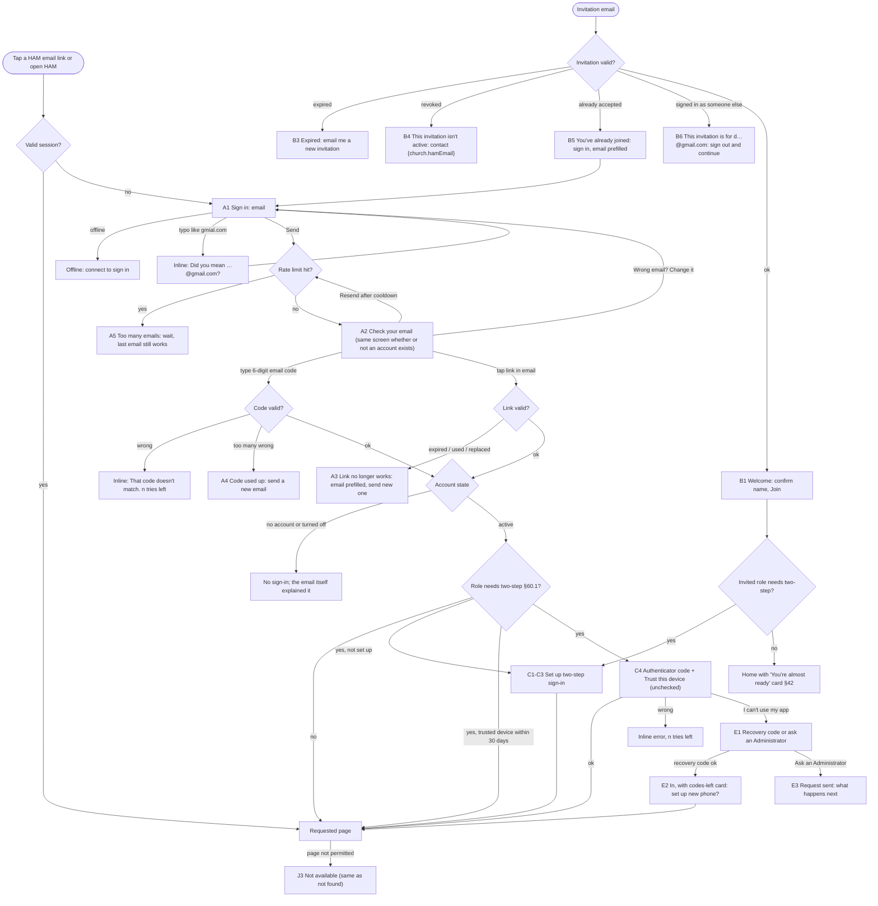
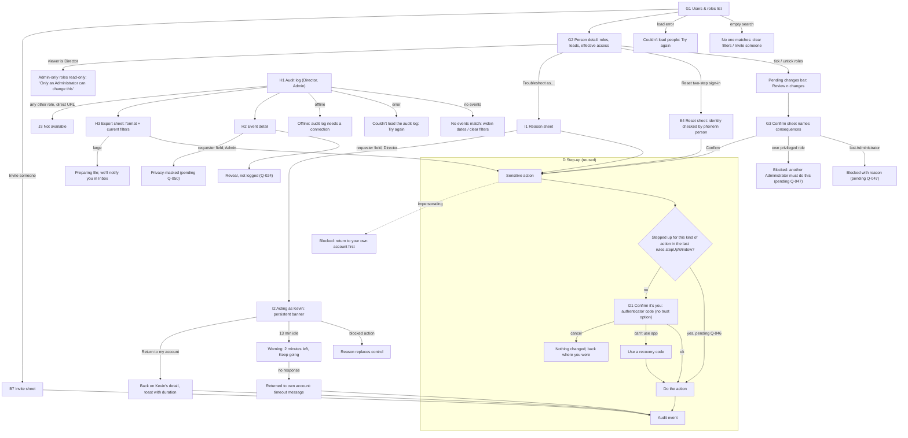

# Auth & access: sign-in, two-step sign-in, roles, audit log, impersonation

Build-order step 1 (skeleton, roles, audit, MFA). Owner: ham-ux-designer.
Personas: [personas.md](personas.md). Navigation, global states and the access table: [navigation.md](navigation.md). Components: `design-system/components.md` (cited as **C§n**); patterns: `design-system/patterns.md` (**P§n**).
Implements PRD §4, §7 (boundary only), §20, §58, §59, §60, §67, §68, §70.4, §70.6. Uses the owner decisions of 2026-09-27: **Q-010** (trusted device 30 days; always re-check for audit export and role changes), **Q-019** (email codes only, no SMS), **Q-024** (PII reveals logged for everyone except the HAM Director), **Q-026** (church name and contact from the church profile, so copy uses `{church.name}`, `{church.shortName}`, `{church.hamEmail}`, `{church.hamPhone}`).
New gaps are **Q-040 to Q-052** (§8.2). Anything that depends on one is marked **pending Q-0NN**. Rule values (lifetimes, attempt limits, timeouts) are written as `{rules.x}` because they live in the versioned rules module, never in UI copy literals (CLAUDE.md).
Sample "today" is **Tuesday, Oct 6, 2026**, America/New_York. All names are fictional.

**Words we use with people.** "Sign-in link", "sign-in code" (from email), "two-step sign-in" (MFA), "authenticator app", "recovery codes", "confirm it's you" (step-up), "troubleshoot as" (impersonation), "activity log" is *not* used: the screen is called **Audit log** because Directors and Admins know that term and the PRD uses it.

Contents
1. Jobs, personas, devices
2. User journeys
3. Screen flows
4. Screen specs (A sign-in · B invitations · C two-step sign-in · D step-up · E lost phone & reset · F Me → Sign-in & security · G users & roles · H audit log · I impersonation · J session, sign-out, not-found)
5. Microcopy
6. Accessibility
7. Success measures
8. PRD trace & gaps

---

## 1. Jobs, personas, devices

| Area | Job to be done | Primary persona | Also | Device & context |
|---|---|---|---|---|
| A. Sign in | "Get me into HAM from this email in one step, without a password." | Kevin, volunteer | Everyone with an account | Phone, in a truck or on a break, often arriving from a notification email; the email app and the browser may be on different devices |
| B. Invitation | "Someone asked me to help. Let me say yes and get set up without paperwork." | New volunteer invited by Luis (Project Leader) or Marcus | Pastors and Board reps invited by Nadia | Phone, first contact with HAM, low patience, no idea what HAM looks like yet |
| C. Two-step sign-in | "Keep my leadership account safe without making me type codes every day." | Pastor Ruth (phone, between visits) | Marcus, Andre, Elder Samuel, Nadia (§60.1) | Phone for Ruth; laptop at a Board meeting for Samuel, possibly a shared church-office computer |
| D. Step-up | "Let me prove it's really me right before I do something sensitive." | Nadia (role change), Marcus (audit export) | | Desktop |
| E. Lost phone | "My phone is gone and I need back in." / "Help my colleague back in safely." | Marcus (locked out), Nadia (resets) | | Marcus on a borrowed laptop; Nadia at her desk, calls him to confirm |
| G. Users & roles | "Give this person the right access, and know exactly what that changes." | Nadia, Administrator | Marcus, limited (**pending Q-041**) | Desktop (occasional); must work on phone for an urgent removal |
| H. Audit log | "Find out who did what and when, and hand the Board a clean export." | Marcus, HAM Director | Nadia | Desktop; occasionally phone for a quick lookup |
| I. Impersonation | "See exactly what Kevin sees so I can fix his problem, without being able to misuse his account." | Nadia | Kevin (the person being viewed) | Desktop |
| J. Session, sign-out, not-found | "Don't lose my work when I'm signed out. Don't leak what I'm not allowed to see." | Everyone | | Any |

**Not in this spec:** the requester's secure link and email-code verification (§7, navigation.md §5, **Q-025 open**). The sign-in page only points requesters to their link (§4.A1). Contractor terms (§40.1) and volunteer onboarding (§42) start *after* sign-in and have their own specs.

---

## 2. User journeys

### 2.1 Kevin signs in from an invitation email (the most common path)
Email "Invitation: HAM #041 Exterior painting, Sat Oct 17" → tap **See invitation** → his session has expired → **Sign in** screen with his email already filled in (carried in the deep link as a hint, never as proof) → **Email me a sign-in link** → check-email screen → switches to the Mail app → the new email shows the code in its preview → taps the link → lands on the invitation card on Home → **Accept**.
- *Hesitation:* "Do I have to make a password?" No. The screen says so up front. · "Link or code?" He doesn't have to choose in advance; every email has both.
- *Wait:* email delivery (usually seconds). The check-email screen tells him what to expect and when **Resend** becomes available.
- *Give-up:* the email lands in spam; he opened the email on his laptop but wants HAM on his phone (the code solves this); a tap on an old link from yesterday (the link-used screen offers a new one in one tap, with the email prefilled).

### 2.2 A new volunteer joins through a leader's invitation (**pending Q-040**)
Luis meets Dwayne at church and invites him from Volunteers → **Invite someone** (email, first and last name; role defaults to Volunteer) → Dwayne gets "Luis Romero invited you to volunteer with HAM at {church.name}" → taps **Join HAM** → Welcome screen with his name prefilled → **Join** (the invitation link proves he owns the email, so there's no separate code) → Home opens on the "You're almost ready" onboarding card (§42).
- *Hesitation:* "What is this? Is it legit?" The email and the Welcome screen name the church and the person who invited him, and use the church logo. · "How much is this going to ask of me?" The Welcome screen says "About 5 minutes today. You can finish the rest later."
- *Give-up:* the invite expired while he was busy. **Email me a new invitation** re-sends to the same address in one tap, no need to chase Luis.

### 2.3 Pastor Ruth signs in on her phone (two-step)
Notification "Urgent request needs certification: HAM #046" → tap → sign in by link → **Enter the 6-digit code from your authenticator app** → she switches to her authenticator app, copies the code, and comes back (the field accepts paste and the iOS/Android one-time-code autofill) → she ticks **Trust this device for 30 days** because it's her own phone → lands on the request → certifies. For the next 30 days, the email step is the only step when her session expires.
- *Hesitation:* two different 6-digit codes (email, then app). Each screen names its source in the heading, uses a different icon (mail vs. shield), and the authenticator screen never appears before the email step is done.
- *Give-up:* phone lost (see 2.5); time drift on the phone (the server accepts one adjacent 30-second window; the error explains how to check the phone's clock).

### 2.4 Elder Samuel's first sign-in after being given the Board rep role
Nadia adds the Board representative role → Samuel gets an email "You've been added to HAM as Board representative" → signs in → HAM says two-step sign-in is required for this role and walks him through setup in 3 steps (install/open app → scan or enter the key → save recovery codes) → he lands on Board decisions. On the shared church-office laptop he leaves **Trust this device** unchecked, which is the default.
- *Hesitation:* "What app do I need?" We name two common free ones and say any authenticator app works. · "What are recovery codes for?" One sentence, plus Print and Download.
- *Give-up:* he doesn't have his phone at the meeting. **Set up later** isn't offered for an MFA role (§60.1 is mandatory), but he keeps whatever non-MFA access he already had, such as his volunteer profile, until he finishes (**pending Q-045**). The screen says that, so it's not a dead end.

### 2.5 Marcus loses his phone
Sign in by link → authenticator screen → **I can't use my authenticator app** → **Use a recovery code** (he printed them) → in → a card: "You used a recovery code. 9 left. Set up your new phone now?" → re-enroll.
If he has no recovery codes: **Ask an Administrator for help** → a request goes to every Administrator, attributed to the email-verified person → Nadia calls Marcus at the number she already knows, confirms it's him, then **Reset two-step sign-in** (with step-up) → Marcus gets an email → next sign-in, he sets up again. Every step is audited (§58).

### 2.6 Nadia changes roles
Admin → **Users & roles** → search "Ruth" → detail panel shows current roles, projects she leads (read-only) and "What Ruth can do" in plain words → ticks **Pastor** → **Review 1 change** → confirm sheet names the consequence (what Ruth can now do; she'll set up two-step sign-in; she gets an email) → **Confirm it's you** (authenticator code, **Q-010**) → saved, audit event, toast.
- *Hesitation:* "Will this remove her volunteer access?" The effective-access summary updates live before she confirms.
- *Guard:* removing the last Administrator is blocked with a reason (**pending Q-047**).

### 2.7 Marcus exports the audit log for the Board
Sidebar → **Audit log** → presets "Last 30 days" → filter Action type = "Budget changes", Project = HAM #037 → reviews rows (ID-first, no requester names) → opens one row for detail → **Export** → choose CSV, Excel or PDF → **Confirm it's you** → the file downloads; the export itself becomes an audit event.

### 2.8 Nadia troubleshoots as Kevin
Kevin emails: "I can't see Saturday's invitation." Nadia opens Kevin → **Troubleshoot as Kevin…** → picks the reason chip "Can't see an invitation" (it prefills the reason, which she edits) → **Confirm it's you** (**pending Q-046**) → the app reloads as Kevin with a non-dismissable banner → she sees the problem (an agreement card is blocking) → **Return to my account** → toast with duration. Kevin later gets an email saying an administrator viewed HAM as him, when, and why (**pending Q-049**).
- *Guard:* while acting as Kevin she can't accept his agreement for him, change roles, reset MFA, export the audit log or start another impersonation (§59, **pending Q-048**). Each blocked control is replaced with a one-line reason.

---

## 3. Screen flows

### 3.1 Sign-in, invitation, two-step sign-in



### 3.2 Step-up, roles, audit, impersonation



---

## 4. Screen specs

Layout conventions for every signed-out screen (A, B, C, E1–E3): **no nav**, app bar with the church logo only (C§1), single centered column at `--ham-size-form-max`, `control-lg` inputs and buttons, `body-lg` text, primary button in a sticky bottom action bar on mobile and inline under the field on desktop. On desktop (≥1024) the column sits on a plain `bg.canvas` page with the logo lockup above it: no split-screen marketing panel, because there is nothing to sell and it would push the field below the fold on small laptops.

### A. Sign in (everyone with an account)

#### A1. Sign in: email
- **Purpose:** Start passwordless sign-in (§60.2). Also the first step for MFA roles (§60.1), where the email is the first factor and the authenticator the second.
- **Primary action:** **Email me a sign-in link**.
- **Content (priority order):** logo + "Home Assistance Ministry · {church.name}" → h1 "Sign in to HAM" → one line: "No password needed. We'll email you a link and a code." → Email field → primary button → small print: requester pointer ("Asked HAM for help? You don't need to sign in…").
- **Fields:** Email (required). `type="email"`, `autocomplete="username email"`, `inputmode="email"`, no autocapitalize, trims spaces.
- **Prefill / remember:** the email from a deep-link hint (`?hint=` from the notification email, never used as proof); otherwise the last email used on this device (stored locally only after a successful sign-in; cleared by **Sign out → Forget me on this device**).
- **Forgiving input:** common domain typos (gmial, gmail.con, yaho, hotmial, outlok) show a Link-button suggestion under the field: "Did you mean kevin@gmail.com?" One tap fixes it. The check runs on blur and on submit; it never blocks.
- **No choice up front:** the person doesn't pick "link" or "code". Every sign-in email contains both, and the next screen accepts the code. This is how "whichever the person prefers" costs zero taps.
- **Account enumeration:** the next screen is identical whether or not the address has an account (privacy, §68). The *email* differs (see A6).

```
┌──────────────────────────────────────┐
│ [church logo]                        │  app bar, no nav
├──────────────────────────────────────┤
│ Home Assistance Ministry             │
│ {church.name}                        │
│                                      │
│ Sign in to HAM                       │  h1
│ No password needed. We'll email you  │
│ a link and a code.                   │
│                                      │
│ Email                                │
│ ┌──────────────────────────────────┐ │
│ │ kevin@gmial.com                  │ │
│ └──────────────────────────────────┘ │
│ Did you mean kevin@gmail.com?        │  Link button
│                                      │
│ Asked HAM for help with your home?   │
│ You don't need to sign in. Use the   │
│ link we emailed you, or call         │
│ {church.hamPhone}.                   │
├──────────────────────────────────────┤
│ ┌──────────────────────────────────┐ │
│ │    Email me a sign-in link       │ │  Primary, lg, sticky
│ └──────────────────────────────────┘ │
└──────────────────────────────────────┘
```
Desktop: same column, 480px wide, button inline under the field.

#### A2. Check your email (code entry)
- **Purpose:** Wait for the email; accept the 6-digit code for people who prefer typing, or who opened the email on a different device.
- **Primary action:** none until a code is typed; the code auto-submits at the 6th digit (a **Sign in** button is also present for people who prefer to tap, and for assistive tech).
- **Content:** mail icon → h1 "Check your email" → "We sent a sign-in link and code to **kevin@gmail.com**." → Link button **Wrong email? Change it** (returns to A1 with the address selected for editing) → "Code from your email" field → **Sign in** → **Resend email** (Secondary; disabled with visible text "You can resend in 0:30" during `{rules.signInResendCooldown}`; the countdown is text, not announced every second) → help disclosure "Didn't get it?" (check spam; the email comes from {sender}; it can take a minute; still nothing → contact {church.hamEmail}).
- **Field:** one input, not six boxes (six boxes break paste, autofill and screen readers). `inputmode="numeric"`, `autocomplete="one-time-code"`, `maxlength` 7, accepts "482 913" or "482913", ignores spaces and dashes. Shown with a space in the middle in the email ("482 913") to aid reading aloud.
- **Link and code are one credential:** using either invalidates both; requesting a new email replaces the previous link and code (**pending Q-042**).
- **Cross-device:** the link signs in the device where it's tapped. If Kevin taps the link on his laptop but A2 is open on his phone, the phone stays on A2; the email line "Signing in on another device? Type the code there instead." covers this.

```
┌──────────────────────────────────────┐
│ ✉                                    │
│ Check your email                     │
│ We sent a sign-in link and code to   │
│ kevin@gmail.com.                     │
│ Wrong email? Change it               │
│                                      │
│ Tap the link in the email, or type   │
│ the code here.                       │
│ Code from your email                 │
│ ┌──────────────────────────────────┐ │
│ │ 482 913                          │ │
│ └──────────────────────────────────┘ │
│ The code works for 15 minutes.       │  from rules module
│                                      │
│ [ Resend email ]  You can resend in  │
│                   0:24               │
│ ▸ Didn't get it?                     │
├──────────────────────────────────────┤
│ ┌──────────────────────────────────┐ │
│ │            Sign in               │ │
│ └──────────────────────────────────┘ │
└──────────────────────────────────────┘
```

#### A3. Link no longer works (expired, already used, replaced by a newer one)
- **Purpose:** Recover in one tap without blame. The three causes share one screen because the person's next step is the same, and naming "already used" could confirm to an attacker that the link was valid.
- **Primary action:** **Email me a new link** with the address prefilled (the address is taken from the link's token, shown partly masked "k•••@gmail.com" in case this is a forwarded email; the person may edit it).
- Copy: h1 "This sign-in link has expired" · "Sign-in links work once, for 15 minutes, to keep your account safe. We'll send you a fresh one."
- If the person is **already signed in** on this device when they tap an old link, skip A3 and go straight to the destination.

#### A4. Code used up (too many wrong tries)
- Shown after `{rules.signInCodeMaxAttempts}` wrong codes. The link in the same email is also invalidated.
- Copy: h1 "Let's send a new code" · "That code was entered incorrectly a few times, so we turned it off to protect your account." · Primary **Email me a new code**.

#### A5. Too many emails (rate limited)
- Shown when `{rules.signInEmailsPerHour}` is reached for an address or device. Never says "suspicious" or "blocked".
- Copy: h1 "Your last email is on its way" · "You've asked for several sign-in emails in a short time. The most recent one still works, so check your inbox and spam folder. You can ask for another at {local time}." · Secondary **Back to sign in**. The time is absolute ("at 3:42 PM"), not a live countdown.

#### A6. Sign-in emails (content, not a screen)
PII-free subject lines (navigation.md §4). Sender name "{church.shortName} HAM".
| Case | Subject | Body (first line is the preview) |
|---|---|---|
| Account exists | "Your HAM sign-in link" | "Your code is 482 913. Or tap **Sign in to HAM** below. It works once, for 15 minutes. Signing in on another device? Type the code there instead. Didn't ask for this? You can ignore this email; no one can sign in without it." |
| No account | "About your HAM sign-in" | "Someone tried to sign in to HAM with this email address, but there's no HAM account for it. If you'd like to volunteer, ask a HAM leader to invite you, or reply to {church.hamEmail}. If it wasn't you, you can ignore this email." (**pending Q-040**) |
| Account turned off | "About your HAM sign-in" | "Your HAM account is turned off, so we can't sign you in. If you think that's a mistake, contact {church.hamEmail}." (**pending Q-052**) |
| Paused volunteer (§20) | normal sign-in email | Signs in normally; Home shows the paused card with **Reactivate** (navigation.md §6). Pausing is not a sign-in problem. |

### B. Invitations

#### B7. Invite someone (sheet, from Users & roles or Volunteers; **pending Q-040**)
- **Who:** Administrator (any role); Director and Assistant Director; Project Leaders (Volunteer role only), per the Q-040 default.
- **Primary action:** **Send invitation**.
- **Fields (required unless marked):** Email · First name · Last name · Roles (checkboxes; Volunteer pre-ticked; only the roles the inviter may grant are listed) · Personal note (optional, 200 characters, "Shown in the email").
- Duplicate email → inline: "Dwayne Carter already has a HAM account. [Open profile]" (only for roles that can view people; others see "This person may already have an account. Ask them to sign in with that email.").
- Result toast: "Invitation sent to dwayne@… It works for 7 days." The invitation shows as **Invited** in the people list with **Resend** and **Cancel invitation**. Audit event: `user.invited` with inviter, roles, UTC time.

#### B1. Welcome (accept invitation)
- **Purpose:** Turn an invitation into an account with the fewest possible fields. The invitation link proves email ownership, so no code is asked.
- **Primary action:** **Join HAM**.
- **Content:** logo → h1 "Welcome to HAM, Dwayne" → "Luis Romero invited you to volunteer with the Home Assistance Ministry at {church.name}." → the personal note if any, in a quote block with Luis's name → "What happens next: we'll ask a few questions about your skills, and you'll review our volunteer agreements. About 5 minutes today; you can finish the rest later." → Name fields (prefilled, editable, required) → primary.
- **Only name here.** Phone, skills, tools, availability, emergency contact and agreements belong to onboarding (§42) and appear on Home as the "almost ready" checklist, so they can be done in pieces.
- **Invited to an MFA role** (e.g. Pastor): the "What happens next" line reads "Your role needs two-step sign-in, which takes about 3 minutes and an authenticator app on your phone." and **Join HAM** continues to C1.
- **Invited as a contractor:** "What happens next" says "You'll review the contractor terms and see the work you're assigned to." (§40.1). Nothing else changes.

```
┌──────────────────────────────────────┐
│ [church logo]                        │
├──────────────────────────────────────┤
│ Welcome to HAM, Dwayne               │
│ Luis Romero invited you to volunteer │
│ with the Home Assistance Ministry at │
│ {church.name}.                       │
│ ┃ "Good to meet you Sunday. We could │
│ ┃ use your carpentry." — Luis        │
│                                      │
│ What happens next                    │
│ A few questions about your skills,   │
│ then our volunteer agreements. About │
│ 5 minutes today; finish the rest     │
│ later.                               │
│                                      │
│ First name        Last name          │
│ [Dwayne      ]    [Carter        ]   │
│ Signing in as dwayne@example.com     │  read-only
├──────────────────────────────────────┤
│ [          Join HAM                 ]│
└──────────────────────────────────────┘
```

#### B3–B6. Invitation problems
| Screen | Trigger | Content | Primary |
|---|---|---|---|
| B3 Expired | Past `{rules.invitationLifetime}` | "This invitation has expired. Invitations work for 7 days. We can send you a fresh one to the same email." | **Email me a new invitation** (re-sends to the original address only; notifies the inviter; audited) |
| B4 Not active | Cancelled by a leader | "This invitation isn't active anymore. If you'd still like to help, contact {church.hamEmail}." | Link **Email {church.shortName} HAM** |
| B5 Already joined | Invitation already accepted | "You've already joined HAM. Sign in with dwayne@example.com." | **Email me a sign-in link** (A1 prefilled, one tap) |
| B6 Wrong person signed in | Device signed in as Kevin, invitation for Dwayne | "This invitation is for d•••@example.com, but you're signed in as Kevin Thompson." | **Sign out and continue** (Secondary: **Stay signed in as Kevin**) |

### C. Two-step sign-in (§60.1 roles: Administrator, HAM Director, Assistant Director, Pastor, Board representative)

Project Leaders, Task Leaders, volunteers, contractors and the Social Media Specialist are **never** asked (§60.1, personas). A person with both kinds of role (Pastor + Volunteer) is asked, because the higher privilege applies (§4.11).

#### C1–C3. Set up (wizard, 3 steps, P§5)
Header "Step 1 of 3 · Get an app". Back (ghost) + Continue (primary) in the sticky bar. No "Set up later" (mandatory, §60.1). A Ghost link **Sign out** is always present so the person isn't trapped.

- **C1 Get an app.** "Your role as {role} needs two-step sign-in. After your email link, you'll type a code from an app on your phone. This keeps requester and ministry information safe." · "Any authenticator app works, for example Google Authenticator or Microsoft Authenticator. Already have one? Continue." · If they aren't finishing now: "Can't do this now? You can still use HAM as a volunteer until you finish. Your {role} access starts once you're set up." (**pending Q-045**)
- **C2 Connect the app.**
  - *Phone:* primary **Open my authenticator app** (an `otpauth://` link that adds the account directly) · below: "Didn't open? Copy this key into the app" + the key in 4-character groups + **Copy key** (Secondary). QR is in a disclosure "Setting up on another phone? Show QR code".
  - *Desktop:* QR code first (240px, `alt` "QR code for setting up HAM two-step sign-in. Can't scan? Use the key below."), key below with **Copy key**.
  - Account label shown in the app: "{church.shortName} HAM ({email})".
  - Then "Enter the 6-digit code the app shows" field (same input rules as A2) + **Trust this device for 30 days** (unchecked). Continue verifies the code.
- **C3 Save recovery codes.** "If you lose your phone, each of these codes gets you in once." 10 codes in a monospace grid → **Download** · **Print** · **Copy** (Secondary, any one counts) → checkbox "I've saved my recovery codes somewhere safe" (required; it's the one exception to "no confirmations", because losing these means a phone call to an Administrator) → **Finish**. Codes are shown only here and after regeneration (F). Audit event: `mfa.enrolled`.

```
Mobile, C2
┌──────────────────────────────────────┐
│ Step 2 of 3 · Connect the app        │
│ ▓▓▓▓▓▓▓▓▓▓▓▓░░░░░░                   │
│                                      │
│ [ Open my authenticator app      ]   │  Secondary lg
│ Didn't open? Copy this key into the  │
│ app:  JBSW Y3DP EHPK 3PXP  [Copy key]│
│ ▸ Setting up on another phone?       │
│   Show QR code                       │
│                                      │
│ Enter the 6-digit code the app shows │
│ ┌──────────────────────────────────┐ │
│ │                                  │ │
│ └──────────────────────────────────┘ │
│ ☐ Trust this device for 30 days      │
│   Leave this off on a shared         │
│   computer.                          │
├──────────────────────────────────────┤
│ [ Back ]        [    Continue      ] │
└──────────────────────────────────────┘
```
Only one Primary per screen: on C2 that is **Continue**; **Open my authenticator app** is Secondary lg.

#### C4. Two-step challenge (every sign-in without a trusted device)
- **Purpose:** Second factor after the email step.
- **Content:** shield icon → h1 "Enter the code from your authenticator app" → "It's the 6-digit code for {church.shortName} HAM." → field → **Trust this device for 30 days** checkbox, **unchecked by default** (Q-010), helper "Leave this off on a shared computer." → primary **Verify** (auto-submits at 6 digits) → Link **I can't use my authenticator app**.
- Wrong code: inline "That code didn't match. Codes change every 30 seconds, so try the current one." After 3 wrong: add "If codes keep failing, check that your phone's time is set automatically." After `{rules.mfaMaxAttempts}`: A4-style "For your safety, please start again from your email" → back to A1 (email prefilled).
- Trusted-device cookie is per browser. When a device is trusted, C4 is skipped but **D (step-up) still applies** (Q-010).

### D. Step-up: "Confirm it's you"

- **When:** role changes and audit export (Q-010, decided); also, **pending Q-046**: reset another person's two-step sign-in, start impersonation, regenerate own recovery codes, change own sign-in email.
- **Form:** bottom sheet on mobile, 480px modal on desktop (C§14). It opens *after* the person has reviewed and confirmed the action, so they confirm intent once and identity once, not the other way round.
- **Content:** h2 "Confirm it's you" → one line naming the action ("Before changing Ruth Alvarez's roles" / "Before exporting the audit log") → "Enter the code from your authenticator app." → field → primary **Confirm** (auto-submits at 6) → Ghost **Cancel** → Link **Use a recovery code instead**. No trust checkbox here.
- **Window:** a successful step-up covers the same kind of action for `{rules.stepUpWindow}` (proposed 5 minutes) in the same session, so Nadia can adjust three people's roles without three codes (**pending Q-046**). The sheet never appears for non-MFA users because none of these actions are available to them.
- **Cancel:** nothing is saved; the pending changes stay on screen so no work is lost.
- **While impersonating:** step-up actions are blocked before the sheet opens (I3).
- Audit: `stepup.succeeded` / `stepup.failed` with the action it guarded.

### E. Lost phone and Administrator reset

#### E1. I can't use my authenticator app
- Two options as large radio cards, then one primary:
  1. **Use a recovery code** → field "Recovery code" (accepts with or without dashes, case-insensitive) → **Sign in**.
  2. **Ask an Administrator for help** → "We'll ask HAM's Administrators to reset your two-step sign-in. They'll contact you to make sure it's really you." Optional field "Best way to reach you (optional)" · **Send request**.
- Available only after the email step, so the request is tied to a verified email.

#### E2. Signed in with a recovery code
Top card on Home (Attention row style, C§7): "You signed in with a recovery code. 9 left. **Set up your new phone**" (restarts C1–C3 and invalidates the old authenticator; remaining recovery codes stay valid until regenerated). With 2 or fewer codes left the card also says "Make new recovery codes soon."

#### E3. Request sent
"Request sent. An Administrator will contact you, usually within a day. For your security, they'll check it's you before resetting anything." · "In the meantime you can still use any HAM features that don't need two-step sign-in, like your volunteer profile." (**pending Q-045**) · **Sign out**.
Administrators get an Inbox item under **Needs response** + email: "Marcus Bell asked to reset two-step sign-in · 7:12 PM" → opens E4.

#### E4. Reset two-step sign-in (Administrator, on the person's detail G2)
- **Who:** Administrators, not for themselves (another Administrator must reset an Administrator; **pending Q-044**).
- **Sheet content:** h2 "Reset two-step sign-in for Marcus Bell?" → consequence list: "Removes his authenticator app, recovery codes and trusted devices. Signs him out everywhere. Next time he signs in, he'll set up two-step sign-in again. We'll email him." → **How did you confirm it's Marcus?** (required, radio: *Phone call to a number I already had* · *In person* · *Other*) → Note (optional; required if Other) → Danger **Reset two-step sign-in** → step-up (D).
- Result: toast "Two-step sign-in reset for Marcus Bell · 7:31 PM". Audit `mfa.reset` with actor, subject, verification method, note, request link. Email to Marcus: "Your two-step sign-in was reset by Nadia Pierre on Oct 6 at 7:31 PM. If you didn't ask for this, contact {church.hamEmail} right away."
- A reset without a pending request is allowed (e.g. he phoned), with the same required fields.

### F. Me → Sign-in & security (every signed-in person; MFA parts for §60.1 roles)
One section in **Me**, one screen, no sub-navigation.
- **Sign-in email:** kevin@gmail.com · **Change** (verifies the new address by code; the old address gets a notice; **pending Q-051**).
- **Two-step sign-in** (MFA roles): "On · authenticator app added Sep 27" · **Set up a new phone** · Recovery codes: "8 of 10 left" · **Make new codes** (step-up; old codes stop working; shows C3 again).
- **Trusted devices** (MFA roles): list "Chrome on iPhone · trusted until Nov 5 · this device" with **Stop trusting** per row.
- **Sign out everywhere** (Secondary; confirm sheet: "Signs you out on every phone and computer, including this one.").
- Every change here is audited.

### G. Users & roles (Administrator; Director limited, **pending Q-041**)

Location: Admin → **Users & roles** (sidebar, Administrator). The Director reaches the same screen from **Volunteers → People & access** (the Director's ADMIN group holds only the Audit log, navigation.md §3.3). Same component, permissions differ.

#### G1. People list
- **Purpose:** Find a person and see their access at a glance.
- **Primary action:** **Invite someone** (B7).
- **Desktop (≥1280):** split view (P§2). Filter bar (P§3): Search (name or email) · Role (filter chips: each standing role + "Leads a project") · Status (Active, Invited, Paused, Turned off) · "Two-step: Not set up" chip (shows MFA-role holders who haven't enrolled; this is the list Nadia actually needs). Table columns: Name · Email · Roles (chips, max 3 + "+2") · Two-step (icon + text: *On*, *Not set up*, *Not needed*) · Last sign-in (local) · Status. Default sort: Name. Count line: "57 people · 3 invited".
- **Mobile:** stacked rows (name, roles line, status chip); filters in a bottom sheet with "Filters · 2". Detail pushes a new screen.
- **Empty (search):** compact empty state "No one matches 'Rut'. Check the spelling or clear filters." + **Clear filters**.
- **Loading:** table skeleton. **Error:** inline alert "We couldn't load people. [Try again]". **Offline:** "Managing people needs a connection."
- **No requester data here.** Requesters have no accounts (§60.3) and never appear.

#### G2. Person detail
Content, priority order:
1. Header: avatar, name, email, status chip, "Last signed in Oct 5, 8:14 PM". Overflow menu (Admin only): **Troubleshoot as {first name}…**, **Reset two-step sign-in**, **Turn off account** (**pending Q-052**), **Resend invitation** (if Invited).
2. **Roles** (checkbox list, one row per standing role, each with a one-line plain description):
   - Administrator: "Users, roles, settings, integrations, audit log, troubleshooting."
   - HAM Director: "Final say on feasibility and scope; all ministry operations; audit log."
   - Assistant Director: "Assessments, planning, staffing, holds, budgets, credential checks. Recommends, doesn't make final scope decisions."
   - Pastor: "Approves requests and certifies urgent ones."
   - Board representative: "Records Board decisions."
   - Social Media Specialist: "Reviews and publishes project photos with consent."
   - Volunteer: "Serves on projects; own profile and commitments."
   - Contractor: "Sees only the work assigned to them." (Contractor holders also show the projects they're assigned to.)
   - A small tag "Two-step sign-in" appears on the five §60.1 roles.
   - Roles the viewer can't change render read-only with a lock icon and "Only an Administrator can change this" (not a disabled checkbox with no reason; navigation.md §1).
3. **Leads projects** (read-only, links): "Project Leader · HAM #038 Wheelchair ramp" · "Task Leader · Frame & deck on HAM #038". Helper: "Project and Task Leaders are chosen inside each project." Link **Open project**. Empty: "Not leading any projects right now."
4. **What {first name} can do** (live summary of the union, §4.11): 2–4 plain lines, regenerated as boxes are ticked, e.g. "As HAM Director and Volunteer, Marcus has full ministry access and the audit log, plus his own volunteer profile." A changed line is marked "New" or "Removed".
5. **Two-step sign-in:** On / Not set up / Not needed, with enrolled date.
6. **Recent access changes:** the last 5 audit events for this person (role changes, resets, impersonations) with a link **See all in audit log** (Admin and Director only).

**Pending changes bar** (sticky; mobile bottom, desktop bottom of the detail pane): appears once a box changes: "1 change · Add Pastor" · Ghost **Undo** · Primary **Review 1 change**. Navigating away with pending changes asks "Discard 1 unsaved change?".

```
Desktop detail pane (right of list), 1440
┌─────────────────────────────────────────────────────┐
│ (RA) Ruth Alvarez   [Active]                    ⋯   │
│ ruth.a@example.org · Last signed in Oct 5, 8:14 PM  │
├─────────────────────────────────────────────────────┤
│ Roles                                               │
│ ☐ Administrator            [Two-step sign-in]       │
│ ☐ HAM Director             [Two-step sign-in]       │
│ ☐ Assistant Director       [Two-step sign-in]       │
│ ☑ Pastor   NEW             [Two-step sign-in]       │
│   Approves requests and certifies urgent ones.      │
│ ☐ Board representative     [Two-step sign-in]       │
│ ☐ Social Media Specialist                           │
│ ☑ Volunteer                                         │
│ ☐ Contractor                                        │
│                                                     │
│ Leads projects                                      │
│ Not leading any projects right now.                 │
│ Project and Task Leaders are chosen inside each     │
│ project.                                            │
│                                                     │
│ What Ruth can do                                    │
│ NEW  Approve requests and certify urgent ones.      │
│      Serve as a volunteer; own profile and          │
│      commitments.                                   │
│ Two-step sign-in: Not set up yet. She'll set it up  │
│ at her next sign-in.                                │
├─────────────────────────────────────────────────────┤
│ 1 change · Add Pastor        [Undo] [Review 1 change]│
└─────────────────────────────────────────────────────┘
```

#### G3. Confirm role changes (sheet)
- h2 "Change Ruth Alvarez's roles?"
- One block per change, each naming the consequence:
  - **Add Pastor:** "Ruth will be able to approve and reject requests and certify urgent ones. She'll need to set up two-step sign-in the next time she signs in; her Pastor access starts then." (**pending Q-045**)
  - **Remove Assistant Director** (example for Andre): "Andre loses access to requests, budgets, holds and staffing right away, including on open pages. His volunteer profile and history stay. Recommendations he already made stay on their projects."
  - **Remove Volunteer** when the person has future commitments: "Kevin is on 2 upcoming projects (HAM #038, #041). Removing Volunteer cancels those spots, and the leaders are told." (Reliability is not affected by an admin removal; **pending Q-052**.)
  - **Remove Administrator** (last one): blocked, no confirm button: "HAM needs at least one Administrator. Add another Administrator first." (**pending Q-047**)
  - **Own privileged role:** blocked: "You can't change your own {role} role. Ask another Administrator." (**pending Q-047**)
- "Who's told: Ruth gets an email about her new role." (Role-change emails name the role, never another person's data.)
- Ghost **Cancel** · Primary **Confirm changes** → step-up (D) → saved.
- Result: toast "Roles updated for Ruth Alvarez · 7:48 PM". Audit `role.granted` / `role.revoked` per role: actor, subject, role, UTC time, step-up reference. Server re-checks permissions; access changes take effect on the subject's next request (no stale client permissions).

### H. Audit log (HAM Director and Administrator only, §58)

Route and nav: sidebar **Audit log** in the ADMIN group (navigation.md §3.3; for the Director it's the only item there). On mobile: More → Audit log. Any other role hitting the URL gets J3 (not found).

#### H1. Audit log list
- **Purpose:** Answer "who did what, when" and produce an export.
- **Primary action:** **Export** (the list itself needs no action).
- **Filters (§58):** Date range (presets Today · Last 7 days (default) · Last 30 days · Custom; the picker stops at the retention floor with "Audit history goes back one year, to Oct 6, 2025.") · User (people search; matches actor *or* acting-as) · Project (ID or category search, "HAM #037") · Action type (grouped multi-select: Approvals & decisions, Status changes, Roles & permissions, Sign-in & security, Staffing & assignments, Budget, Comments, Incidents, Requester access, Impersonation, Overrides, Data exports) · Role (the actor's role at the time). Active filters summarized: "Last 30 days · Budget · HAM #037 · Clear".
- **Desktop table** (P§3, dense-but-calm): When (local, "Oct 6, 7:48 PM"; UTC in the detail) · Who (name + role at the time; impersonated events show "Nadia Pierre as Kevin Thompson" with an `user-cog` icon) · Action (plain verb phrase, "Changed roles", "Approved request", "Exported audit log") · Subject (ID-first: "HAM #037", "Request R-2026-046", "Ruth Alvarez (user)", "INC-0112") · Summary (one line, PII-free: "Budget line Materials $420 → $510"). Newest first. Load more at 50.
- **Mobile:** stacked rows: line 1 action + subject, line 2 who + when. Filters in a bottom sheet. Export is in the header overflow.
- **PII rule for rows:** rows never contain requester name, address, phone or circumstances, for either role. Staff names are allowed (both viewers can see users). Incident rows show ID + type only, never the narrative (**pending Q-050**).
- **States:** Loading skeleton rows · Empty: "No events match these filters. Try a wider date range." **Clear filters** · Error: inline alert with Try again · Offline: "The audit log needs a connection." (no stale cache for audit data).
- Viewing the list is not an audit event; exporting is, and reveals in H2 follow Q-024 (**pending Q-050**).

```
Desktop 1440, list + detail split
┌──────────┬───────────────────────────────────────────────────────────────────────────────┐
│ SIDEBAR  │ Audit log                                                  [ Export ]         │
│          │ Audit history goes back one year.                                              │
│          │ [Last 30 days ▾] [User ▾] [Project: HAM #037 ×] [Action: Budget ×] [Role ▾]   │
│          │ 3 events · Clear filters                                                       │
│          │ ┌───────────────────────────────────────────────┐┌──────────────────────────┐ │
│          │ │ When          Who            Action   Subject ││ Changed budget line       │ │
│          │ │ Oct 5 8:02 PM Andre W.·AD    Changed  #037    ││ HAM #037 Install water    │ │
│          │ │                              budget           ││ heater                    │ │
│          │ │ Oct 2 6:40 PM Luis R.·PL     Added    #037    ││ Andre Whitfield · Asst.   │ │
│          │ │                              expense          ││ Director                  │ │
│          │ │ Sep 29 9:15 AM Marcus B.·Dir Approved #037    ││ Oct 5, 2026 8:02 PM EDT   │ │
│          │ │                              budget           ││ 2026-10-06 00:02:11 UTC   │ │
│          │ └───────────────────────────────────────────────┘│ Materials: $420 → $510    │ │
│          │                                                  │ Reason: "Backordered part │ │
│          │                                                  │ replaced with pricier…"   │ │
│          │                                                  │ Event ID ae41…  [Copy]    │ │
│          │                                                  └──────────────────────────┘ │
└──────────┴───────────────────────────────────────────────────────────────────────────────┘
```

#### H2. Event detail (right pane on desktop ≥1280; full screen on mobile and 1024–1279)
- Action (h2) · Subject with link to the record (link respects the viewer's permissions; if the record is gone or not permitted, plain text) · Actor, role at the time, and "acting as" line for impersonation ("Nadia Pierre (Administrator) acting as Kevin Thompson (Volunteer) · Reason: can't see invitation") · Local time with zone, plus UTC · Before → after values · Reason/justification if one was required · For sign-in and security events: device summary ("Chrome on Android") and approximate location if recorded · Event ID (Copy).
- **Requester fields in detail** (e.g. an approval event): for the Director, a **Privacy-masked field** (C§18) with **Show** that reveals without logging, labeled "Leadership only" (Q-024). For the Administrator, the field stays masked: "Hidden · Visible to the HAM Director" (Admin has no requester access in the access table; **pending Q-050**).
- **Deleted comments** (§57): the event shows "Comment deleted by {actor} · {time}" and, for Director and Admin, the original text in a clearly labeled "Deleted comment" block (both roles may see deleted comments per §67 and personas).

#### H3. Export
- Sheet: h2 "Export audit log" → "Uses your current filters: Last 30 days · Budget · HAM #037 · 3 events" (with **Change filters** link that closes the sheet) → Format segmented control **CSV · Excel · PDF** (remembers last choice) → note "The file includes event IDs and staff names, not requester names or addresses." (**pending Q-050**) → Primary **Export** → step-up (D) → download.
- Large exports (over `{rules.auditExportInlineMax}` events): "We're preparing your file. We'll let you know in your Inbox when it's ready (usually a few minutes)." The download link in Inbox requires sign-in and expires after `{rules.exportLinkLifetime}`.
- Audit event `audit.exported`: actor, filters, format, row count, UTC time. The export appears in the log it exported from.
- Blocked while impersonating (I3).

### I. Administrator impersonation (§59)

#### I1. Start ("Troubleshoot as…")
- **Entry:** G2 overflow → **Troubleshoot as Kevin…** Not shown for: yourself, other Administrators, turned-off accounts (**pending Q-048**).
- **Sheet:** h2 "Troubleshoot as Kevin Thompson?" → "You'll see HAM exactly as Kevin does. Everything you do is recorded as *Nadia Pierre acting as Kevin Thompson*." → **Reason** (required; reason chips prefill the text and remain editable: *Can't see an invitation* · *Notification problem* · *Check-in problem* · *Profile or credential problem* · *Something else*; minimum `{rules.impersonationReasonMinChars}` characters so "x" doesn't pass) → "While you're acting as Kevin you can't: change roles or permissions, reset two-step sign-in, export the audit log, accept agreements or give consent for him, record approvals or decisions for him, or change settings." → "Kevin will get an email afterward saying you viewed HAM as him and why." (**pending Q-049**) → Ghost **Cancel** · Primary **Start troubleshooting** → step-up (D, **pending Q-046**).
- Audit `impersonation.started`: admin, target, reason, UTC.

#### I2. Acting-as banner (every screen, both breakpoints)
- Page banner (C§1, C§11), `tone.attention`, pinned under the app bar, **not dismissable**, not hidden on scroll, and present on every route including errors and J3.
- Mobile (2 lines): "**Acting as Kevin Thompson** · 11 min left if idle" / "Reason: Can't see an invitation" · Button **Return to my account** (Secondary sm-lg, 48px). Desktop: one line, same content, button right-aligned.
- The idle text is static and updates once a minute (not a live timer). The account menu avatar shows Kevin with a small `user-cog` badge and the menu's first item is **Return to my account**.
- PII: while acting as Kevin, Nadia sees only what Kevin sees. Reveals by Kevin's roles that are normally logged are logged with both identities; reveals by a Director target are **logged** while impersonated, because the real actor is not the Director (Q-024 applies to the human, **pending Q-048**).

```
┌──────────────────────────────────────┐
│ [logo] HAM                    (🔔 3) │  app bar
├──────────────────────────────────────┤
│ 👤⚙ Acting as Kevin Thompson          │  attention banner, pinned
│ Reason: Can't see an invitation      │
│ 11 min left if idle                  │
│ [ Return to my account ]             │
├──────────────────────────────────────┤
│ Hi Kevin                             │  Kevin's Home, unchanged
│ …                                    │
```

#### I3. Blocked actions while impersonating
- The control is replaced by an inline note (C§11 info) in the same place, never a silent disabled button: "{Action} isn't available while you're acting as someone else. **Return to my account** to do this." For consents and agreements: "Only Kevin can accept his agreements. You can see what he'd see, but not accept for him."
- If a blocked request reaches the server anyway (stale client), the response is the same note, and an audit event `impersonation.blocked_action` records the attempt.
- Blocked set (§59 + proposal, **pending Q-048**): role changes · permission changes · privileged budget approvals (church contribution, over-budget approvals, §14) · protected admin actions (settings, church profile, integrations, agreement versions, user invites/turn-off) · MFA reset, recovery codes, trusted devices, sign-in email change · audit export · starting another impersonation · the target's own agreements, waivers, media release and consents (§41–§43) · approval authority actions (request approve/reject, urgent certification, Board decisions, feasibility and scope decisions) · comment deletion (§57, it must be the author's own act).
- Allowed (operational, §59): viewing, navigating, retrying notifications, fixing profile data such as skills or availability, accepting/declining/cancelling a commitment when troubleshooting requires it (each carries the dual identity).

#### I4–I6. Ending
- **Idle warning (I4):** at `{rules.impersonationIdleTimeout}` minus 2 minutes, a modal: "Still troubleshooting? You'll return to your own account in 2 minutes." Primary **Keep going** · Ghost **Return now**. This satisfies WCAG 2.2.1 (the person can extend).
- **Timed out (I5):** on the next interaction, Nadia lands on Kevin's G2 page as herself, with inline info "Your troubleshooting session as Kevin ended after 15 minutes without activity." If her own session also expired, she goes through sign-in and then lands there.
- **Returned (I6):** Kevin's G2 page as herself; toast "You're back as Nadia. Troubleshooting as Kevin lasted 6 min." The G2 "Recent access changes" list shows the session.
- Audit `impersonation.ended` with reason (manual / idle timeout / sign-out) and duration. Kevin's email (**pending Q-049**): "Nadia Pierre, a HAM Administrator, viewed HAM as you on Oct 6 from 7:40 to 7:46 PM to help with: Can't see an invitation. Questions? Contact {church.hamEmail}."

### J. Session expiry, sign-out and "not allowed = not found"

Reuses navigation.md §6; this adds the auth specifics.

#### J1. Session expired
- Passwordless roles: session length `{rules.sessionLifetimePasswordless}`; MFA roles: `{rules.sessionIdleMfa}` idle (**pending Q-043**).
- Behavior: the next server call returns 401; the current screen stays visible with a bottom sheet (not a redirect, so drafts on screen survive): "For your security, please sign in again. We'll bring you right back here." with the email prefilled and **Email me a sign-in link**. Unsaved form input is kept locally and restored after sign-in (navigation.md §6). MFA roles: C4 appears unless the device is trusted.
- Offline with an expired session: cached screens stay readable; actions say "Sign in again when you're back online." Queued offline check-ins (Q-006) are kept and sent after sign-in, never discarded.

#### J2. Sign out
- Account menu → **Sign out** (no confirmation; it's reversible in one email). Result screen: "You're signed out." + Link button **Forget my email on this device** (for shared computers) + **Sign in again**.
- **Sign out everywhere** lives in F.
- Signing out while impersonating ends the impersonation first (audited), then signs Nadia out.

#### J3. Not available (no permission = not found)
Exactly the navigation.md §6 screen: "This page isn't available to your account. If you think you should have access, ask the HAM Director." · **Go home**. Same status code, same copy and same timing for "doesn't exist" and "not allowed", no project title or ID (§68). Used for the audit log, Users & roles and every admin route hit by anyone else. For an Administrator it reads "…ask another Administrator." only when the viewer *is* an Administrator (no leak, since that role sees everything admin-side anyway).

---

## 5. Microcopy

Voice: plain, warm, never blaming. No "invalid", "unauthorized", "suspicious", "failed login". Times are local and absolute.

| Where | Copy |
|---|---|
| A1 heading / lead | "Sign in to HAM" · "No password needed. We'll email you a link and a code." |
| A1 button | "Email me a sign-in link" |
| A1 empty email | "Enter your email so we can send your link." |
| A1 malformed email | "That doesn't look like a full email address. Check for a missing @ or dot." |
| A1 typo suggestion | "Did you mean {suggestion}?" |
| A1 requester pointer | "Asked HAM for help with your home? You don't need to sign in. Use the link we emailed you, or call {church.hamPhone}." |
| A1 offline | "You're offline. Connect to the internet to sign in." |
| A2 heading / body | "Check your email" · "We sent a sign-in link and code to {email}." |
| A2 change | "Wrong email? Change it" |
| A2 field label / hint | "Code from your email" · "The code works for {n} minutes." |
| A2 wrong code | "That code doesn't match the one we sent. Check the newest email. {n} tries left." |
| A2 resend wait | "You can resend in {m:ss}" → button "Resend email" → toast "Sent again. Use the newest email." |
| A2 help | "Check your spam or promotions folder. The email comes from {sender}. It can take a minute. Still nothing? Contact {church.hamEmail}." |
| A3 | "This sign-in link has expired" · "Sign-in links work once, for {n} minutes, to keep your account safe. We'll send you a fresh one." · "Email me a new link" |
| A4 | "Let's send a new code" · "That code was entered incorrectly a few times, so we turned it off to protect your account." · "Email me a new code" |
| A5 | "Your last email is on its way" · "You've asked for several sign-in emails in a short time. The most recent one still works. You can ask for another at {time}." |
| B1 | "Welcome to HAM, {first}" · "{inviter} invited you to volunteer with the Home Assistance Ministry at {church.name}." · "Join HAM" |
| B1 success (Home) | "You're in, {first}! A few quick steps and you're ready to serve." |
| B3 | "This invitation has expired" · "Invitations work for {n} days. We can send a fresh one to the same email." · "Email me a new invitation" → "Sent! Check your email." |
| B6 | "This invitation is for {masked email}, but you're signed in as {name}." · "Sign out and continue" |
| B7 toast | "Invitation sent to {email}. It works for {n} days." |
| C1 | "Your role as {role} needs two-step sign-in. After your email link, you'll type a code from an app on your phone. This keeps requester and ministry information safe." |
| C2 | "Open my authenticator app" · "Didn't open? Copy this key into the app" · "Enter the 6-digit code the app shows" |
| C3 | "Save your recovery codes" · "If you lose your phone, each code gets you in once. Keep them somewhere safe, like with your important papers." · "I've saved my recovery codes somewhere safe" · "Finish" |
| C3 done | "Two-step sign-in is on. Thanks for keeping HAM safe." |
| C4 | "Enter the code from your authenticator app" · "It's the 6-digit code for {church.shortName} HAM." |
| Trust checkbox | "Trust this device for 30 days" · helper "Leave this off on a shared computer." |
| C4 wrong | "That code didn't match. Codes change every 30 seconds, so try the current one." · after 3: "If codes keep failing, check that your phone's time is set automatically." |
| C4 link | "I can't use my authenticator app" |
| D | "Confirm it's you" · "Before {action}, enter the code from your authenticator app." · "Confirm" · "Use a recovery code instead" |
| D actions | "changing {name}'s roles" · "exporting the audit log" · "resetting {name}'s two-step sign-in" · "troubleshooting as {name}" |
| E1 | "Use a recovery code" · "Ask an Administrator for help" |
| E2 card | "You signed in with a recovery code. {n} left. Set up your new phone" |
| E3 | "Request sent. An Administrator will contact you, usually within a day. For your security, they'll check it's you before resetting anything." |
| E4 | "Reset two-step sign-in for {name}?" · "How did you confirm it's {first}?" · "Reset two-step sign-in" |
| E4 email to subject | "Your two-step sign-in was reset by {admin} on {date} at {time}. If you didn't ask for this, contact {church.hamEmail} right away." |
| G1 empty | "No one matches '{q}'. Check the spelling or clear filters." |
| G2 leader note | "Project and Task Leaders are chosen inside each project." |
| G2 read-only role | "Only an Administrator can change this." |
| G2 pending bar | "{n} change(s) · {summary}" · "Undo" · "Review {n} change(s)" |
| G3 heading | "Change {name}'s roles?" |
| G3 last admin | "HAM needs at least one Administrator. Add another Administrator first." |
| G3 self | "You can't change your own {role} role. Ask another Administrator." |
| G3 toast | "Roles updated for {name} · {time}" |
| Role email (subject) | "You've been added to HAM as {role}" / "Your HAM access has changed" |
| H1 retention | "Audit history goes back one year, to {date}." |
| H1 empty | "No events match these filters. Try a wider date range." |
| H3 | "Export audit log" · "Uses your current filters: {summary} · {n} events" · "The file includes event IDs and staff names, not requester names or addresses." |
| H3 large | "We're preparing your file. We'll let you know in your Inbox when it's ready." |
| I1 | "Troubleshoot as {name}?" · "You'll see HAM exactly as {first} does. Everything you do is recorded as {admin} acting as {name}." · "Start troubleshooting" |
| I1 reason error | "Please say briefly what you're troubleshooting. It's kept in the audit log." |
| I2 banner | "Acting as {name} · Reason: {reason} · {n} min left if idle · Return to my account" |
| I3 blocked | "{Action} isn't available while you're acting as someone else. Return to my account to do this." |
| I3 consent | "Only {first} can accept their own agreements. You can see what {first} would see, but not accept for them." |
| I4 | "Still troubleshooting? You'll return to your own account in 2 minutes." · "Keep going" · "Return now" |
| I5 | "Your troubleshooting session as {first} ended after {n} minutes without activity." |
| I6 toast | "You're back as {admin first}. Troubleshooting as {first} lasted {n} min." |
| J1 | "For your security, please sign in again. We'll bring you right back here." |
| J2 | "You're signed out." · "Forget my email on this device" |
| J3 | "This page isn't available to your account. If you think you should have access, ask the HAM Director." · "Go home" |

Note on I3: use "their" everywhere in templates; HAM does not store pronouns.

---

## 6. Accessibility (WCAG 2.2 AA, §70.4)

**Authentication (3.3.8 Accessible Authentication, minimum).** No cognitive test anywhere: no passwords to remember, no CAPTCHA puzzles. Every code field allows **paste** and `autocomplete="one-time-code"`; the magic link is a no-typing alternative for the email code; **Copy key** and the `otpauth://` button remove transcription in C2. Recovery codes can be pasted.
- **Focus order.** A1: email → suggestion link (only when shown) → primary → requester pointer links. A2: heading is focused on arrival (so screen readers hear "Check your email") → Change email → code field → Sign in → Resend → help. C-wizard: focus moves to the step heading on each step. Sheets (D, E4, G3, H3, I1) trap focus, start on the heading, and return focus to the trigger on close; D and I4 cannot be closed with Esc if closing would lose a mandatory decision (I4 **Esc** = Keep going, which is safe).
- **Labels.** Every input has a visible label (no placeholder-only). Code fields: label names the source ("Code from your email" / "Code from your authenticator app") so the two 6-digit codes are never confused by ear. Role checkboxes use the role name as label and the one-line description via `aria-describedby`; read-only roles expose "Only an Administrator can change this" in their description.
- **Status announcements (4.1.3).** "Sent again", code errors, "Roles updated", "Invitation sent" are `role="status"` (polite). Blocking errors (rate limit, locked code) are rendered as the page's h1 content with focus moved to it, not as `role="alert"` interruptions. The A2 resend countdown and the I2 idle minutes are **not** live regions; only the change to "You can resend now" is announced once.
- **Impersonation banner.** A `region` landmark named "Impersonation" placed *before* `main` in DOM order, so it's the first thing read on every page; skip-link goes past it to main. The page `<title>` is prefixed "Acting as Kevin Thompson · " so screen-reader users and people switching tabs always know.
- **Timing (2.2.1).** Sign-in codes expire, but typing never times out mid-entry and the replacement is one tap. Impersonation idle gives a 2-minute warning with **Keep going**. Session expiry keeps the screen and input (J1).
- **Targets (2.5.8).** All controls ≥48px; code fields and sign-in primaries use `control-lg` (56px). Role checkbox rows are 48px full-row targets. **Accept** / destructive buttons are never adjacent to a close button.
- **Tables.** Audit and people tables have `<caption>` ("Audit events, newest first, 3 results"), sortable headers with `aria-sort`, and the "acting as" icon has text ("as"). The detail pane is a labelled region; Esc returns focus to the row.
- **Color.** Two-step status, invitation status and the impersonation banner use icon + text; the banner meets 4.5:1 text contrast and a 3:1 boundary against the app bar.
- **QR (C2).** Always paired with a copyable key and, on phones, the app link; the QR `alt` points to the key.
- **Zoom/reflow (1.4.10).** All signed-out screens are single column and work at 320px/400% zoom; recovery codes wrap in a 2-column grid, never horizontal scroll.

---

## 7. Success measures

| Flow | Taps / fields | Time target |
|---|---|---|
| Volunteer sign-in from a notification (email prefilled) | 1 tap (send) + 1 tap (link in email) · 0 typed fields | < 30 s including the app switch |
| Sign-in by typing the code | 1 tap + 6 digits (auto-submit) | < 45 s |
| MFA sign-in on a trusted device | same as volunteer | < 30 s |
| MFA sign-in, untrusted device | + 6 digits (auto-submit) | < 60 s |
| New volunteer accepts invitation | 1 tap in email + 1 tap **Join HAM** · 0 required typed fields (name prefilled) | < 30 s to Home |
| MFA enrollment | 3 steps · 1 code + 1 checkbox · 2 saves | < 3 min |
| Role change (Admin) | search → tick → Review → Confirm → 6 digits · 4 clicks | < 60 s |
| Audit export | filter(s) → Export → format → Confirm → 6 digits · 3 clicks after filters | < 45 s after filters |
| Start impersonation | overflow → reason chip → Start → 6 digits · 3 clicks | < 45 s |
| End impersonation | 1 click | instant |
| Lost phone with a recovery code | 1 link + paste code | < 60 s |

Operational: ≥ 95% of sign-in emails result in a successful sign-in within 15 minutes; < 2% of sign-ins hit the rate limit; zero audit events without actor + UTC time (§70.6); 100% of MFA-role holders enrolled within 7 days of role grant (Two-step: Not set up filter trends to 0).

---

## 8. PRD trace & gaps

### 8.1 Trace

| Spec part | PRD |
|---|---|
| Passwordless email sign-in, link + code (A) | §60.2 (email magic link; SMS excluded per §75, Q-019) |
| Requester pointer on sign-in; no requester accounts | §4.1, §7, §60.3 (Q-025 still open, not touched) |
| Invitations, contractor and MFA-role variants (B) | §4.9, §20, §40.1, §42, §60.1 (who may invite: Q-040) |
| Two-step sign-in for Admin, Director, Asst Director, Pastors, Board rep; not for Project Leaders (C) | §60.1; combined roles §4.11 |
| Trusted device 30 days, unchecked by default; step-up for audit export and role changes (C4, D) | §60.1, Q-010 |
| Lost phone, recovery codes, audited Admin reset (E) | §58 (permission/admin overrides), §60.1, §70.6 |
| Users & roles, union of roles, PL/TL assigned in projects (G) | §4.4–§4.11, §16, §17, §58 (role/permission changes), §67 |
| Audit log filters, export formats, retention, Director + Admin only (H) | §58, §67 (Director audit viewing, deleted-comment access), §57, §68 |
| PII reveal logging in audit detail and during impersonation | §68, Q-024 |
| Impersonation: reason, dual identity, 15-min idle, blocked actions (I) | §59, §58, §41–§43 (consents) |
| Session expiry, sign-out, not-allowed = not-found (J) | §68, navigation.md §6, Q-006 |
| Church naming and contact in copy | Q-026, Q-007 |
| Accessibility | §70.4 (WCAG 2.2 AA incl. 3.3.8, 2.5.8, 4.1.3, 2.2.1) |
| Local display, UTC storage in audit | §70.5 |

**Design decisions made here (within PRD latitude):** every sign-in email carries both a link and a code (no up-front choice); identical check-email screen whether or not an account exists; one "link no longer works" screen for expired/used/replaced; Project and Task Leader shown read-only on the person page and assigned only inside projects; live "What {name} can do" summary; step-up comes after the confirm sheet; impersonation banner is a named landmark and prefixes the page title; audit rows are ID-first and PII-free for both viewers.

### 8.2 New gaps (for `docs/prd-open-questions.md`; ham-architect is using Q-030 to Q-039)

| ID | PRD § | Question | Options | Proposed default |
|---|---|---|---|---|
| Q-040 | §4.11, §20, §67 | Who can create HAM accounts, and how does a new volunteer join? | Administrator only / Admin + Director + Assistant Director / also Project Leaders (Volunteer role only) / open self-signup with leader approval | Admin, Director and Assistant Director may invite with any role they're allowed to grant (Q-041); Project Leaders may invite new people as Volunteer only; Directors and PLs invite contractors to assigned work; no open self-signup in V1. Invitation lifetime 7 days (rules module). |
| Q-041 | §4.4, §4.11, §67 | Which roles may the HAM Director grant or remove? | None (Admin only) / non-MFA roles only / all except Administrator | Director may grant/remove Volunteer, Contractor and Social Media Specialist; the five §60.1 roles and Administrator are Administrator-only. Step-up applies either way (Q-010). |
| Q-042 | §60.2 | Sign-in link/code lifetime, attempts and rate limits | Various | Link + code are one credential, single use, 15 min; a newer email replaces the older; 5 wrong codes invalidates it; 5 sign-in emails per address per hour; 30 s resend cooldown. All in the rules module. |
| Q-043 | §60, §70 | Session lengths | Same for all / by role tier | Passwordless roles: 30 days rolling. MFA roles: end after 8 h idle and 7 days absolute; a trusted device skips only the authenticator step. Rules module. |
| Q-044 | §60.1, §58 | MFA methods and recovery; what if the only Administrator is locked out? | TOTP only / TOTP + passkeys / + recovery codes; reset by any Admin / by Director too | TOTP + 10 single-use recovery codes in V1 (passkeys later; no SMS, Q-019). Only an Administrator resets MFA, never their own, after an out-of-band identity check recorded in the audit event. Recommend at least 2 Administrators; a single locked-out Admin is recovered by a documented operator procedure outside the app, audited on first use. |
| Q-045 | §60.1, §4.11 | When someone is given an MFA role, when does it take effect? | Immediately (force setup at next sign-in) / only after enrollment | The role is recorded at once, but its permissions activate only after enrollment; until then the person keeps any non-MFA access (e.g. Volunteer). The G1 "Two-step: Not set up" filter shows them. |
| Q-046 | §60.1, Q-010 | Which other actions need step-up, and does one step-up cover repeated actions? | Only Q-010's two / add more; each time / short window | Also: resetting another person's MFA, starting impersonation, regenerating recovery codes, changing sign-in email. One step-up covers the same kind of action for 5 minutes in that session (rules module). |
| Q-047 | §4.11, §67 | Can people change their own roles? Must HAM always have an Administrator / Director? | Allow / block self-changes; block / warn on last holder | No one may grant themselves a role or remove their own privileged role (another Admin must). Block removing the last Administrator. Warn, but allow, removing the last HAM Director ("Director-only decisions will wait"). |
| Q-048 | §59 | Exact blocked-action list while impersonating, and whom may an Admin impersonate? | PRD examples only / expanded list | Expanded list in §4.I3 (adds MFA/security changes, audit export, nested impersonation, the target's own agreements and consents, approval-authority decisions, comment deletion). Can't impersonate yourself, other Administrators or turned-off accounts. PII reveals while impersonating are always logged with both identities, even if the target is the Director. |
| Q-049 | §59, §3.3 | Is the impersonated person told? | No / email after the session / in-app notice | Email after the session: admin name, time span, reason. |
| Q-050 | §58, §68 | Requester PII in audit events and exports | Store values / store IDs and resolve on view | Events store record IDs and change values, never requester name/address/phone/circumstances. Detail resolves requester fields only for the Director (reveal not logged, Q-024); Administrator sees them masked. Exports contain IDs and staff names only. Viewing the list isn't audited; exports are. |
| Q-051 | §60.2 | Can a user change their own sign-in email? | No (Admin only) / yes with verification | Yes, from Me → Sign-in & security, by verifying the new address with a code; the old address gets a notice; MFA roles need step-up (Q-046). Admins can also correct an email for someone who can't sign in. |
| Q-052 | §4.11, §20, §21 | Can an Administrator turn off an account (distinct from a volunteer pausing, §20)? What happens to future commitments? | No / yes | Yes. Turning off keeps history, ends all sessions and blocks sign-in. Future commitments are cancelled and leaders told, with no reliability effect (by analogy with §21). Director may turn off Volunteer-only accounts if Q-041 lets the Director manage that role. |

**Hand-offs**
- **ham-ui-designer:** needs visuals for the acting-as banner on mobile (components §1 shows a one-line desktop version: "You are viewing as J. Smith — End"; this spec uses the wording "Acting as … · Return to my account" and a 2–3 line mobile layout), the code input (single field, `control-lg`), the recovery-code grid, the role checkbox row with the "Two-step sign-in" tag and "New/Removed" markers, and the "acting as" icon in audit rows.
- **ham-architect / ham-backend-engineer:** audit event names used above (`user.invited`, `mfa.enrolled`, `mfa.reset`, `stepup.succeeded|failed`, `role.granted|revoked`, `audit.exported`, `impersonation.started|ended|blocked_action`) are proposals; align with the domain event catalogue. Permissions must re-check server-side on every request so role removal takes effect immediately.
- **ham-rules-engineer:** `{rules.signInCodeLifetime}`, `signInCodeMaxAttempts`, `signInEmailsPerHour`, `signInResendCooldown`, `invitationLifetime`, `mfaMaxAttempts`, `stepUpWindow`, `sessionLifetimePasswordless`, `sessionIdleMfa`, `impersonationIdleTimeout` (15 min, §59), `impersonationReasonMinChars`, `auditExportInlineMax`, `exportLinkLifetime`, `trustedDeviceDays` (30, Q-010).
- **navigation.md follow-ups:** §3.3 sidebar shows "Audit log" under ADMIN for the Director; this spec keeps that and adds "People & access" under Volunteers for the Director (pending Q-041). §6 MFA row stays as is.
