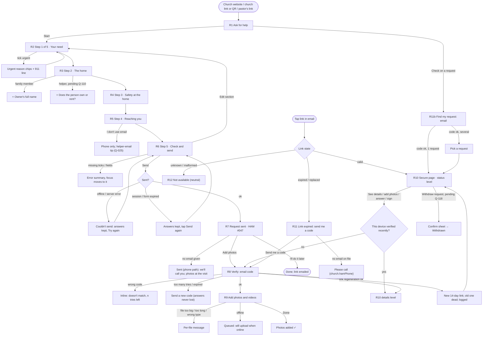
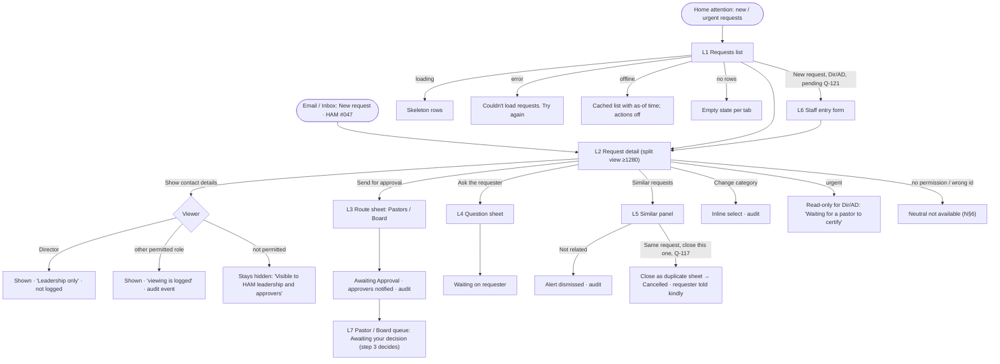

# Intake: asking for help, the secure request page, and leadership triage

Build-order step 2 (Intake). Owner: ham-ux-designer.
Personas: [personas.md](personas.md). Navigation, global states, requester status wording and the access table: [navigation.md](navigation.md) (cited as **N§n**). Sign-in patterns reused here: [auth-and-access.md](auth-and-access.md) (**AA§x**). Lessons from [reviews/step1-usability.md](reviews/step1-usability.md) are applied throughout (messages on public pages, prefill that survives errors, no raw codes in copy, local times). Components: `design-system/components.md` (**C§n**); patterns: `design-system/patterns.md` (**P§n**).

Implements PRD §3.1, §3.4, §4.1, §5, §6, §7, §8 (hand-off only), §9, §10, §35 (requester notices), §39 (hazard disclosure), §45 (upload limits), §52 (Submitted, Awaiting Approval), §58, §63, §68, §70.4, §77 steps 1–3.
Owner decisions used: **Q-004, Q-007, Q-008, Q-009, Q-019** (email codes only), **Q-024** (PII reveals logged for everyone except the HAM Director), **Q-026** (`{church.*}` copy), **Q-030** (church time zone), **Q-032** (code lifetime and tries), **Q-033** (no sign-in tokens in notification emails), **Q-048**.
Status note for the coordinator: the brief says Q-025 and Q-029 are decided, but `docs/prd-open-questions.md` on this branch shows both as **Open**. This spec follows Q-029's proposed default (Project Leader first name + arrival window) and **proposes the answer to Q-025** in §10. Please reconcile.

Rule values (code lifetime, tries, link lifetimes, upload limits) are written `{rules.x}` because they live in the versioned rules module, never as literals in copy (CLAUDE.md). Sample "today" is **Tuesday, Oct 6, 2026**, America/New_York. All names, addresses and numbers are fictional.

Contents
1. Jobs, personas, devices
2. Key decisions (read this first)
3. User journeys
4. Screen flows
5. Screen specs: requester (R1–R12)
6. Screen specs: leadership (L1–L7)
7. Emails and notifications
8. Accessibility
9. Privacy in the UI
10. Success measures
11. Data assumptions for ham-architect
12. PRD trace and new questions (Q-025 proposal, Q-110 to Q-129)

---

## 1. Jobs, personas, devices

| Area | Job to be done | Primary persona | Also | Device and context |
|---|---|---|---|---|
| Ask for help (R1–R6) | "Tell the church what's wrong with my home without feeling judged, and know what happens next." | Doris, 74, requester | Her daughter Angela (authorized family member); Deacon James, a church member helping a neighbor | Older Android phone, large font, spotty Wi-Fi, maybe stressed. Angela on her laptop at work |
| Add photos, verify (R7–R9) | "Show them the leak so they understand." | Doris | Angela | Phone camera, in the bedroom with the leak |
| Check on my request (R10) | "Where does my request stand? Do they need anything from me?" | Doris | | Taps the link in her email, days later |
| Get back in (R11) | "The old link doesn't work. Let me back in without calling anyone." | Doris | | Phone, weeks or months later |
| Take a phone-in request (L6) | "Doris called the church office. Get her request into HAM while I'm on the phone with her." | Marcus, HAM Director | Andre (Assistant Director), Pastor Ruth | Desktop at home; sometimes phone |
| Triage (L1–L5) | "Show me what's new and what's urgent, spot repeats, and get each request to the right approver." | Marcus | Andre | Desktop, evenings, 10–20 minutes; possibly projected in a leadership meeting |
| Hand-off to approvers (L7) | "Show me what's waiting for my decision." | Pastor Ruth (phone) | Elder Samuel, Board rep (laptop) | The decision screens themselves are step 3 |

---

## 2. Key decisions (read this first)

These are the choices in this spec that ham-architect, ham-frontend-engineer and the product owner most need to see. Items marked **Owner Q** need a decision and are in §12.

1. **Need first, then home, then contact.** The form opens on "What's going on?" because that is why the person came. Asking for name and phone first feels like paperwork. 5 short steps, then a review (P§5).
2. **One question covers "relationship to property" and "filling in for someone else".** Four large choices: *I own it* · *I rent it* · *It's a family member's home* · *I'm helping a friend, neighbor or church member*. The fourth is not in the PRD (§4.1 lists owner, authorized family member, tenant) → **Owner Q-110**.
3. **Send first, verify later. We never lose a request at the code step.** The request is saved when the person taps **Send request**. Email verification (§7.1) is asked for only when they want to add photos or see their details, right after sending on the same screen. This reverses the order in N§5 ("form → verify → received"). Reason: switching to the Mail app to fetch a code is where older users give up, and a lost request is worse than an unverified one. Leadership sees "Email not confirmed yet" on unverified requests. PRD §77 steps 2–3 are still met in one sitting: send, verify, add photos, before any approver sees it.
4. **Email is asked for, but "I don't use email" is allowed** (explicit tick-box, not a blank field). A phone number is always required. Updates can go to a family member's or friend's email with their OK. This is the proposed answer to **Q-025** (costly to change, §12).
5. **A category question was added** ("What kind of help?", one tap, "Not sure" allowed). It is not in §6.1, but without it every list row reads "HAM #047 · (untitled)" and leadership must read each description to triage. The alternative, AI categorizing the description, would send household circumstances to the AI service (CLAUDE.md privacy rule) → **Owner Q-114**.
6. **Urgent is one tick-box, unticked by default,** with a required reason (one tap on a reason chip) (§10). Ticking it shows the 911 line. Urgent requests skip triage and go straight to pastors.
7. **Hazards get their own step** with big cards and an explicit "None that I know of" (§39 "must disclose"). Nothing is auto-held at intake → **Q-119**.
8. **Two tick-boxes to certify, not five.** (a) the property-authority statement, whose wording follows the relationship answer (§6.2); (b) "HOA/landlord approvals are my responsibility, and what I've shared is true." No uploads (§6.2).
9. **"Submitted" means "with HAM leadership", and "Awaiting Approval" means "with pastors or the Board".** The Director or Assistant Director triages and sends each normal request to a route in one click. Urgent requests go straight to Awaiting Approval with the pastors. This gives both §52 states a real meaning and makes ownership clear → **Owner Q-111** (costly).
10. **The secure page has two levels.** Anyone holding the link sees status, next steps and how to reach HAM. Seeing the details (address, description, photos), uploading or signing needs a one-time email code on that device, which is remembered for a while. This protects a 74-year-old living alone if her link is forwarded or seen on a shared device → **Owner Q-112** (costly).
11. **Leadership lists are ID-first. Requester name, contact and street address sit behind a deliberate "Show contact details" button** in the detail view. That reveal is audit-logged for everyone except the Director (Q-024). I dropped the hover-card reveal from N§8.6 for request lists: hover reveals happen by accident, create noisy audit events, and don't exist on touch screens. Please update N§8.6 to match, or tell me to restore it.
12. **One number for life.** The requester's reference ("HAM #047") stays the same from request to project → **Owner Q-113** (costly).
13. **Similar requests are shown with their reasons** ("Same address · Same phone"), never as a score, and never to the requester (§9). Leadership can dismiss the alert or close an exact duplicate → **Q-117**.

---

## 3. User journeys

### 3.1 Doris asks for help on her phone (the main path)
Church website "Need help at home?" → **R1 Ask for help** (what HAM is, no cost to ask, 911 line, "about 5 minutes") → **Start** → **R2 Your need**: taps *Roof or ceiling*, dictates "Water comes through my bedroom ceiling when it rains…" → **Continue** → **R3 The home**: *I own it*, address, *House* → **R4 Safety**: *Dog* → **R5 Reaching you**: name, phone, email, *Any time* → **R6 Check and send**: ticks two boxes → **Send request** → **R7 Sent**: "Thank you, Doris. Your request number is HAM #047" → **Add photos** → **R8 Verify**: code from her email (preview shows it) → **R9 Add photos**: 4 photos → **Done**.
- *Hesitation:* "Will this cost me?" (R1 answers: no cost to ask; costs are discussed before any work). · "Is my problem big enough?" (R2 helper: "Big or small, tell us"). · "What's a property type?" (plain labels: House, Apartment or condo…). · "Why do they need my email?" (helper: "So we can send you updates and a link to check on your request").
- *Wait:* the code email. R8 says it can take a minute and offers Resend after `{rules.requesterCodeResendCooldown}`.
- *Give-up points and mitigations:* typing a long description (dictation tip, no minimum length) · leaving to find the code (the request is already saved, and the code screen can be reached again later from the request page) · weak signal at Send (answers kept on the device, Retry) · closing the tab halfway (answers kept for this tab session; see R2 "Draft kept").

### 3.2 Angela asks for her mother's home (authorized family member, §6.2)
Same path. On R3 she picks *It's a family member's home* → one extra field: "Owner's full name" (Doris Pennington). R5 labels switch to "Your name / your phone", with helper text: "We'll contact you about this request. We'll arrange visits with you." The R6 authority tick reads: "Doris Pennington owns this home and has asked me to request this help." No separate owner confirmation (§6.2).

### 3.3 Deacon James helps his neighbor fill it in (non-family helper, **pending Q-110**)
On R3 he picks *I'm helping a friend, neighbor or church member* → "Does the person you're helping own or rent the home?" (Own / Rent) → R5 asks for **the person's** name, phone and email (or "They don't use email", in which case updates can go to James's email with a note) plus **your name and phone** (2 fields). R6 tick: "Mrs. Hall asked me to request this help, and she agrees to it." Triage shows the chip "Filled in by a helper · confirm with resident" (proposed default of Q-110).

### 3.4 Marcus takes a phone-in request (L6, **pending Q-121**)
Doris calls the church office; the secretary passes her to Marcus. Marcus → Requests → **New request (phone or in person)** → the same five steps inside the app shell, worded "the requester" instead of "you" → R6 becomes one staff tick: "I read these statements to Doris Pennington and she agreed. How: Phone call / In person" → **Save request**. The request starts in Submitted with the source "Entered by Marcus Bell · phone call". If Doris has no email, Marcus ticks "Phone confirmed on this call" (proposed Q-025 path) and HAM's updates to her go by phone.

### 3.5 Doris checks her request a week later
Email "We received your request · HAM #047" → **Check on my request** → **R10 Secure page, status level**: "Our pastors are reviewing your request." · Things we need from you: none · How to reach us. She taps **See my request details** → R8 code (skipped if this phone verified recently) → details level: her description, address, photos.

### 3.6 Doris's link has expired (§7.3)
Eight months after completion she taps an old link → **R11 Link expired**: "For your privacy, this link has expired. We can send you a new one to d•••@gmail.com." → **Send me a code** → R8 → new link valid `{rules.regeneratedLinkLifetime}` (14 days), old link dead, event logged with time and method → she lands on R10 and the new link is also emailed.
- Lost the email entirely? R1 and R11 have **Check on a request** → enter email → code → her request(s) listed.
- No email on file (Q-025 path): R11 shows only "Please call us at {church.hamPhone}. We'll help you right away."

### 3.7 Marcus triages new requests
Home attention item "3 new requests · 1 urgent" → **L1 Requests, New tab** (urgent first, then oldest) → opens HAM #047 → **L2 detail**: need, category, hazards, photos, "Similar requests (1): HAM #031, same address, Completed Mar 2025" → reads it, it's a different problem → **Not related** → **Send for approval** → **L3**: Pastors (default) or Board → **Send** → the request moves to Awaiting Approval, pastors are notified, and the requester's page says "Our pastors are reviewing your request."
- *Hesitation:* "Is this the same as #031?" (match reasons shown, prior outcome and history one click away). "Should this go to the Board?" (L3 shows a one-line explanation of each route; see Q-111).
- *Needs info:* **Ask the requester a question** (L4) → the request shows "Waiting on requester"; Doris sees a card on her page and gets an email.
- *Andre* sees the same screens. His reveal of contact details is logged and labelled so (Q-024).

### 3.8 An urgent request at 8 PM
Doris ticks *This is urgent* → reason *Water is coming in / active damage* → R7 Sent: "Because this is urgent, we've let our pastors know right away." → the request goes straight to **Awaiting Approval** with the Urgent chip → all pastors get "Urgent request needs a pastor · HAM #048 Roof" (email + in-app) → Marcus and Andre see it as an awareness row (N§8.3 group 4). Pastor Ruth certifies in step 3.

### 3.9 Pastor Ruth and Elder Samuel (hand-off only)
They see **Requests → Awaiting your decision**, filtered to their route, and a Home card "2 requests waiting for a decision". Opening one shows L2 in read-only mode with the triage note. Approve, reject and certify are specified in step 3.

---

## 4. Screen flows

### 4.1 Requester



### 4.2 Leadership



---

## 5. Screen specs: requester (R1–R12)

**Layout conventions for every requester screen** (P§1, P§5, AA§4): no nav; app bar with the church logo only; single column at `--ham-size-form-max`; `body-lg` text; `control-lg` inputs and buttons; 32px status chips. On mobile the primary button sits in a sticky bottom bar with **Back** (Ghost) to its left from step 2 on. On tablet (768) the column is centered with the same bar. On desktop (≥1024) a left step list (completed steps clickable) + the form column + a right "Good to know" panel with what happens next and the ministry phone and email. No marketing panel. Reading level target: US grade 6.

**Draft kept.** Answers are stored in the browser tab's session storage as the person types, so a reload, a dropped connection or an expired server form never loses them. Nothing leaves the device until **Send request**. After a successful send, or **Start over**, the draft is erased. Session storage (not local storage) is used so answers don't linger on a shared or library computer once the tab is closed. There is no "Save & exit" for the public form (there's no account to save it to); this is a deliberate exception to P§5.

**No time limits.** The public form has no timeout. If the server-side form token has expired when the person taps Send, the page re-renders with every answer kept and says "Please tap Send request again." (AA review M1/M2 lessons.)

### R1. Ask for help (start)
- **Purpose:** Build trust, set expectations, route emergencies and returning requesters.
- **Primary action:** **Start** (lg, full width).
- **Content (priority order):** logo + "Home Assistance Ministry · {church.name}" → h1 "Ask for help with your home" → 3 short lines: who we are, no cost to ask, how long it takes → emergency line (inline `attention` alert) → what you'll need (address and a phone number) → **Start** → Link: "Already asked? **Check on your request**" → "Prefer to talk? Call {church.hamPhone}."
- **Prefill:** a church link or pastor's link (`/help/r/<code>`, **Q-129**) records its source silently. No field appears.

```
┌──────────────────────────────────────┐
│ [church logo]                        │
├──────────────────────────────────────┤
│ Home Assistance Ministry             │
│ {church.name}                        │
│                                      │
│ Ask for help with your home          │  h1
│ Our church's men's ministry helps    │
│ with repairs and safety work for     │
│ people who can't manage it alone.    │
│ Anyone may ask. There's no cost to   │
│ ask.                                 │
│                                      │
│ ⚠ In danger right now? Fire, a gas   │  attention alert, not dismissible
│   smell, sparking wires or flooding: │
│   call 911 first.                    │
│                                      │
│ Takes about 5 minutes. Have your     │
│ address and a phone number ready.    │
│                                      │
│ Already asked? Check on your request │  Link
│ Prefer to talk? Call (305) 555-0100  │  tel: link
├──────────────────────────────────────┤
│ ┌──────────────────────────────────┐ │
│ │             Start                │ │  Primary lg, sticky
│ └──────────────────────────────────┘ │
└──────────────────────────────────────┘
```
- **768:** same, centered, button inline. **1280:** column 560px centered; right panel "What happens after you ask" (the 3 steps from R7) so people can read ahead.

### R2. Step 1 of 5 · Your need
- **Purpose:** Capture the need in the person's own words (§6.1 description, urgency, justification; §5 genuine need, asked gently).
- **Primary action:** **Continue**.
- **Fields:**

| Field | Required | Control | Notes |
|---|---|---|---|
| What kind of help? | Yes (**Q-114**) | Radio cards, 2 columns at 390: Roof or ceiling · Plumbing or water · Electrical · Doors, windows or locks · Floors or stairs · Ramps, rails or grab bars · Painting or walls · Yard or outside · Something else or not sure | One tap. Leadership can change it later |
| Tell us what's happening | Yes | Textarea, auto-grow, 5 rows, no minimum, soft max 2,000 chars (counter appears at 1,800) | Helper: "What's wrong, where in the home, and how long it's been like this. If it's hard for you or your family to take care of it, you can tell us why." + "Tip: tap the microphone on your keyboard to speak instead of typing." |
| This is urgent | No (unticked) | One checkbox card | Ticking reveals the next two fields and the 911 alert |
| Why is it urgent? | Yes if urgent | Radio chips: Someone could get hurt · Water is coming in or damage is getting worse · No power, water, heat or cooling · Can't get in or out of the home safely · Something else | §10 examples in plain words |
| Anything else about why it's urgent? | No; **required only for "Something else"** | Textarea 2 rows | |

```
┌──────────────────────────────────────┐
│ [logo]                               │
├──────────────────────────────────────┤
│ Step 1 of 5 · Your need              │
│ ▓▓▓░░░░░░░░░░░░░                     │
│ What's going on?                     │  h1
│                                      │
│ What kind of help?                   │  fieldset legend
│ ┌────────────────┐┌────────────────┐ │
│ │◉ Roof or       ││○ Plumbing or   │ │  56px min cards
│ │  ceiling       ││  water         │ │
│ └────────────────┘└────────────────┘ │
│  … 7 more …                          │
│                                      │
│ Tell us what's happening             │
│ What's wrong, where in the home, and │
│ how long it's been like this…        │
│ ┌──────────────────────────────────┐ │
│ │Water comes through my bedroom    │ │
│ │ceiling when it rains. It started │ │
│ │in August…                        │ │
│ └──────────────────────────────────┘ │
│ 🎤 Tip: tap the microphone on your   │
│ keyboard to speak instead of typing. │
│                                      │
│ ┌──────────────────────────────────┐ │
│ │ ☐ This is urgent                 │ │
│ │   It's unsafe or getting worse   │ │
│ │   quickly.                       │ │
│ └──────────────────────────────────┘ │
├──────────────────────────────────────┤
│ [ Start over ]  ┌──────────────────┐ │  Start over = Ghost, confirm first
│                 │    Continue      │ │
│                 └──────────────────┘ │
└──────────────────────────────────────┘
Urgent ticked:
│ ⚠ If anyone is in danger right now,  │
│   call 911 first.                    │
│ Why is it urgent?                    │
│ ○ Someone could get hurt             │
│ ◉ Water is coming in or damage is    │
│   getting worse                      │
│ ○ No power, water, heat or cooling   │
│ ○ Can't get in or out safely         │
│ ○ Something else                     │
│ Anything else about why? (optional)  │
```

### R3. Step 2 of 5 · The home
- **Purpose:** Where the work is and who has authority (§6.1 address, property type, relationship; §6.2).
- **Primary action:** **Continue**.

| Field | Required | Control | Notes |
|---|---|---|---|
| Whose home is it? | Yes | 4 radio cards: **I own it** · **I rent it** · **It's a family member's home** · **I'm helping a friend, neighbor or church member** (**Q-110**) | Drives R5 labels and R6 wording |
| Owner's full name | Yes if family member | Text | Helper: "The person who owns the home." §6.2 |
| Does the person you're helping own or rent the home? | Yes if helper | Radio: Own · Rent | |
| Street address | Yes | Text, `autocomplete="address-line1"` | No third-party address lookup: the address stays inside HAM (§3.4). Browser autofill is fine |
| Apartment or unit | No | Text, `address-line2` | Label "(optional)" |
| City | Yes | Text, `address-level2` | |
| ZIP code | Yes | Text, `inputmode="numeric"`, `postal-code`, 5 digits (ZIP+4 accepted) | |
| State | Prefilled | Shown as text "Florida · Change" from the church profile | Change reveals a select |
| Type of home | Yes | Radio cards: House · Townhouse · Apartment or condo · Mobile or manufactured home · Other (**Q-123**) | |

- Tenants see an info line under their choice: "Before any work begins, you'll need written permission from your landlord or property owner. You don't need it to ask." (§6.2, **Q-116**)
- HOA note (all): shown on R6, not here, to keep this step short.

### R4. Step 3 of 5 · Safety at the home
- **Purpose:** Disclose known hazards so nobody is hurt (§39). This protects the volunteers, and the copy says so, so it doesn't feel like a trap.
- **Primary action:** **Continue**.
- **Fields:** "Is there anything at the home our volunteers should know about?" Checkbox cards with icons, 2 columns at 390, 3 at ≥768: **Dogs or other animals** · **Mold** · **Exposed or damaged wiring** · **Sagging floors, roof or stairs** · **Pests (bees, rodents, insects)** · **Something else** → then a separate full-width card **None that I know of** (mutually exclusive: ticking it clears the others and vice versa, with a polite status message). Required: at least one card.
- "Tell us more (optional)" textarea appears once any hazard is ticked. Required only for "Something else".
- Helper: "This keeps everyone safe, including you. It won't stop us from helping."

### R5. Step 4 of 5 · Reaching you
- **Purpose:** Contact and visiting times (§6.1 name, email, mobile phone, preferred method, availability).
- **Primary action:** **Continue**.
- Labels follow R3: *own/rent/family* → "Your …"; *helper* → "Their …" plus a "You" group.

| Field | Required | Control | Notes |
|---|---|---|---|
| Your name | Yes | Text, `autocomplete="name"`, one field (no first/last split) | |
| Phone number | Yes | `type="tel"`, `autocomplete="tel"`; accepts any US format | Helper: "A mobile number is best, but any number where we can reach you works." Landline accepted (V1 has no SMS, §75, **Q-128**) |
| Email | Yes, unless "I don't use email" is ticked (**Q-025**) | `type="email"`, typo suggestion from AA§A1 ("Did you mean …@gmail.com?") | Helper: "We'll send updates and a link to check on your request. It's fine to use a family member's or friend's email if they say it's OK." |
| I don't use email | — | Checkbox under the field | Ticking hides Email, sets the preferred method to Phone call, and shows: "That's OK. We'll call you with updates. We'll take photos when we visit." |
| How should we contact you? | Yes, **prefilled** | Radio: Email · Phone call. Prefilled **Email** when an email is given | Text/SMS isn't offered in V1 (§35, Q-019) |
| When could someone visit? | Yes | Chips (multi): the days HAM serves from the church profile (**Q-122**) + Mornings · Afternoons; plus a single **Any time works** chip | "Anything else about timing? (optional)" 1-row text |
| Helper only: Your name, Your phone | Yes | 2 fields | Stored as "Filled in by" (Q-110) |

### R6. Step 5 of 5 · Check and send
- **Purpose:** Review, certify authority (§6.2), send.
- **Primary action:** **Send request**.
- **Content:** h1 "Check and send" → summary cards per step (need, home, safety, reaching you), each with **Edit** (returns to that step, then **Back to review**) → certification group (h2 "Please confirm") → privacy line → Send.
- **Certification ticks (both required):**
  1. Authority, worded by relationship:
     - Own: "I own this home, and I give HAM permission to do the work we agree on."
     - Rent: "I rent this home. Before any work begins, I'll get written permission from my landlord or property owner."
     - Family: "**{Owner's name}** owns this home and has asked me to request this help for them."
     - Helper (Q-110): "**{Name}** asked me to request this help and agrees to it."
  2. "If a homeowners' association, condo association, landlord or property manager needs to approve work, I'll get their OK. What I've shared is true to the best of my knowledge."
- **Privacy line (no tick):** "Your details stay private inside HAM. Only the people handling your request can see them. [How we use your information]" (link to the church profile's privacy statement, **Q-127**).
- **On error:** an error summary (`role="alert"`, focused) lists links to each problem; each field keeps its value (AA review M2).
- **Double-send guard:** the button shows a spinner and locks; the server treats a repeated submit of the same draft as one request.

```
┌──────────────────────────────────────┐
│ Step 5 of 5 · Check and send         │
│ ▓▓▓▓▓▓▓▓▓▓▓▓▓▓▓▓                     │
│ Check and send                       │  h1
│ ┌──────────────────────────────────┐ │
│ │ YOUR NEED                  Edit  │ │
│ │ Roof or ceiling · Urgent: water  │ │
│ │ is coming in                     │ │
│ │ "Water comes through my bedroom  │ │
│ │ ceiling when it rains…"          │ │
│ └──────────────────────────────────┘ │
│ ┌ THE HOME ──────────────── Edit ┐   │
│ │ I own it · House                 │ │
│ │ 1400 NW Example Ave, Miami 33142 │ │
│ └──────────────────────────────────┘ │
│ ┌ SAFETY ────────────────── Edit ┐   │
│ │ Dogs or other animals: "friendly │ │
│ │ but loud"                        │ │
│ └──────────────────────────────────┘ │
│ ┌ REACHING YOU ──────────── Edit ┐   │
│ │ Doris Pennington · (305) 555-0142│ │
│ │ doris.p@gmail.com · by email     │ │
│ │ Visits: any time works           │ │
│ └──────────────────────────────────┘ │
│ Please confirm                       │  h2
│ ☐ I own this home, and I give HAM    │  48px rows, whole row tappable
│   permission to do the work we agree │
│   on.                                │
│ ☐ If a homeowners' association,      │
│   condo association, landlord or     │
│   property manager needs to approve  │
│   work, I'll get their OK. What I've │
│   shared is true to the best of my   │
│   knowledge.                         │
│ 🔒 Your details stay private inside   │
│ HAM. How we use your information     │
├──────────────────────────────────────┤
│ [ Back ]  ┌────────────────────────┐ │
│           │     Send request       │ │
│           └────────────────────────┘ │
└──────────────────────────────────────┘
```
- **1280:** left step list with ✓ on completed steps; summary cards in a 2×2 grid; certification and Send full width below.

### R7. Request sent
- **Purpose:** Reassure, give the number, say what happens next, and invite photos while the person is still at home with their phone.
- **Primary action:** **Add photos** (when an email was given). Otherwise none; a **Done** Secondary.
- **Content:** success icon + h1 "Thank you, {first name}. We've received your request." → "Your request number is **HAM #047**." → *(urgent)* "Because this is urgent, we've let our pastors know right away. If anyone is in danger, call 911." → "What happens next" (3 numbered steps) → email line with the address shown in full so a typo is visible: "We've sent a link to **doris.p@gmail.com** so you can check on your request anytime. Not your email? **Fix it**" (Fix it → edit field → re-send; allowed within this session only, logged) → **Add photos** block: "Photos help us understand the work. You can add up to {rules.requesterPhotoBatch} photos and {rules.requesterVideoBatch} short videos." → Link "I'll add photos later".
- **What happens next (normal):** 1. "HAM's leaders look at your request, usually within a few days." (**Q-125**: remove "usually within a few days" if the owner doesn't want any time wording) 2. "Our pastors or Board review it." 3. "If it's approved, someone from HAM will call you to arrange a visit to look at the work."
- **What happens next (urgent):** 1. "A pastor reviews urgent requests as soon as they can." 2. "If it's approved, HAM's leaders will contact you quickly to arrange a visit."
- **No-email variant (R7N):** "We'll call you at (305) 555-0142 with updates. When we visit, we'll take any photos we need." No photo block, no link line.
- The screen also shows **Open my request page** (Link) because the same device is trusted for this session.

### R8. Verify: email code (shared by photos, details, link regeneration and Find my request)
- **Purpose:** Prove the person controls the email (§7.1, Q-019) with the least friction.
- **Reuses AA§A2:** single code field (`inputmode="numeric"`, `autocomplete="one-time-code"`, paste and spaces OK), auto-submits at the 6th digit, plus a **Confirm** button. Code valid `{rules.requesterCodeLifetime}` (15 min), `{rules.requesterCodeMaxAttempts}` tries (5). Resend after `{rules.requesterCodeResendCooldown}` with visible "You can resend in 0:24" text (not announced every second).
- **Content:** mail icon → h1 "Check your email" → "We sent a 6-digit code to **d•••@gmail.com**." (masked on R10/R11 paths where the viewer only holds a link; shown in full right after R7) → why: "This keeps your request private." → field → Resend → "Didn't get it?" disclosure (spam folder; sender name "{church.shortName} HAM"; still nothing → call {church.hamPhone}).
- **After success:** this device is remembered for `{rules.requesterDeviceTrust}` (**Q-112**), so Doris isn't asked again each visit. Verification is recorded on the request with method and UTC time (§7.3, §58).
- **Never loses work:** code expiry or too many tries only affects the code, never the request or selected photos.

### R9. Add photos and videos
- **Purpose:** Initial media batch (§45): up to `{rules.requesterPhotoBatch}` photos, `{rules.requesterVideoBatch}` videos, each video up to `{rules.requesterVideoMaxDuration}`.
- **Primary action:** **Done** (enabled at any time; uploading continues in the background).
- **Content (P§8):** h1 "Add photos" → limits line before picking → **Take a photo** (Primary-style tile, opens camera) + **Choose from my phone** (Secondary) → 160px dashed drop zone on desktop → thumbnail grid (3-up at 390, 5-up at 1280) with per-file progress, **Retry**, and 48px **Remove** ("Remove photo 3") → counter "4 of 10 photos · 0 of 3 videos" → helpful line "Try one photo from a distance and one up close."
- **States:** uploading (progress per file, `aria-live="polite"` summary "3 of 4 uploaded"); offline (`cloud-off` + "Will upload when you're back online. Keep this page open."); file failed; limit reached (picker disabled with the reason as text); video too long; wrong type; processing ("Getting your video ready…").
- **Done state (R9D):** "Thank you. Your photos are with your request." + **Open my request page**.
- Media consent for public use (§48) is not asked here. These photos are for HAM's work only, and the screen says so: "Only the people handling your request will see these."

### R10. Secure request page (§7.2)
- **Purpose:** One page to know where things stand and do anything HAM needs. No nav, no account (N§5).
- **Two levels (Q-112):**
  - **Status level** (anyone holding a valid link): request number, plain status and next step, "Things we need from you" (titles only), schedule date and arrival window once Scheduled, how to reach HAM. No name, address, description, hazards or photos.
  - **Details level** (this device verified within `{rules.requesterDeviceTrust}`): adds "Hi {first name}", the full request summary, photos, and the ability to act on cards (upload, answer, sign, approve cost, survey).
- **Page order (mobile):** 1 greeting + number → 2 status card (chip + plain sentence + "What happens next") → 3 Things we need from you (0–n action cards) → 4 Schedule (once scheduled) → 5 Your request (details level; otherwise a **See my request details** button) → 6 How to reach us (Q-007) → 7 footer: "Withdraw my request" Link (**Q-118**), "This link works until {date}." (local date).
- **Primary action:** the first action card's button; if there are none, no primary.

**What the requester sees, by status (intake-relevant rows; the full table is N§5):**

| §52 status (staff) | Status chip (requester) | Sentence | Things we need from you |
|---|---|---|---|
| Submitted | Received | "We've received your request. HAM's leaders are looking at it." | Add photos (if none and allowance open) · Confirm your email (if unverified) |
| Submitted + a HAM question | Received | same | **Answer a question from HAM** |
| Awaiting Approval | Being reviewed | "Our pastors or Board are reviewing your request." (never names which, or who) | Add photos (while open, **Q-120**) |
| Awaiting Approval + Urgent | Being reviewed · Urgent | "Because it's urgent, a pastor is looking at it first." | — |
| Approved → later | per N§5 | per N§5 | per later steps |
| Cancelled (duplicate) | Combined | "This request was combined with your request **HAM #045**, so we don't handle it twice." + **Open HAM #045** (same email only) | — |
| Cancelled (withdrawn) | Withdrawn | "You withdrew this request on Oct 8. You're always welcome to ask again." + **Ask for help again** | — |

**Never shown to the requester (§9, §67, §68, Q-029):** the similar-request alert or any earlier-request history; internal comments or triage notes; the route choice and approver names before a decision (step 3 decides how a decision is worded); who revealed their details; volunteer names beyond the Project Leader's first name and arrival window once Scheduled (Q-029 proposed default); reliability scores; budget internals beyond their own share (§13); the audit trail.

```
┌──────────────────────────────────────┐
│ [church logo]                        │
├──────────────────────────────────────┤
│ Home Assistance Ministry             │
│ Your request · HAM #047              │  h1
│ ┌──────────────────────────────────┐ │
│ │ (✓ Being reviewed)               │ │  32px chip, icon + word
│ │ Our pastors or Board are         │ │
│ │ reviewing your request.          │ │
│ │ What happens next: if it's       │ │
│ │ approved, someone from HAM will  │ │
│ │ call you to arrange a visit.     │ │
│ └──────────────────────────────────┘ │
│ THINGS WE NEED FROM YOU (1)          │  h2
│ ┌──────────────────────────────────┐ │
│ │ Add photos of the problem        │ │
│ │ They help us understand the work.│ │
│ │ ┌──────────────────────────────┐ │ │
│ │ │         Add photos           │ │ │  Primary lg
│ │ └──────────────────────────────┘ │ │
│ └──────────────────────────────────┘ │
│ YOUR REQUEST                         │  h2
│ Roof or ceiling · Sent Oct 6         │
│ ┌──────────────────────────────────┐ │
│ │    See my request details        │ │  Secondary; → R8 if not verified
│ └──────────────────────────────────┘ │
│ HOW TO REACH US                      │  h2
│ Questions? Call (305) 555-0100 or    │
│ email ham@example.org. We're glad to │
│ help.                                │
│                                      │
│ Withdraw my request                  │  Link, small
│ This link works until 7 days after   │
│ your project is finished.            │
└──────────────────────────────────────┘
```
- **768:** same column, centered. **1280:** two columns inside a 960px container: left = status, things we need, schedule; right = your request, how to reach us. Still no nav.

### R11. Link expired, and Find my request (§7.3)
- **R11a Link expired** (past `{rules.requestLinkEndsAfterCompletion}`, or replaced by a newer link): h1 "This link has expired" → "For your privacy, request links stop working after a while. We can send you a new one." → "We'll send a code to **d•••@gmail.com**." → **Send me a code** → R8 → new link valid `{rules.regeneratedLinkLifetime}`; the old one stops working; the event is logged with UTC time and "email code". The person lands on R10 details level and the new link is emailed. Same screen for "expired" and "replaced" (don't confirm which, AA§A3 reasoning).
  - No email on file: "Please call us at {church.hamPhone}. We'll help you right away." No button.
- **R11b Check on your request** (from R1 or R11a "Different email?"): h1 "Check on your request" → Email field (typo suggestion) → **Email me a code** → R8 → one request: straight to R10; several: a list ("HAM #047 · Roof or ceiling · Sent Oct 6 · Being reviewed"). The screen after sending is identical whether or not a request exists; the email differs (see §7). Rate limited like sign-in (`{rules.requesterCodeEmailsPerHour}`), with AA§A5 copy.
- **R11c Link not recognized** (malformed or never existed): the neutral R12.

### R12. Other states (requester)
| State | Behavior | Copy |
|---|---|---|
| Loading | Skeleton of the status card; target ~2 s (§70.2) | — |
| Offline, form | Thin banner; Continue works (local); Send disabled with reason | "You're offline. Your answers are saved on this device. You can send your request when you're connected." |
| Offline, secure page | Cached status if any, with as-of time; actions disabled | "You're offline. Showing what we had at 3:12 PM." |
| Send failed | Keep everything; auto-retry once; then inline alert with **Try again** | "We couldn't send your request just now. Your answers are still here. Please try again." |
| Link not recognized | Neutral page with logo, no request details | "We couldn't open this page. If you asked HAM for help, use the newest email from us, or call {church.hamPhone}." + **Check on your request** |
| Request withdrawn / closed | Status level shows the closed sentence; details still viewable after verification until the link ends | See R10 table |
| HAM down / maintenance | Friendly error page with the ministry phone | "Our request page isn't working right now. Please try again later, or call {church.hamPhone}." |

---

## 6. Screen specs: leadership (L1–L7)

Signed-in app shell (N§3). Desktop is the primary device for triage; phone must work for urgent items and quick looks.

### L1. Requests list
- **Who:** HAM Director and Assistant Director (triage). Pastors and Board rep see only **Awaiting your decision** and **Decided** (L7). Administrator: view only (N§2 table), no reveal (Q-050 masking applies).
- **Purpose:** See new and urgent items first; open one to act.
- **Primary action:** open the top row. Page-header action: **New request** (Secondary, Director/AD, Q-121).
- **Saved views (tabs, P§3):** **New** (Submitted, default) · **Urgent** (any open, urgent) · **With approvers** (Awaiting Approval) · **Waiting on requester** · **All**. Each tab shows its count.
- **Sort (New):** urgent first, then oldest first. Age is shown as words: "3 days".
- **Row content (ID-first, no PII):** Urgent chip → **HAM #047 · Roof or ceiling** → status chip → age → general area ("Allapattah · 33142": neighborhood from ZIP, never street) → markers: `copy` icon "Similar request" · `mail-check`/`mail-question` "Email confirmed"/"Not confirmed" · `phone` "Phone only" · `image` "4 photos" · `user-plus` "Filled in by a helper" · `headset` "Entered by Marcus B." Markers are icon + word (never icon alone).
- **Filters (desktop bar; mobile sheet):** search by request ID (name/address search is available to permitted roles through global Search, §71, and is not in this list's filter bar); category; area/ZIP; source (public form / church link / staff entry).
- **Empty states:** New: "No new requests. Nice work, everything has been looked at." · Urgent: "No urgent requests right now." · Waiting on requester: "No one owes us an answer right now." · Filtered: "No requests match. **Clear filters**."

```
1280 · split view (list 400px | detail)
┌──────────┬───────────────────────────────┬──────────────────────────────────────────────────┐
│ SIDEBAR  │ Requests            [New request]│ HAM #047 · Roof or ceiling                      │
│          │ [New 3][Urgent 1][With appr. 4]  │ (● Submitted) · Sent Oct 6, 9:14 AM              │
│ ◉ Reqs(3)│ [Waiting 1][All]                 │ Source: public form · Email confirmed Oct 6     │
│          │ 🔍 Request ID   Category ▾ Area ▾ │                              [Send for approval]│
│          ├─────────────────────────────────┤ ───────────────────────────────────────────────  │
│          │ ⚡Urgent HAM #048 · Plumbing     │ ⧉ Similar request found (1)             [View ›] │
│          │   Awaiting Approval · 2 h        │   HAM #031 · same address · Completed Mar 2025   │
│          │   Little Haiti · 33138           │ WHAT'S NEEDED                                    │
│          │   Waiting for a pastor (info)    │ "Water comes through my bedroom ceiling when it  │
│          │ ─────────────────────────────── │  rains. It started in August…"                    │
│          │ ▌HAM #047 · Roof or ceiling      │ SAFETY AT THE HOME                               │
│          │   Submitted · 3 days             │ ⚠ Dogs or other animals: "friendly but loud"     │
│          │   Allapattah · 33142             │ PHOTOS (4)  [▢][▢][▢][▢]                         │
│          │   ⧉ Similar · ✉ Email confirmed  │ THE HOME                                         │
│          │   · ▢ 4 photos                   │ I own it · House · Allapattah 33142              │
│          │ ─────────────────────────────── │ VISITS: any time works · prefers email           │
│          │ HAM #049 · Ramps, rails…         │ REQUESTER & CONTACT  🔒 Leadership only           │
│          │   Submitted · 1 day              │ Name, phone, email, street address   [Show]      │
│          │   Kendall · 33176 · ☎ Phone only │ HISTORY                                          │
│          │   · Entered by Marcus B.         │ • Sent by requester (public form) · Oct 6 9:14 AM│
│          │                                  │ • Email confirmed · Oct 6 9:21 AM                │
│          │                                  │ [Ask the requester] [More ▾: Change category,    │
│          │                                  │  Close as duplicate…]                            │
└──────────┴─────────────────────────────────┴──────────────────────────────────────────────────┘
```
- **768:** list full width (cards 1-up), tapping pushes L2 full page. **390:** stacked list rows (ID + category line, chips line, one meta line), tabs become a horizontally scrollable tab row with visible counts (the only horizontal scroll, and it has visible overflow cues), filters in a bottom sheet "Filters · 1".

### L2. Request detail (triage)
- **Purpose:** Understand the need, check safety and repeats, and move the request on.
- **Primary action (Submitted, normal):** **Send for approval** (L3). (Urgent: none for Director/AD; an info banner "Waiting for a pastor to certify. HAM leadership is notified when it's approved." §10.) (Awaiting Approval: none for Director/AD; the banner says who it's with: "With the pastors since Oct 7".)
- **Content (priority order):** header (ID, category, Urgent chip, status chip, sent time in local time, source, contact-verification state) → **Similar request** alert (L5), if any → **What's needed** (description; urgent reason) → **Safety at the home** (hazards, `attention` tone; "None that I know of" shown as plain text) → **Photos** (thumbnails; opens a viewer) → **The home** (relationship, property type, general area; tenant reminder "Landlord's written OK needed before work begins" Q-116) → **Visits and contact preference** → **Requester & contact** [PII, masked] → **Questions and answers** (L4) → **History** (C§16 timeline).
- **Masked block (C§18):** label "Requester & contact", value area `bg.sunken` + lock + "Hidden" + reason "Visible to HAM leadership and approvers." + Ghost **Show contact details** (`eye`). Revealed fields: name, phone (tap to call on mobile), email, preferred method, street + unit, owner's name (family), helper name and phone (Q-110), "Entered by" details. Label after reveal: Director "🔒 Leadership only"; everyone else "🔒 Leadership only · viewing is logged" (Q-024). One audit event per reveal per request per page view; re-hides on navigation.
- **Actions (secondary):** **Ask the requester** (L4) · More ▾: **Change category** (inline select, audited) · **Close as duplicate…** (L5, Q-117) · **Close request…** (Q-117: withdrawn by phone / not a real request).
- **Pastor/Board (L7) view of L2:** same content minus triage actions, plus "HAM note" from L3 if any. The decision bar is step 3.
- **Mobile 390:** header card → sticky bottom bar with **Send for approval** → sections as collapsible h2 regions (What's needed and Safety open by default). **1280:** detail pane with main column (need, safety, photos, Q&A, history) + side column (key facts: status, source, verification, area, visits, masked contact) per P§2.

### L3. Send for approval (sheet, **Q-111**)
- **Primary action:** **Send**.
- **Fields:** "Who should review this?" radio, **Pastors** preselected (the faster route) · **Board of Elders** (helper under each: "Any pastor can approve." / "Reviewed at the next Board meeting; Elder Samuel records the decision."). "Note for the reviewers (optional)" textarea, hint: "Don't include names, addresses or personal details. The reviewers can see the request." (Q-095 pattern).
- **Consequence line:** "HAM #047 moves to Awaiting Approval. The pastors get an email and an Inbox item. Doris's page will say it's being reviewed."
- **Result:** toast "Sent to the pastors · 7:52 PM" and the next New row opens automatically (desktop) so triage flows.

### L4. Ask the requester a question (sheet; §7.2, §35 "request for additional information")
- **Fields:** "Your question" (required textarea). Hint: "Keep it simple. Doris will see this on her request page." Checkbox "Also call them" (a reminder only; nothing is dialled).
- **Result:** the request shows "Waiting on requester"; the requester gets the "question" email (§7) and an action card on R10: "HAM has a question for you" → answer box (details level) → **Send answer**. Leaders can also **Record an answer from a phone call** (text + "by phone", attributed). Both are audited. Answering clears "Waiting on requester".
- If the requester has no email: the sheet says "Doris doesn't use email. Please call her at the number in her contact details, then record her answer here."

### L5. Similar requests (§9) and closing a duplicate
- **Alert** (top of L2, `info` tone, never `danger`): "Similar request found (n). This doesn't rule anything out; each request is looked at on its own." (§5, §9)
- **Panel:** for each match: ID · category · date · **why it matched** (chips: Same address · Same phone · Same email · Same name and ZIP · Similar description) · outcome with status chip · approval or rejection reason · "Helped {n} times before, last {year}" · **Open** (a new tab/panel; that request's PII is revealed only on its own button, same logging). No similarity score or percentage.
- **Actions:** **Not related** (dismisses this pair; audited; the alert stays in History) · **Same request, close this one…** (Q-117) → sheet: "Close HAM #049 as a duplicate of HAM #047? Its description and photos are copied to #047 as a note. Doris is told kindly that we've combined them." Reason prefilled "Duplicate of HAM #047", editable. Danger-free: Primary **Close and combine**, Ghost **Cancel**.
- **Visible to:** Director, Assistant Director, pastors, Board rep (§9 "authorized leadership and approvers"). Never to the requester, Project/Task Leaders, volunteers or the Administrator's non-audit screens.

### L6. New request (phone or in person) (**Q-121**)
- Same five steps and fields as R2–R6, inside the app shell, with these changes:
  - Wording in third person ("the requester", then their first name once entered).
  - R5: Email optional with **No email** tick; "Phone confirmed on this call" checkbox (**Q-025** proposed default) records contact verification by the leader, with method and time.
  - R6: one tick replaces the two: "I read these statements to **{name}** and they agreed." + "How: Phone call · In person" (radio, required). The statements themselves are shown in full above.
  - Primary **Save request**. Result: L2 of the new request, status Submitted, History "Entered by Marcus Bell · phone call · Oct 6, 7:40 PM". If the leader is a pastor, the request still goes through triage (Q-111) unless urgent.
  - If an email was given, the requester gets the "received" email with their link; otherwise nothing is sent and the L2 header says "Phone only".
  - Autosave: the staff form keeps a server-side draft ("Draft saved · 7:43 PM") because the leader is signed in (P§4).

### L7. Hand-off to Pastor and Board rep
- **Home card** (N§3.1 "Home (Decisions)"): "{n} requests are waiting for a decision" · urgent ones as their own card at the top: "Urgent · HAM #048 Plumbing · Water is coming in · waiting 2 h" [Review]. 3 taps or fewer from notification to decision is the step-3 target (personas).
- **Requests** tab for them: **Awaiting your decision** (their route only; pastors also see all urgent) · **Decided**. Rows ID-first like L1.
- **Detail:** L2 read-only view + similar-request alert (they are authorized approvers) + masked contact with logged reveal. Decision controls: step 3.

### L-states (all leadership screens)
Loading skeletons; section error with **Try again**; offline cached with as-of time and actions disabled (N§6); neutral not-available for wrong IDs or no permission (no request title shown); impersonation banner (Q-048: reveals while impersonating are always logged with both identities; triage actions are allowed unless listed in Q-048's blocked set, and "decision on someone's behalf" actions are blocked).

---

## 7. Emails and notifications

Sender name "{church.shortName} HAM". Subjects and previews carry the request number and category at most: **never** name, address, description, hazards or urgency reason (§68, N§4). Requester email bodies may greet by first name (it's their inbox) but don't repeat the address or description. Links in requester emails are the request's secure link; leadership emails deep-link into the app with no sign-in token (Q-033).

| # | To | Trigger | Subject | Preview / body essentials |
|---|---|---|---|---|
| E1 | Requester | Sent | "We received your request · HAM #047" | "Thank you for reaching out, Doris. You can check on your request anytime with the button below." → **Check on my request** → What happens next (same 3 steps as R7) → call/email us |
| E1u | Requester | Sent, urgent | same subject | Adds: "Because it's urgent, we've let our pastors know right away. If anyone is in danger, call 911." |
| E2 | Requester | Code requested | "Your code for HAM request #047" | "Your code is 482 913. It works for 15 minutes. Didn't ask for this? You can ignore this email." (minutes from rules) |
| E3 | Requester | Link regenerated | "Your new link for HAM request #047" | "Here's your new link. Your old link no longer works. This link works for 14 days." |
| E4 | Anyone | Find my request, no request for that email | "About your HAM request" | "We couldn't find a request for this email address. If you used a different email, try that one, or call {church.hamPhone}. If you didn't ask, you can ignore this email." |
| E5 | Requester | HAM question | "A question about your HAM request #047" | "HAM has a question for you. Please open your request page to answer, or call us." (question text is **not** in the email) |
| E6 | Requester | Closed as duplicate | "About your HAM request #049" | "We noticed you sent us two requests, so we've combined them into HAM #047. Nothing else changes. Thank you." |
| E7 | Requester | Withdrawn | "Your HAM request #047 is withdrawn" | "As you asked, we've withdrawn your request. You're always welcome to ask again." |
| E8 | Requester | Email fixed on R7 | E1 to the new address | Old address gets nothing (it may be a stranger's) |
| L-E1 | Director, AD | New request | "New request · HAM #047 Roof or ceiling" | "Open in HAM" |
| L-E2 | All pastors (+ Director, AD as awareness) | Urgent request | "Urgent request needs a pastor · HAM #048 Plumbing" | Sent on email + in-app regardless of preference (§10, §35) |
| L-E3 | Route's approvers | Sent for approval | "Request ready for review · HAM #047 Roof or ceiling" | Board: batched into one daily digest (proposal) |
| L-E4 | Asker | Requester answered | "The requester answered · HAM #047" | |

Every requester-facing message also appears on R10. In-app notifications for leadership follow N§4 (Home = to-do, Inbox = log).

---

## 8. Accessibility (WCAG 2.2 AA, §70.4)

- **Structure:** one h1 per screen; step heading format "Step 2 of 5 · The home" in text (not dots only). On Continue/Back, focus moves to the new step's h1 and the document `<title>` updates ("Step 2 of 5 · The home · Ask for help · {church.shortName} HAM").
- **Groups:** every chip/card set is a `fieldset` with a `legend`; radio cards are real radios, checkbox cards real checkboxes; the whole card is the label. Cards are at least 56px tall; checkboxes 24px inside 48px rows; Back and Continue separated by 8px or more (2.5.8).
- **Required fields:** optional ones say "(optional)" (C§10). Required-ness is not signalled by color or asterisk alone.
- **Errors:** validate on blur (only after the person leaves a field they typed in) and on Continue. On Continue with errors: an error summary at the top with `role="alert"`, focused, linking to each field; each field gets `aria-invalid` and `aria-describedby` to its message. Messages say how to fix, not just what's wrong (3.3.3). Values are never cleared.
- **No time limits that lose data (2.2.1):** no form timeout; draft kept in the tab; code expiry never discards the request or photos; the server form-token expiry re-renders with answers.
- **Status messages (4.1.3):** "Draft kept on this device" is not announced on every keystroke (announced once, politely, the first time). Upload progress summary is `aria-live="polite"`. The sent confirmation h1 receives focus. Resend countdown is static text updated every 5 s without announcement; when resend becomes available, one polite announcement.
- **Mutually exclusive "None that I know of":** when ticking it clears other boxes (or vice versa), a polite message says so ("We cleared 'None that I know of'").
- **Input help:** correct `autocomplete` tokens on name, tel, email, address fields (1.3.5); `inputmode` for ZIP and code; paste allowed everywhere; no CAPTCHA (3.3.8 accessible authentication; see Q-126).
- **Zoom and large fonts:** everything reflows at 400% / 320 CSS px (1.4.10); 2-column card grids drop to 1 column at large text sizes (container query on card width, not viewport only). Doris's large-font setting must not clip labels (C rules: no fixed-width buttons, labels wrap).
- **Masked field:** the lock + "Hidden" + reason are text; **Show contact details** has an accessible name that includes the request ("Show contact details for HAM #047"); after reveal, focus stays on the revealed region's heading and the logging label is read as part of it.
- **Split view:** the detail pane is a labelled region; selecting a row moves focus to its h1; Esc returns to the row (N§8.8).
- **Contrast and color:** chips always icon + word; hazard cards use icons plus text; Urgent is a chip with an icon, never red text alone.
- **Plain language:** grade-6 target; no jargon on requester screens ("request page", not "portal"; "code", not "OTP"; "being reviewed", not "Awaiting Approval").

---

## 9. Privacy in the UI

| Surface | Requester name | Street address | Phone / email | Description / hazards | Allowed |
|---|---|---|---|---|---|
| Public form (own entry) | ✓ | ✓ | ✓ | ✓ | Their own draft on their device (session storage only) |
| R7 Sent | first name | — | email shown to catch typos | — | same session only |
| R10 status level (link only) | — | — | — | — | status, next step, schedule date/window |
| R10 details level (verified device) | ✓ | ✓ | masked (d•••@gmail.com, •••-0142) | ✓ | |
| L1 lists, Home attention, pipeline counts | — | — (neighborhood + ZIP only) | — | — (category only) | ID-first (N§8.6) |
| L2 detail | behind **Show** | behind **Show** | behind **Show** | ✓ (needed to triage) | Director not logged; others logged (Q-024) |
| Similar-request panel | — | "Same address" chip only | "Same phone" chip only | prior outcome/reason | leadership + approvers (§9) |
| Emails (subject + preview), all | — | — | — | — | ID + category only |
| Audit events | IDs only (Q-050) | — | — | — | |
| Google Calendar, scoreboards, reports, AI prompts | never | never | never | never | §51.1, §63, §68; the category may appear in aggregates |
| Server logs / error trackers | never (form bodies scrubbed) | never | never | never | CLAUDE.md |

Other rules:
- Draft storage is session-scoped; **Start over** and a successful send wipe it. There is no "remember my details" for requesters.
- The R7 email-fix only works in the same session that sent the request, is audited, and sends E1 only to the new address.
- Photos may show the inside of a home. They get the same access as the request (§69 "project-scoped"): leadership and approvers now; later, the assigned project's leaders.
- No third-party address autocomplete, maps or analytics scripts on requester pages (§3.4). A static map of the area is out of scope.
- "Find my request" never reveals whether an email has a request (same screen either way).

---

## 10. Success measures

| Flow | Target |
|---|---|
| Doris, public form, own home, email, not urgent, no hazards | **5 required choices** (category, relationship, property type, hazards = None, availability = Any time) + **7 typed fields** (description, street, city, ZIP, name, phone, email; 6 with "I don't use email") + **2 ticks** + **5 Continue/Send taps**. Median under **6 minutes** on a phone; under 4 for Angela on a laptop |
| Add photos from R7 | 1 tap + 6-digit code + photos; under 2 minutes for 4 photos on 4G |
| Check status from email | 1 tap, 0 typing (status level). Details: + 6-digit code the first time on a device |
| Regenerate an expired link | 1 tap + 6-digit code; under 90 s |
| Completion rate | ≥ 85% of people who tap **Start** reach **Request sent** (measured from anonymous step counts, no PII) |
| Photo uptake | ≥ 60% of emailed requests have photos before approval |
| Triage | Director: open → Send for approval = **2 clicks**. Median time from Submitted to Awaiting Approval under 2 days |
| Phone-in entry (L6) | Under 5 minutes while on the call |
| Privacy | 0 requester names/addresses in lists, emails subjects, calendar, logs (checked by ham-privacy-security-reviewer and a test) |

---

## 11. Data assumptions for ham-architect

Please reconcile these with your model; I designed against them.

1. **One record from request to project, one number** (`HAM #047`), shown to the requester and staff. The secure link uses a random token, never the number (Q-113).
2. **Requester** = the person HAM communicates with and who certifies (owner, tenant or authorized family member, §4.1): name, phone (required), email (nullable), `no_email` flag, preferred method (`email` | `phone_call`).
3. **Relationship** enum: `owner` | `tenant` | `family_member` | `helper_for_owner` | `helper_for_tenant` (last two pending Q-110). `owner_name` required when `family_member`. **Helper** ("filled in by") name + phone, nullable. **Entered by** staff user + method (`phone_call` | `in_person`), nullable.
4. **Property**: street, unit, city, state (default from church profile), ZIP, property type enum (Q-123). A derived general area (neighborhood/ZIP) for lists.
5. **Request**: category enum (Q-114), description, urgent flag, urgency reason enum + optional text, hazards (multi enum incl. `none_known`) + note, availability (days from the church profile + parts of day, or `any_time`) + note, source (`public_form` | `church_link:<code>` | `staff_entry`), certification statements' exact text version + UTC time (like agreement versions, so we can prove what they ticked), route (`pastoral` | `board`, set at triage, Q-111).
6. **Status**: Submitted (with HAM leadership) → Awaiting Approval (with a route); urgent goes straight to Awaiting Approval. "Waiting on requester" is a flag on an open question, not a §52 status. Closing as duplicate/withdrawn/not-a-real-request = **Cancelled** with a reason code (Q-117, Q-118).
7. **RequestContactVerification**: method (`email_code` | `leader_phone_confirmation` [Q-025]), UTC time, actor (null for requester). **Trusted requester device**: token cookie scoped to one request, lifetime `{rules.requesterDeviceTrust}` (Q-112).
8. **Request access link**: token, issued_at, expires_at (null until completion + 7 days; or regenerated lifetime), replaced_by, issue method (`on_submit` | `regenerated_email_code`), all logged (§7.3).
9. **Question/answer** thread on the request (question by staff; answer by requester or recorded by staff with method).
10. **Similarity alert**: pair (request, earlier request), match reasons (list), dismissed_by/at. Computed by a background job on submit (§9, §76 "auto-flag duplicates").
11. **Audit events** (IDs only, Q-050): request.submitted, request.entered_by_staff, contact.verified, access_link.issued / regenerated / invalidated, media.batch_uploaded, request.sent_for_approval, request.category_changed, request.question_asked / answered, requester_pii.revealed (not for the Director, Q-024), similarity.dismissed, request.closed_duplicate, request.withdrawn, request.closed_invalid.
12. **Rules module keys** used by this spec: `requesterCodeLifetime`, `requesterCodeMaxAttempts`, `requesterCodeResendCooldown`, `requesterCodeEmailsPerHour`, `requesterDeviceTrust`, `requestLinkEndsAfterCompletion` (7 days), `regeneratedLinkLifetime` (14 days), `requesterPhotoBatch` (10), `requesterVideoBatch` (3), `requesterVideoMaxDuration` (2 min), `publicFormSubmissionsPerHour` (Q-126).

---

## 12. PRD trace and new questions

### 12.1 Trace
§3.1 minimal fields, prefill (R5 method, R3 state), no justification except urgent (§10) · §3.4, §68 privacy (§9 here) · §4.1 requester types (R3) · §5 genuine need (R2 helper text; no gatekeeping field) · §6 public form + church links (R1, Q-129) · §6.1 every listed field (R2–R5; media R9) · §6.2 authority and HOA (R3, R6) · §7.1 verification (R8) · §7.2 secure page (R10) · §7.3 expiry and regeneration (R11) · §8 hand-off (L3, L7) · §9 duplicates (L5) · §10 urgent (R2, L-E2, L2) · §35 requester notifications (§7 here) · §39 hazards (R4) · §45 upload limits (R9) · §52 Submitted / Awaiting Approval / Cancelled · §58, §70.6 audit events (§11.11) · §67 access · §70.2 load targets · §70.4 accessibility (§8) · §70.5 local times · §77 steps 1–3.

### 12.2 Changes to earlier UX docs (for the coordinator)
- **N§5 flow order:** "form → verify → received" becomes "form → sent → verify when adding photos or viewing details" (decision 3).
- **N§8.6 hover reveal:** request lists drop the hover card; the reveal is a button in the detail view (decision 11).
- **N§5 status table:** add the "Combined" and "Withdrawn" rows from R10.
- **Sample data:** navigation.md and the Director dashboard mock put several projects on Saturdays. If {church.name} doesn't hold work projects on the Sabbath, those samples should move (see Q-122).

### 12.3 Owner questions (ready to paste into `docs/prd-open-questions.md`)

**Costly to change later (please decide before build):** Q-025, Q-110, Q-111, Q-112, Q-113, Q-114. Each changes what the database stores or how requests move between people, so changing it after launch means migrating real requests or retraining leaders.

Proposed replacement for the existing **Q-025** row (it says "to be proposed with step 2"):

| ID | PRD § | Question | Options | Proposed default | Status / Decision |
|---|---|---|---|---|---|
| Q-025 | §7.1, §7.3, §6.1 | **COSTLY TO CHANGE.** Some requesters don't use email, and V1 sends codes by email only (Q-019). How do they ask for help, verify, and get updates? | (a) Email required: people without email can't use the form. (b) Email optional: phone required; a family member's or friend's email may be used with their OK; with no email at all, HAM keeps them updated by phone, a leader can record "phone confirmed on a call" as verification, and photos are taken at the site visit. (c) Add an SMS provider just for codes (conflicts with §75) | (b). The form has an "I don't use email" tick-box (so blank emails aren't accidental). No-email requests show "Phone only" to leaders. Agreement signing uses the PRD's offline option (§41); the survey (§54) is recorded by a leader from a call (needs your OK) | Open (proposed with step 2 intake spec) |

New rows:

| ID | PRD § | Question | Options | Proposed default | Status / Decision |
|---|---|---|---|---|---|
| Q-110 | §4.1, §6.2 | **COSTLY TO CHANGE.** Can someone who isn't family (a friend, neighbor or church member) fill in the form for a person who needs help? The PRD lists only owners, tenants and authorized family members | (a) No: the form asks them to have the person or a family member apply, or call the church. (b) Yes, same as family: they certify the person asked for help. (c) Yes, but a HAM leader confirms with the resident by phone before sending it for approval | (c). The helper's own name and phone are recorded as "Filled in by". Updates go to the resident's contact, or to the helper's email if the resident agrees | Open |
| Q-111 | §8, §52 | **COSTLY TO CHANGE.** Who decides whether a request goes to a pastor or to the Board, and does HAM leadership look at it first? | (a) Everything goes to pastors and Board at once; whoever decides first wins. (b) The Director or an Assistant Director looks at each new request and sends it to "Pastors" or "Board" (one click, Pastors preselected). (c) The church link used decides the route | (b). "Submitted" = with HAM leadership; "Awaiting Approval" = with the chosen route. Urgent requests skip this and go straight to the pastors (§10) | Open |
| Q-112 | §7.2, §68 | **COSTLY TO CHANGE.** Anyone holding a request link can open the page. What can they see without a code? | (a) Everything on the link alone. (b) Status and next steps on the link alone; details (address, description, photos) and actions need a 6-digit email code once per device, remembered for a while. (c) A code every time | (b), remembered 30 days per device (rules module). Protects people whose link is forwarded or opened on a shared device. PRD §7.1 already requires the code for uploads | Open |
| Q-113 | §52, §66, §71 | **COSTLY TO CHANGE.** Does a request keep one number from the day it's sent through the finished project? | (a) One number for life (HAM #047). (b) Separate request and project numbers | (a). It's the number the requester quotes on the phone, so it should never change | Open |
| Q-114 | §6.1, §65, §71 | **COSTLY TO CHANGE.** Should the form ask "What kind of help?" (not in the PRD list), and which list? Reports and search group by this, so changing the list later means re-sorting old requests | (a) No question; leaders categorize at triage. (b) Requester picks one (with "Not sure"); leaders can change it. (c) AI suggests from the description (sends private details to the AI service) | (b) with: Roof or ceiling · Plumbing or water · Electrical · Doors, windows or locks · Floors or stairs · Ramps, rails or grab bars · Painting or walls · Yard or outside · Something else or not sure | Open |
| Q-115 | §7.3 | When does the link stop working for requests that never complete (rejected, withdrawn, cancelled, not executable), and how long does a link regenerated *before* completion last? Can one email have several requests? | Various | Closed requests: 7 days after the final closing (for rejections, after the reconsideration chance has passed). A link regenerated before completion lasts until the later of 14 days or the normal end. One email may have several requests; "Check on your request" lists them | Open |
| Q-116 | §6.2 | Tenants must have written landlord permission "before work begins." Does HAM check this, and how? | (a) Certification on the form only. (b) Also a "Yes, I have my landlord's written OK" confirmation on the request page before the project is scheduled; upload optional. (c) Upload required | (b). No upload required (§6.2 "certification is sufficient") | Open |
| Q-117 | §8, §9, §52 | Can HAM leadership close a request without a pastor/Board decision? (Duplicate sent twice, the requester phoned to withdraw, or clearly not a real request.) | (a) Never. (b) Director and Assistant Director, with a reason, audited | (b). Duplicates are combined and the requester is told kindly. "Not a real request" (spam, tests) sends no email. Anything else still needs an approver | Open |
| Q-118 | §7.2, §52 | Can a requester withdraw their own request from the request page? | (a) No, call us. (b) Yes, until work is in progress | (b). Confirm step, optional reason, leadership notified; status Cancelled ("Withdrawn") | Open |
| Q-119 | §39 | Do hazards disclosed on the form (for example exposed wiring or sagging floors) put anything On Hold automatically at intake? | (a) Yes, for a list of serious hazards. (b) No: they're flagged on the request and carried into the site assessment; automatic holds apply to scheduled projects | (b). Nothing is scheduled at intake, so a hold would block nothing and add noise | Open |
| Q-120 | §45, §46 | How long does the first photo/video allowance stay open? | Until approval / until the site assessment is done / until used | Until the site assessment is completed or the batch is used up. After that, leaders reopen it (§46) | Open |
| Q-121 | §6, §3.3 | Who can enter a request for someone who calls or visits (phone-in)? How is their agreement to the statements recorded? | Director + AD / also pastors / also Project Leaders | Director, Assistant Director and pastors. The leader ticks "I read these statements to {name} and they agreed" + phone call / in person; recorded as "Entered by" | Open |
| Q-122 | §6.1 | The form asks when a visit could work. Which days should it offer? {church.name} is a Seventh-day Adventist church: should Saturday be offered? | All 7 days / days HAM serves, from the church profile | A "days HAM serves" list in the church profile (for Miami Temple, Sunday to Friday), and the form offers only those plus Mornings / Afternoons / Any time | Open |
| Q-123 | §6.1 | Property type choices | Various | House · Townhouse · Apartment or condo · Mobile or manufactured home · Other | Open |
| Q-124 | §9, §71 | What makes two requests "similar", and how far back do we look? | Various | Any of: same street address (normalized), same phone, same email, same name + ZIP; plus similar description at the same address. All history the system still holds. Reasons shown as chips, never a score | Open |
| Q-125 | §2, §8 | Should requester screens promise any response time? | None / "usually within a few days" / a specific number | "Usually within a few days" for normal requests; no time for urgent ("as soon as they can"). Remove it if you'd rather promise nothing | Open |
| Q-126 | §6, §70.4 | How do we keep spam off the public form without hurting older users? | CAPTCHA / invisible checks + limits | No CAPTCHA (it blocks older and disabled users). A hidden trap field, a per-device/IP limit in the rules module, and Q-117's "not a real request" close | Open |
| Q-127 | §3.4, §6.2, §68 | Certification and privacy wording on the form: does the church (or its counsel) need to approve it? How long do we keep a requester's personal details after a request closes? The form links to a privacy statement that should say so | Various | Owner/church approves the wording in this spec; a privacy statement URL in the church profile; retention period decided with the retention step | Open |
| Q-128 | §6.1, §35 | "Preferred communication method": what choices, and is a landline OK for the "mobile phone" field? | Email / Phone call / Text (not in V1) | Email · Phone call. Any phone number accepted; helper text says mobile is best | Open |
| Q-129 | §6 | What does a "church-issued link or code" do? | Only records where the request came from / also pre-selects the route / a code field on the form | A short link (and printed QR) per source, e.g. a pastor's link; it records the source shown to leaders. No extra field. Same approval workflow (§6) | Open |

### 12.4 Hand-offs
- **ham-architect:** §11 assumptions; Q-110 to Q-115 shape the model.
- **ham-ui-designer:** R2 and R4 card grids at large font sizes; masked block (C§18) "Show contact details" variant with the two labels; R10 two-column desktop layout; `info`-tone similar-request alert.
- **ham-frontend-engineer:** session-storage draft and form-token re-render (§5 conventions); focus management on steps; error summary; upload queue.
- **ham-privacy-security-reviewer:** device-trust cookie scope (Q-112); R7 email-fix abuse limits; form bodies scrubbed from logs; rate limits on R11b and the public form.
- **ham-prd-guardian:** the added category question (Q-114) and the non-family helper path (Q-110) go beyond §6.1 / §4.1 wording.
