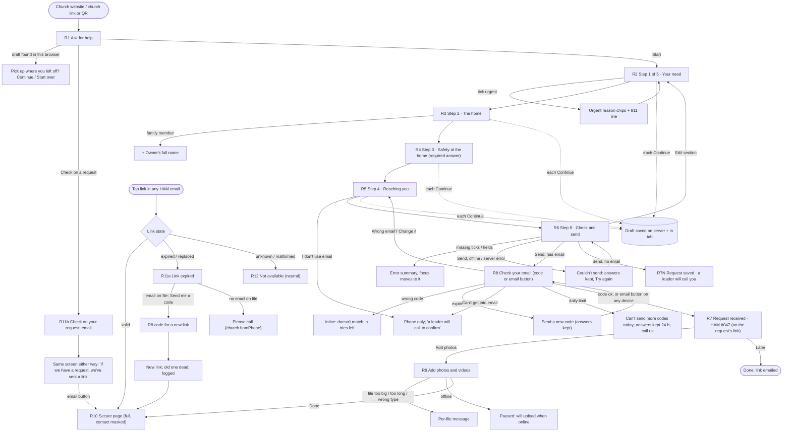
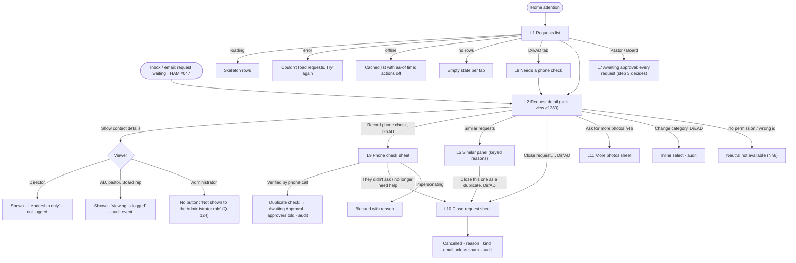

# Intake: asking for help, the secure request page, and leadership intake

Build-order step 2 (Intake). Owner: ham-ux-designer. Revised 2026-09-28 after the owner's decisions and the PRD guardian's review.
Personas: [personas.md](personas.md). Navigation, global states, requester status wording and the access table: [navigation.md](navigation.md) (cited as **N§n**). Sign-in patterns reused here: [auth-and-access.md](auth-and-access.md) (**AA§x**). Lessons from [reviews/step1-usability.md](reviews/step1-usability.md) are applied throughout (messages on public pages, prefill that survives errors, no raw codes in copy, local times). Components: `design-system/components.md` (**C§n**); patterns: `design-system/patterns.md` (**P§n**). Architecture: `docs/architecture/intake.md` (its **Owner decisions and reconciliation** box wins where the two differ).

Implements PRD §3.1, §3.4, §4.1, §5, §6, §6.1, §6.2, §7.1–§7.3, §8 (hand-off only), §9, §10 (capture and alerts), §35 (requester notices), §39 (hazard disclosure), §45, §46, §52 (Submitted, Awaiting Approval, Cancelled), §58, §60.3, §63, §68, §70.4, §77 steps 1–3.

Question IDs are the final numbers in `docs/prd-open-questions.md` (Q-099 to Q-132 replace this spec's earlier draft numbers Q-110 to Q-129; the mapping is in §12.4).
- **Decided and used:** Q-004, Q-007, Q-008, Q-009, Q-019 (email codes only), **Q-024** (PII reveals logged for everyone except the HAM Director), **Q-025** (no-email path with a phone check), Q-026 (`{church.*}` copy), Q-030 (church time zone), Q-032, Q-033 (no sign-in tokens in notification emails), Q-048, Q-050, **Q-099** (required fields), **Q-100** (verify before submit), **Q-124** (Administrator: view only, contact masked), **Q-127** (retention).
- **Proposed defaults in use (open):** Q-101 to Q-123, Q-125, Q-126, Q-128 to Q-132.

Rule values (code lifetime, tries, link lifetimes, upload limits, draft lifetime) are written `{rules.X}` with the architecture's constant names, because they live in the versioned rules module, never as literals in copy (CLAUDE.md). Sample "today" is **Tuesday, Oct 6, 2026**, America/New_York. All names, addresses and numbers are fictional.

Contents
1. Jobs, personas, devices
2. Key decisions (read this first)
3. User journeys
4. Screen flows
5. Screen specs: requester (R1–R12)
6. Screen specs: leadership (L1, L2, L5, L7–L11)
7. Emails and notifications
8. Accessibility
9. Privacy in the UI
10. Success measures
11. Data assumptions (reconciled with the architecture)
12. PRD trace, question references, new gaps, later additions

---

## 1. Jobs, personas, devices

| Area | Job to be done | Primary persona | Also | Device and context |
|---|---|---|---|---|
| Ask for help (R1–R6) | "Tell the church what's wrong with my home without feeling judged, and know what happens next." | Doris, 74, requester | Her daughter Angela (authorized family member); Deacon James, helping his neighbor Mrs. Hall fill it in | Older Android phone, large font, spotty Wi-Fi, maybe stressed. Angela on her laptop at work |
| Confirm my email and send (R8 → R7) | "Prove it's me so my request actually reaches them." | Doris | Angela (code arrives on her phone, form is on her laptop) | Switching to the Mail app is the riskiest moment in the whole flow |
| Ask without email (R5 → R7N) | "I don't do email. Can I still ask?" | Mrs. Ruth Hall, 81, landline only | Deacon James | Phone, often with someone helping |
| Add photos (R9) | "Show them the leak so they understand." | Doris | Angela | Phone camera, in the bedroom with the leak |
| Check on my request (R10) | "Where does my request stand? Do they need anything from me?" | Doris | | Taps the link in any HAM email, days later |
| Get back in (R11) | "The old link doesn't work. Let me back in without calling anyone." | Doris | | Phone, weeks or months later |
| Phone check (L8, L9) | "Call the people who asked without email, confirm it was really them, and let their request move on." | Marcus, HAM Director | Andre (Assistant Director) | Desktop at home in the evening, or phone in hand; must be able to dial from the screen |
| Keep intake clean (L1, L2, L5, L10) | "See what came in, spot repeats and spam, close only what's clearly spam, withdrawn or sent twice." | Marcus | Andre | Desktop, 10 minutes a few evenings a week |
| Hand-off to approvers (L7) | "Show me every request waiting for a decision." | Pastor Ruth (phone) | Elder Samuel, Board rep (laptop) | The decision screens themselves are step 3 |
| Oversight (L1, L2 read-only) | "See that intake is working without seeing anyone's contact details." | Administrator | | Desktop |

---

## 2. Key decisions (read this first)

1. **Need first, then home, then contact.** The form opens on "What's going on?" because that is why the person came. 5 short steps, then a review (P§5).
2. **Three relationship choices, the PRD's own (Q-105):** *I own it* · *I rent it* · *It's a family member's home*. Someone filling it in for a friend or neighbor answers **for** that person; the resident is the requester. A helper's email may be used for updates (Q-025).
3. **Verify before submit (Q-100).** Form → **Send request** → "Check your email" (6-digit code, or tap the button in the email) → **Request received**. Nothing reaches leaders until the code is used (§77 order, and it stops most spam).
4. **Answers are never lost at the code step.** The unfinished form is saved on HAM's server as the person goes (encrypted, erased after `{rules.INTAKE_DRAFT_LIFETIME}`, 24 h, Q-127) **and** kept in the browser tab. A wrong, expired or locked code, a typo in the email, or a dropped connection only affects the code, never the answers.
5. **"I don't use email" is an explicit choice (Q-025).** A phone number is always required. With no email, the request is **saved** straight away (no code), the person is told a HAM leader will call to confirm before it goes further, and it waits in the Director/AD **Needs a phone check** list (L8). A **Verified by phone call** action (L9, audited) releases it to the approvers. Updates go by phone; photos are taken at the site visit. The owner accepts this departs from §6.1's "email" minimum.
6. **No triage or routing (Q-106).** Once verified, Submitted → Awaiting Approval happens automatically after the duplicate check. All pastors and the Board rep see every awaiting request (§4.3, §8). The old routing sheet (L3) is gone.
7. **A category question is asked** ("What kind of help?", one tap, "Something else or not sure" allowed, Q-109). No AI.
8. **Urgent is one tick-box, unticked by default,** with a required reason chip (§10). Ticking it shows the 911 line. Once verified, pastors are alerted right away.
9. **Hazards are a required answer** with an explicit "None that I know of" (§39, Q-113). Nothing is held at intake.
10. **Two tick-boxes to certify, versioned (Q-103).** (a) the property-authority statement worded by relationship (§6.2); (b) HOA/landlord responsibility + "true to the best of my knowledge". The request stores the version and statement codes. Owner (ideally church counsel) reviews the wording before launch.
11. **The secure page opens in full from the link (Q-101), with contact details masked.** No second code on each device. Every requester email carries the link (Q-102) under a neutral subject.
12. **Leadership lists show HAM # and category only (Q-132).** No name, street, neighborhood or ZIP. Contact details sit behind a deliberate **Show contact details** button on the detail view, logged for everyone except the Director (Q-024). There is no hover-card reveal on lists (N§8.6 updated).
13. **Duplicates use keyed matches only (Q-115):** Same address · Same phone · Same email · Same name and ZIP. Reasons are shown, never a score, never to the requester (§9). No description matching, no "Not related" dismiss.
14. **Leaders close before a decision only for three reasons (Q-107):** spam or test · the requester withdrew · the same request sent twice. Need or eligibility always goes to the approvers (§5, §8.3). No merging.
15. **The Administrator sees Requests read-only, contact details masked, no reveal (Q-124).**
16. **One number for life (Q-126).** "HAM #047" stays the same from request to project.

---

## 3. User journeys

### 3.1 Doris asks for help on her phone (the main path)
Church website "Need help at home?" → **R1 Ask for help** → **Start** → **R2 Your need**: taps *Roof or ceiling*, dictates "Water comes through my bedroom ceiling when it rains…" → **Continue** → **R3 The home**: *I own it*, address, *House* → **R4 Safety**: *Dogs or other animals* → **R5 Reaching you**: name, phone, email, *Any time works* → **R6 Check and send**: ticks two boxes → **Send request** → **R8 Check your email**: "Your answers are saved" → opens Mail, copies the code (or taps **Confirm my email** in the message) → **R7 Request received**: "Thank you, Doris. Your request number is HAM #047" → **Add photos** → **R9**: 4 photos → **Done**.
- *Hesitation:* "Will this cost me?" (R1: no cost to ask; costs are discussed before any work) · "Is my problem big enough?" (R2 helper: "Big or small, tell us") · "Why do they need my email?" (helper: "We'll send you a code to confirm it's you, then updates and a link to check on your request").
- *Wait:* the code email. R8 says it can take a minute; Resend after `{rules.SIGN_IN_RESEND_COOLDOWN}`.
- *Give-up points and mitigations:*
  - Leaving for the Mail app: the answers are saved on HAM's server; the email's button works even if she never comes back to this tab.
  - Typo in the email: "Wrong email? Change it" on R8 returns to that one field with everything kept.
  - Weak signal: Continue keeps working (answers kept in the tab and synced when back online); Send waits with "Try again".
  - Can't get into her email: R8 offers "Choose 'I don't use email' instead" (§3.3 path).

### 3.2 Angela asks for her mother's home (authorized family member, §6.2)
Same path. On R3 she picks *It's a family member's home* → one extra field: "Owner's full name" (Doris Pennington). R5 labels switch to "Your name / your phone", with helper text: "We'll contact you about this request and arrange visits with you." The R6 authority tick reads: "Doris Pennington owns this home and has asked me to request this help." The code goes to Angela's email; she can type it on her laptop or tap the email button on her phone (either device works).

### 3.3 Mrs. Hall doesn't use email (Q-025)
Deacon James sits with Mrs. Hall and fills it in **for her** (R3 intro: "Filling this in for someone? Answer for them."). She owns the home → *I own it*. On R5 he enters **her** name and landline and ticks **I don't use email** → "That's OK. A HAM leader will call you to confirm your request before it goes further." Preference switches to Phone call. In the optional note he writes "My neighbor James Carter helped me fill this in." On R6 he reads both statements to her and she ticks them → **Send request** → **R7N Request saved**: "A HAM leader will call you at (305) 555-0177 to confirm it's you who asked." No code, no photos, no link.
- Alternative: James uses **his own** email with her OK (Q-025, Q-105). Then it's the normal path: the code goes to James, and updates and the link go to James.
- Marcus sees it in **Needs a phone check** (§3.7).

### 3.4 Doris checks her request a week later
Any HAM email → **Open my request page** → **R10**: "Our pastors or Board are reviewing your request." · Things we need from you: none · her request summary with photos · contact details masked (d•••@gmail.com, •••-0142) · how to reach us. No extra code.

### 3.5 Doris's link has expired (§7.3)
Eight months after completion she taps an old link → **R11a Link expired**: "For your privacy, this link has expired. We can send you a new one to d•••@gmail.com." → **Send me a code** → R8 (code or email button) → new link valid `{rules.REGENERATED_REQUESTER_LINK_LIFETIME}` (14 days); the old link stops working; the event is logged with time and method → she lands on R10, and the new link is also emailed.
- Lost the emails entirely? R1 and R11a have **Check on your request** → enter email → "If we have a request under this email, we've sent you a link" → the email's button opens her page.
- No email on file: R11a shows only "Please call us at {church.hamPhone}. We'll help you right away."

### 3.6 Marcus keeps intake clean
Home attention "1 request came in with an earlier request at the same address" is *not* a to-do: requests move to the approvers by themselves. Marcus opens **Requests → Awaiting approval** when he has time → HAM #049 shows "Earlier request" → **L2** → the Similar panel: "HAM #047 · Same email · Same address · sent yesterday · Awaiting Approval" → it's the same leak sent twice → **Close this one as a duplicate…** (L10, reason preselected) → Doris gets a kind note; #047 carries on.
- A test or spam request: **Close request…** → "This is spam or a test" → no email is sent.
- Doris phones to say her son fixed it: **Close request…** → "The requester asked us to withdraw it" → kind note.

### 3.7 Marcus does a phone check (Q-025)
Home attention card "1 request needs a phone check · waiting 1 day" → **L8 Needs a phone check** → HAM #050 · Ramps, rails or grab bars → **L2** → **Record phone check** (primary) → **L9** sheet reveals the contact details for the call (a logged reveal for Andre, not for Marcus) → taps **Call (305) 555-0177** → "Hello, this is Marcus from the Home Assistance Ministry at {church.name}…" → Mrs. Hall confirms → ticks "I spoke with Ruth Hall and she confirmed she asked for this help" → **Verified by phone call** → toast "Verified by phone call · 7:52 PM" → the duplicate check runs → the request moves to Awaiting Approval and the approvers are told.
- *No answer:* Marcus closes the sheet; the request stays on the list with its age. (Recording call attempts is a gap, §12.3 G2.)
- *"I didn't ask for anything":* **They didn't ask for this** → L10 with "spam or a test" preselected.
- *"My son fixed it":* **They no longer need help** → L10 with "withdrew" preselected.
- *Urgent no-email request:* Marcus and Andre get an urgent alert because pastors can't see it until someone calls (§12.3 G1).

### 3.8 An urgent request at 8 PM
Doris ticks *This is urgent* → reason *Water is coming in or damage is getting worse* → Send → code → **R7**: "Because this is urgent, we've let our pastors know right away. If anyone is in danger, call 911." → duplicate check → **Awaiting Approval** with the Urgent chip → all pastors get "Urgent request needs a pastor · HAM #048" (email + in-app, regardless of preference, §10, §35, Q-123) → Marcus and Andre see it as an awareness row (N§8.3 group 4). Certification is step 3.

### 3.9 Pastor Ruth and Elder Samuel (hand-off only)
They see **Requests → Awaiting approval**: every awaiting request, urgent first (Q-106), and a Home card "2 requests waiting for a decision". Opening one shows L2 read-only with the similar-request panel and the masked contact block (their reveal is logged, Q-125). Approve, reject and certify are step 3.

---

## 4. Screen flows

### 4.1 Requester



### 4.2 Leadership



---

## 5. Screen specs: requester (R1–R12)

Screen IDs are kept from the first draft so references stay stable. The order is now R6 → **R8 (verify)** → **R7 (received)**.

**Layout conventions for every requester screen** (P§1, P§5, AA§4): no nav; app bar with the church logo only; single column at `--ham-size-form-max`; `body-lg` text; `control-lg` inputs and buttons; 32px status chips. On mobile the primary button sits in a sticky bottom bar with **Back** (Ghost) to its left from step 2 on. On tablet (768) the column is centered with the same bar. On desktop (≥1024) a left step list (completed steps clickable) + the form column + a right "Good to know" panel with what happens next and the ministry phone and email. No marketing panel. Reading level target: US grade 6.

**Answers are saved as you go (Q-100, Q-127).**
- Each **Continue** saves that step to a server-side draft: encrypted, tied to this browser session (the draft ID is in the session, never in the web address), erased after `{rules.INTAKE_DRAFT_LIFETIME}` (24 h), and never visible to leadership.
- A copy is also kept in this tab's session storage, so a reload or a dropped connection never loses answers. If Continue happens offline, the step is kept in the tab and saved to the server when the connection returns ("Saved on this device. We'll finish saving when you're back online.").
- **Coming back:** if a draft exists in this browser, R1 shows "You started a request on this browser. **Continue it** · **Start over**". The prompt itself shows no details (a shared computer). Continue restores every answer at the step where the person stopped.
- After the request is sent (email confirmed, or saved on the no-email path), or on **Start over** (confirm first), both copies are erased. Session storage, not local storage, so answers don't linger on a library computer after the tab closes.
- A small, quiet line under the step heading: "Your answers are saved." (announced once, §8).

**No time limits.** The form has no timeout. If the server form token has expired at Send, the page re-renders with every answer kept: "Please tap Send request again." If the server draft has expired (over 24 h) but the tab still has the answers, Send simply creates a new draft; nothing is lost while the tab is open.

### R1. Ask for help (start)
- **Purpose:** Build trust, set expectations, route emergencies and returning requesters.
- **Primary action:** **Start** (lg, full width). With a draft in this browser: **Continue my request** becomes primary and **Start over** is a Link.
- **Content (priority order):** logo + "Home Assistance Ministry · {church.name}" → h1 "Ask for help with your home" → 3 short lines: who we are, no cost to ask, how long it takes → emergency line (inline `attention` alert) → what you'll need (address, a phone number, and an email if you have one) → **Start** → Link "Already asked? **Check on your request**" → "Prefer to talk? Call {church.hamPhone}."
- **Prefill:** a church link or QR (`/request-help?c=CODE`, Q-114) records its source silently. No field appears. An unknown or retired code never blocks anyone.

```
┌──────────────────────────────────────┐
│ [church logo]                        │
├──────────────────────────────────────┤
│ Home Assistance Ministry             │
│ {church.name}                        │
│                                      │
│ Ask for help with your home          │  h1
│ Our church's men's ministry helps    │
│ with repairs and safety work for     │
│ people who can't manage it alone.    │
│ Anyone may ask. There's no cost to   │
│ ask.                                 │
│                                      │
│ ⚠ In danger right now? Fire, a gas   │  attention alert, not dismissible
│   smell, sparking wires or flooding: │
│   call 911 first.                    │
│                                      │
│ Takes about 5 minutes. Have your     │
│ address and a phone number ready.    │
│ We'll email you a code to confirm    │
│ it's you. No email? That's OK too.   │
│                                      │
│ Already asked? Check on your request │  Link
│ Prefer to talk? Call (305) 555-0100  │  tel: link
├──────────────────────────────────────┤
│ ┌──────────────────────────────────┐ │
│ │             Start                │ │  Primary lg, sticky
│ └──────────────────────────────────┘ │
└──────────────────────────────────────┘
```
- **768:** same, centered, button inline. **1280:** column 560px centered; right panel "What happens after you ask" (the steps from R7) so people can read ahead.

### R2. Step 1 of 5 · Your need
- **Purpose:** Capture the need in the person's own words (§6.1 description, urgency, justification; §5 genuine need, asked gently).
- **Primary action:** **Continue**.

| Field | Required | Control | Notes |
|---|---|---|---|
| What kind of help? | Yes (Q-109) | Radio cards, 2 columns at 390: Roof or ceiling · Plumbing or water · Electrical · Doors, windows or locks · Floors or stairs · Ramps, rails or grab bars · Painting or walls · Yard or outside · Something else or not sure | One tap. Leaders can change it later (audited) |
| Tell us what's happening | Yes | Textarea, auto-grow, 5 rows, no minimum, soft max 2,000 chars (counter appears at 1,800) | Helper: "What's wrong, where in the home, and how long it's been like this. If it's hard for you or your family to take care of it, you can tell us why." + "Tip: tap the microphone on your keyboard to speak instead of typing." |
| This is urgent | No (unticked) | One checkbox card | Ticking reveals the next two fields and the 911 alert |
| Why is it urgent? | Yes if urgent | Radio chips: Someone could get hurt · Water is coming in or damage is getting worse · No power, water, heat or cooling · Can't get in or out of the home safely · Something else | §10 examples in plain words |
| Anything else about why it's urgent? | No; **required only for "Something else"** | Textarea 2 rows | |

```
┌──────────────────────────────────────┐
│ [logo]                               │
├──────────────────────────────────────┤
│ Step 1 of 5 · Your need              │
│ ▓▓▓░░░░░░░░░░░░░                     │
│ What's going on?                     │  h1
│ Your answers are saved.              │  quiet caption
│                                      │
│ What kind of help?                   │  fieldset legend
│ ┌────────────────┐┌────────────────┐ │
│ │◉ Roof or       ││○ Plumbing or   │ │  56px min cards
│ │  ceiling       ││  water         │ │
│ └────────────────┘└────────────────┘ │
│  … 7 more …                          │
│                                      │
│ Tell us what's happening             │
│ What's wrong, where in the home, and │
│ how long it's been like this…        │
│ ┌──────────────────────────────────┐ │
│ │Water comes through my bedroom    │ │
│ │ceiling when it rains. It started │ │
│ │in August…                        │ │
│ └──────────────────────────────────┘ │
│ 🎤 Tip: tap the microphone on your   │
│ keyboard to speak instead of typing. │
│                                      │
│ ┌──────────────────────────────────┐ │
│ │ ☐ This is urgent                 │ │
│ │   It's unsafe or getting worse   │ │
│ │   quickly.                       │ │
│ └──────────────────────────────────┘ │
├──────────────────────────────────────┤
│ [ Start over ]  ┌──────────────────┐ │  Start over = Ghost, confirm first
│                 │    Continue      │ │
│                 └──────────────────┘ │
└──────────────────────────────────────┘
Urgent ticked:
│ ⚠ If anyone is in danger right now,  │
│   call 911 first.                    │
│ Why is it urgent?                    │
│ ○ Someone could get hurt             │
│ ◉ Water is coming in or damage is    │
│   getting worse                      │
│ ○ No power, water, heat or cooling   │
│ ○ Can't get in or out safely         │
│ ○ Something else                     │
│ Anything else about why? (optional)  │
```

### R3. Step 2 of 5 · The home
- **Purpose:** Where the work is and who has authority (§6.1 address, property type, relationship; §6.2).
- **Primary action:** **Continue**.
- **Intro line (all):** "Filling this in for someone else? Answer for them." (Q-105)

| Field | Required | Control | Notes |
|---|---|---|---|
| Whose home is it? | Yes | 3 radio cards: **I own it** · **I rent it** · **It's a family member's home** (Q-105) | Drives R5 labels and R6 wording |
| Owner's full name | Yes if family member | Text | Helper: "The person who owns the home." §6.2 |
| Street address | Yes | Text, `autocomplete="address-line1"` | No third-party address lookup: the address stays inside HAM (§3.4). Browser autofill is fine |
| Apartment or unit | No | Text, `address-line2` | Label "(optional)" |
| City | Yes | Text, `address-level2` | |
| ZIP code | Yes | Text, `inputmode="numeric"`, `postal-code`, 5 digits (ZIP+4 accepted) | |
| State | Prefilled | Shown as text "Florida · Change" from the church profile | Change reveals a select |
| Type of home | Yes | Radio cards: House · Townhouse · Apartment or condo · Mobile or manufactured home · Other (Q-110) | |

- Tenants see an info line under their choice: "Before any work begins, you'll need written permission from your landlord or property owner. You don't need it to ask." (§6.2, Q-104)
- HOA note: shown on R6, not here, to keep this step short.

### R4. Step 3 of 5 · Safety at the home
- **Purpose:** Disclose known hazards so nobody is hurt (§39 "must disclose", Q-113). The copy says it protects everyone, so it doesn't feel like a trap.
- **Primary action:** **Continue**.
- **Question (required):** "Is there anything at the home our volunteers should know about?" Checkbox cards with icons, 2 columns at 390, 3 at ≥768: **Dogs or other animals** · **Mold** · **Exposed or damaged wiring** · **Sagging floors, roof or stairs** · **Pests (bees, rodents, insects)** · **Something else** → then a separate full-width card **None that I know of** (mutually exclusive: ticking it clears the others and vice versa, with a polite status message).
- Required: at least one card, so "None that I know of" is a real answer, never a skipped question. Error: "Please choose at least one, or 'None that I know of'."
- "Tell us more (optional)" textarea appears once any hazard is ticked. Required only for "Something else".
- Helper: "This keeps everyone safe, including you. It won't stop us from helping."
- Nothing is put on hold at intake (Q-113); hazards are carried into the site assessment.

### R5. Step 4 of 5 · Reaching you
- **Purpose:** Contact and visiting times (§6.1 name, email, mobile phone, preferred method, availability).
- **Primary action:** **Continue**.
- Labels: *own/rent* → "Your …"; *family member's home* → "Your …" (the family member is the requester) with the helper "We'll contact you about this request and arrange visits with you."

| Field | Required | Control | Notes |
|---|---|---|---|
| Your name | Yes | Text, `autocomplete="name"`, one field (no first/last split) | |
| Phone number | Yes | `type="tel"`, `autocomplete="tel"`; accepts any US format | Helper: "A mobile number is best, but any number where we can reach you works." Landline accepted (V1 has no SMS, §75, Q-111) |
| Email | Yes, unless "I don't use email" is ticked (Q-025) | `type="email"`, typo suggestion from AA§A1 ("Did you mean …@gmail.com?") | Helper: "We'll email you a code to confirm it's you, then send updates and a link to check on your request. You can use a family member's or friend's email if they say it's OK." |
| I don't use email | — | Checkbox directly under the field | Ticking hides Email, sets the contact preference to Phone call (locked), and shows the info line below |
| How should we contact you? | Yes, **prefilled** | Radio: **Email** · **Phone call** (Q-111). Prefilled Email when an email is given | Helper: "HAM's automatic messages always come by email." (no-email: hidden) |
| When could someone visit? | Yes | Chips (multi): the **days HAM serves** from the church profile (Q-112; default Sunday–Friday for {church.name}) + Mornings · Afternoons; plus a single **Any time works** chip | |
| Anything else about reaching you or visiting? | No | 2-row text | Helper: "For example, the best time to call, or who helped you fill this in." (Q-105: a helper can note their name here) |

- **"I don't use email" info line** (`info` tone): "That's OK. A HAM leader will call you to confirm your request before it goes further. We'll keep you updated by phone and take any photos we need when we visit."
- Days never include a day the church profile doesn't list; there is no Saturday chip for this church unless the profile adds it.

### R6. Step 5 of 5 · Check and send
- **Purpose:** Review, certify authority (§6.2), send.
- **Primary action:** **Send request**.
- **Content:** h1 "Check and send" → summary cards per step (need, home, safety, reaching you), each with **Edit** (returns to that step, then **Back to review**) → the email (or phone, on the no-email path) is shown large with "We'll send a code to this email" / "We'll call this number to confirm", so a typo is caught before sending → certification group (h2 "Please confirm") → privacy line → Send.
- **Certification ticks (both required, versioned, Q-103):**
  1. Authority, worded by relationship:
     - Own: "I own this home, and I give HAM permission to do the work we agree on."
     - Rent: "I rent this home. Before any work begins, I'll get written permission from my landlord or property owner."
     - Family: "**{Owner's name}** owns this home and has asked me to request this help for them."
  2. "If a homeowners' association, condo association, landlord or property manager needs to approve work, I'll get their OK. What I've shared is true to the best of my knowledge."
  - Tip above the ticks (all): "Filling this in for someone? Please read these to them. They're the one agreeing."
  - The request stores the wording version and statement codes with the time they were ticked. Final wording: owner (ideally church counsel) review before launch.
- **Privacy line (no tick):** "Your details stay private inside HAM. Only the people handling your request can see them. [How we use your information]" (church-profile privacy statement, Q-131).
- **On error:** an error summary (`role="alert"`, focused) lists links to each problem; each field keeps its value (AA review M2).
- **Double-send guard:** the button shows a spinner and locks; a repeated submit of the same draft reuses the same code, never a second request.
- **After Send:** with email → R8. Without email → R7N.

```
┌──────────────────────────────────────┐
│ Step 5 of 5 · Check and send         │
│ ▓▓▓▓▓▓▓▓▓▓▓▓▓▓▓▓                     │
│ Check and send                       │  h1
│ ┌──────────────────────────────────┐ │
│ │ YOUR NEED                  Edit  │ │
│ │ Roof or ceiling · Urgent: water  │ │
│ │ is coming in                     │ │
│ │ "Water comes through my bedroom  │ │
│ │ ceiling when it rains…"          │ │
│ └──────────────────────────────────┘ │
│ ┌ THE HOME ──────────────── Edit ┐   │
│ │ I own it · House                 │ │
│ │ 1400 NW Example Ave, Miami 33142 │ │
│ └──────────────────────────────────┘ │
│ ┌ SAFETY ────────────────── Edit ┐   │
│ │ Dogs or other animals: "friendly │ │
│ │ but loud"                        │ │
│ └──────────────────────────────────┘ │
│ ┌ REACHING YOU ──────────── Edit ┐   │
│ │ Doris Pennington · (305) 555-0142│ │
│ │ By email · Visits: any time works│ │
│ │ We'll send a code to:            │ │
│ │ doris.p@gmail.com                │ │  body-lg, bold
│ └──────────────────────────────────┘ │
│ Please confirm                       │  h2
│ ☐ I own this home, and I give HAM    │  48px rows, whole row tappable
│   permission to do the work we agree │
│   on.                                │
│ ☐ If a homeowners' association,      │
│   condo association, landlord or     │
│   property manager needs to approve  │
│   work, I'll get their OK. What I've │
│   shared is true to the best of my   │
│   knowledge.                         │
│ 🔒 Your details stay private inside   │
│ HAM. How we use your information     │
├──────────────────────────────────────┤
│ [ Back ]  ┌────────────────────────┐ │
│           │     Send request       │ │
│           └────────────────────────┘ │
└──────────────────────────────────────┘
```
- **1280:** left step list with ✓ on completed steps; summary cards in a 2×2 grid; certification and Send full width below.

### R8. Check your email (verify before submit, Q-100; also used for new links)
- **Purpose:** Prove the person controls the email (§7.1, Q-019) with the least friction, before the request reaches leaders.
- **Primary action:** **Confirm** (the code field auto-submits at the 6th digit).
- **Reuses AA§A2:** single code field (`inputmode="numeric"`, `autocomplete="one-time-code"`, paste and spaces OK). Code valid `{rules.SIGN_IN_CODE_LIFETIME}`, `{rules.SIGN_IN_CODE_MAX_ATTEMPTS}` tries. Resend after `{rules.SIGN_IN_RESEND_COOLDOWN}` with visible "You can resend in 0:24" text (not announced every second).
- **Content (intake):** step label "Last step" → h1 "Check your email" → "Your answers are saved. To send your request, enter the 6-digit code we sent to **doris.p@gmail.com**." (shown in full: she just typed it) → "Or tap **Confirm my email** in that message. It works on any phone or computer." → code field → **Confirm** → **Resend code** → Link "Wrong email? **Change it**" → "Didn't get it?" disclosure.
- **"Didn't get it?"** Check spam or junk; the sender is "{church.shortName} HAM"; it can take a minute. "Can't get into your email? **Choose 'I don't use email' instead**, and a HAM leader will call you." Still stuck: call {church.hamPhone}.
- **Change it:** returns to R5 with focus on Email and every answer kept; Continue → R6 → Send issues a new code; the old code stops working.
- **Confirmed from another device** (email button tapped on her phone while the form is on her laptop): the button opens a "Confirm your request" page with one **Continue** button (safe from email link scanners), then R7 on that device. The original tab notices when it regains focus and moves to R7 as well.
- **Content (new link, from R11a):** h1 "Check your email" → "We sent a code to **d•••@gmail.com**." (masked: the viewer only holds an old link) → same field and help.
- **Never loses work:** expiry or too many tries affects only the code. Answers stay in the draft and the tab.
- **Recording:** a successful code (or button) records the verification on the request with method (`email_code` / `email_link`) and UTC time (§7.3, §58), then submits.

### R7. Request received (after verification)
- **Purpose:** Reassure, give the number, say what happens next, and invite photos while the person is still at home with their phone.
- **Where it lives:** R7 is the secure request page (R10) at the request's own link, opened in "welcome" mode, so bookmarking or refreshing it keeps working.
- **Primary action:** **Add photos** (no further code: the email was just confirmed).
- **Content:** success icon + h1 "Thank you, {first name}. We've received your request." → "Your request number is **HAM #047**." → *(urgent)* "Because this is urgent, we've let our pastors know right away. If anyone is in danger, call 911." → "What happens next" (numbered) → "We've emailed a link to this page to d•••@gmail.com so you can check on your request anytime." → **Add photos** block: "Photos help us understand the work. You can add up to {rules.REQUESTER_MEDIA_BATCH_MAX_PHOTOS} photos and {rules.REQUESTER_MEDIA_BATCH_MAX_VIDEOS} short videos." → Link "I'll add photos later" → then the rest of R10 below.
- **What happens next (normal):** 1. "Our pastors or Board review your request, usually within a few days." (Q-130; remove "usually within a few days" if the owner prefers no time wording) 2. "If it's approved, someone from HAM will call you to arrange a visit to look at the work."
- **What happens next (urgent):** 1. "A pastor reviews urgent requests as soon as they can." 2. "If it's approved, HAM's leaders will contact you quickly to arrange a visit."
- The draft is erased the moment the request is received.

### R7N. Request saved (no email, Q-025)
- **Purpose:** Reassure someone without email that the request is safely with HAM, and that a call is coming.
- **Primary action:** none. A Secondary **Done** returns to R1 (and clears the page for the next person on a shared device).
- **Content:**
```
┌──────────────────────────────────────┐
│ [church logo]                        │
├──────────────────────────────────────┤
│ ✓                                    │
│ Thank you, Ruth. We've saved your    │  h1 (focused)
│ request.                             │
│                                      │
│ Your request number is HAM #050.     │  body-lg, bold
│ Please write it down.                │
│                                      │
│ What happens next                    │  h2
│ 1. A HAM leader will call you at     │
│    (305) 555-0177 to confirm it's    │
│    you who asked. This usually       │
│    happens within a few days.        │  (Q-130 wording)
│ 2. After that call, our pastors or   │
│    Board review your request.        │
│ 3. If it's approved, we'll call you  │
│    to arrange a visit. We'll take    │
│    any photos we need when we visit. │
│                                      │
│ The call may come from a number you  │
│ don't know. Missed it? Call us at    │
│ (305) 555-0100 and give your request │  tel: link
│ number.                              │
│                                      │
│ (urgent) Because you said this is    │
│ urgent, our leaders will call you as │
│ soon as they can. If anyone is in    │
│ danger, call 911.                    │
├──────────────────────────────────────┤
│ ┌──────────────────────────────────┐ │
│ │              Done                │ │  Secondary lg
│ └──────────────────────────────────┘ │
└──────────────────────────────────────┘
```
- The phone number is shown in full because the person just typed it on this screen's session; it is never shown again on a public surface. If it's wrong, the "Missed it? Call us" line is the fix (no edit after saving).
- No photo block, no link line, no secure link in step 2 (§12.3 G4).
- The draft is erased the moment the request is saved.

### R9. Add photos and videos
- **Purpose:** Initial media batch (§45): up to `{rules.REQUESTER_MEDIA_BATCH_MAX_PHOTOS}` photos, `{rules.REQUESTER_MEDIA_BATCH_MAX_VIDEOS}` videos, each video up to `{rules.REQUESTER_MEDIA_MAX_VIDEO_DURATION}` (limits Q-119).
- **Who:** any holder of a valid link on a request whose email was confirmed (§7.1 is met at intake). No extra code.
- **Primary action:** **Done** (enabled at any time; uploading continues in the background).
- **Content (P§8):** h1 "Add photos" → limits line before picking → **Take a photo** (Primary-style tile, opens camera) + **Choose from my phone** (Secondary) → 160px dashed drop zone on desktop → thumbnail grid (3-up at 390, 5-up at 1280) with per-file progress, **Retry**, and 48px **Remove** ("Remove photo 3"; the requester may remove their own items while the batch is open, Q-118) → counter "4 of 10 photos · 0 of 3 videos" → helpful line "Try one photo from a distance and one up close."
- **States:** uploading (progress per file, `aria-live="polite"` summary "3 of 4 uploaded"); offline (`cloud-off` + "Paused. We'll keep going when you're back online. Keep this page open."); file failed; limit reached (picker disabled with the reason as text); video too long; wrong type; too large; processing ("Getting your video ready…"); batch closed ("Photo uploads are closed for now. If HAM needs more, we'll ask.").
- **Done state:** "Thank you. Your photos are with your request." then R10.
- Media consent for public use (§48) is not asked here. The screen says: "Only the people handling your request will see these."

### R10. Secure request page (§7.2, §60.3, Q-101)
- **Purpose:** One page to know where things stand and do anything HAM needs. No nav, no account (N§5).
- **Access:** the link opens the full page. There is no per-device code. Contact details are masked on the page (a forwarded link or a shared screen doesn't expose them): email `d•••@gmail.com`, phone `(•••) •••-0142`, and the street line shown as "Street address on file" with city and ZIP (see §12.3 G5). The page sends no-store and no-referrer headers.
- **Page order (mobile):** 1 greeting ("Hi {first name}") + number → 2 status card (chip + plain sentence + "What happens next") → 3 Things we need from you (0–n action cards) → 4 Schedule (once scheduled) → 5 Your request (category, description, urgent reason, hazards, home type, city/ZIP, visit times, photos, masked contact) → 6 How to reach us (Q-007) → 7 footer: "No longer need help? Call us at {church.hamPhone} and we'll close your request." (no self-withdraw, Q-108) · "This link works until 7 days after your project is finished." (local date once known).
- **Primary action:** the first action card's button; if there are none, no primary.
- **Step-2 action cards:** **Add photos** (while the initial batch is open, Q-118) · **HAM would like a few more photos** (a reopened batch, §46, with the leader's reason in plain words). **Answer a question from HAM** is a step-3 card.

**What the requester sees, by status (intake rows; the full table is N§5):**

| §52 status (staff) | Status chip (requester) | Sentence | Things we need from you |
|---|---|---|---|
| Submitted (the brief duplicate check) | Received | "We've received your request." | Add photos (if none and the batch is open) |
| Awaiting Approval | Being reviewed | "Our pastors or Board are reviewing your request." (never names who) | Add photos (while open) |
| Awaiting Approval + Urgent | Being reviewed · Urgent | "Because it's urgent, a pastor is looking at it first." | — |
| Cancelled (requester withdrew) | Closed | "As you asked, we've closed this request. You're always welcome to ask again." + **Ask for help again** | — |
| Cancelled (sent twice) | Closed | "We already have this same request from you, so we closed this copy. Your other request is still open. If that's not right, please call us." | — |
| Cancelled (spam or test) | Closed | "This request has been closed." | — |
| Approved → later | per N§5 | per N§5 | per later steps |

**Never shown to the requester (§9, §67, §68, Q-029):** the similar-request alert or any other request; internal notes; approver names before a decision; who revealed their details; volunteer names beyond the Project Leader's first name and arrival window once Scheduled (Q-029 proposed default); reliability scores; budget internals beyond their own share (§13); the audit trail.

```
┌──────────────────────────────────────┐
│ [church logo]                        │
├──────────────────────────────────────┤
│ Home Assistance Ministry             │
│ Hi Doris                             │
│ Your request · HAM #047              │  h1
│ ┌──────────────────────────────────┐ │
│ │ (✓ Being reviewed)               │ │  32px chip, icon + word
│ │ Our pastors or Board are         │ │
│ │ reviewing your request.          │ │
│ │ What happens next: if it's       │ │
│ │ approved, someone from HAM will  │ │
│ │ call you to arrange a visit.     │ │
│ └──────────────────────────────────┘ │
│ THINGS WE NEED FROM YOU (1)          │  h2
│ ┌──────────────────────────────────┐ │
│ │ Add photos of the problem        │ │
│ │ They help us understand the work.│ │
│ │ ┌──────────────────────────────┐ │ │
│ │ │         Add photos           │ │ │  Primary lg
│ │ └──────────────────────────────┘ │ │
│ └──────────────────────────────────┘ │
│ YOUR REQUEST                         │  h2
│ Roof or ceiling · Sent Oct 6         │
│ "Water comes through my bedroom      │
│ ceiling when it rains…"              │
│ Safety: dogs or other animals        │
│ House · Miami 33142 · street on file │
│ Visits: any time works               │
│ Contact: d•••@gmail.com ·            │
│ (•••) •••-0142 · by email            │
│ Photos (0)                           │
│ HOW TO REACH US                      │  h2
│ Questions? Call (305) 555-0100 or    │
│ email ham@example.org. We're glad to │
│ help.                                │
│                                      │
│ No longer need help? Call us and     │  small
│ we'll close your request.            │
│ This link works until 7 days after   │
│ your project is finished.            │
└──────────────────────────────────────┘
```
- **768:** same column, centered. **1280:** two columns inside a 960px container: left = status, things we need, schedule; right = your request, how to reach us. Still no nav.

### R11. Link expired, and Check on your request (§7.3)
- **R11a Link expired** (past its end, or replaced by a newer link): h1 "This link has expired" → "For your privacy, request links stop working after a while. We can send you a new one." → "We'll send a code to **d•••@gmail.com**." → **Send me a code** → R8 (code, or the button in the email) → new link; the old one stops working; the event is logged with UTC time and method (Q-116, Q-117). The person lands on R10 and the new link is emailed. Same screen for "expired" and "replaced" (AA§A3 reasoning).
  - No email on file: "Please call us at {church.hamPhone}. We'll help you right away." No button.
  - Link "Different email? **Check on your request**".
- **R11b Check on your request** (from R1 or R11a): h1 "Check on your request" → Email field (typo suggestion) → **Email me a link** → a confirmation that is identical whether or not a request exists: "Check your email. If we have a request under **doris.p@gmail.com**, we've sent a link to open it. It can take a minute." → Link "Didn't get it? Call {church.hamPhone}". The email carries one button per matching request (one email each, Q-117); an address with no request gets **no email** (Q-121). Rate limited (`{rules.FIND_REQUEST_PER_IP_PER_HOUR}`), with AA§A5 copy.
- **R11c Link not recognized** (malformed or never existed): the neutral R12.

### R12. Other states (requester)
| State | Behavior | Copy |
|---|---|---|
| Loading | Skeleton of the status card; target ~2 s (§70.2) | — |
| Offline, form | Thin banner; Continue works (kept in the tab, saved to HAM on reconnect); Send disabled with reason | "You're offline. Your answers are saved on this device. You can send your request when you're connected." |
| Offline, secure page | Cached status if any, with as-of time; actions disabled | "You're offline. Showing what we had at 3:12 PM." |
| Send failed | Keep everything; auto-retry once; then inline alert with **Try again** | "We couldn't send your request just now. Your answers are still here. Please try again." |
| Code limit for today | Send disabled; answers kept in the draft and tab | "We can't send more codes to this email today. Your answers are saved for 24 hours on this browser. Please try again later, or call {church.hamPhone}." |
| Draft expired, tab closed (over 24 h) | R1 with no resume prompt | (no message: nothing identifying is kept to say it with) |
| Link not recognized | Neutral page with logo, no request details | "We couldn't open this page. If you asked HAM for help, use the newest email from us, or call {church.hamPhone}." + **Check on your request** |
| Request closed | R10 with the closed sentence; details stay viewable until the link ends | See R10 table |
| HAM down / maintenance | Friendly error page with the ministry phone | "Our request page isn't working right now. Please try again later, or call {church.hamPhone}." |

---

## 6. Screen specs: leadership (L1, L2, L5, L7–L11)

Signed-in app shell (N§3). Desktop is primary for intake work; phone must work for urgent items, phone checks and quick looks.

**Retired from the first draft:** L3 "Send for approval" routing sheet (removed, Q-106) · L4 "Ask the requester a question" and the "Waiting on requester" tab (moved to step 3) · L6 staff phone-in entry (out of scope for step 2; possible later addition, §12.5).

### L1. Requests list
- **Who and tabs (P§3 saved views; each shows its count):**
  - **Director, Assistant Director:** **Needs a phone check** (L8) · **Awaiting approval** · **All**. Default tab: Needs a phone check when it has rows, otherwise Awaiting approval.
  - **Pastors, Board rep:** **Awaiting approval** (every awaiting request, Q-106). Step 3 adds "Decided". They never see requests still waiting for a phone check.
  - **Administrator:** **Awaiting approval** · **All**, view only (Q-124).
- **Purpose:** See urgent and oldest items first; open one.
- **Primary action:** open the top row. No page-header action in step 2.
- **Sort:** urgent first, then oldest first. Age in words: "3 days".
- **Row content (Q-132, ID + category only):** Urgent chip → **HAM #047 · Roof or ceiling** → status chip → age → markers, each icon + word: `copy` "Earlier request" · `image` "4 photos" · `phone` "Updates by phone" (no-email requests) · `phone-call` "Phone check needed". No name, street, neighborhood or ZIP.
- **Filters (desktop bar; mobile sheet):** search by request number; category; status (All tab). Name or address search belongs to global Search for permitted roles (§71) and is not in this bar.
- **Empty states:** Awaiting approval: "No requests are waiting for a decision." · Needs a phone check: "No one is waiting for a call. Everyone who asked without email has been checked." · All: "No requests yet. When someone asks for help, it will show up here." · Filtered: "No requests match. **Clear filters**."

```
1280 · split view (list 400px | detail), Director
┌──────────┬──────────────────────────────────┬──────────────────────────────────────────────────┐
│ SIDEBAR  │ Requests                         │ HAM #047 · Roof or ceiling                       │
│          │ [Needs a phone check 1]          │ (● Awaiting Approval) · Sent Oct 6, 9:14 AM      │
│ ◉ Reqs(1)│ [Awaiting approval 4] [All]      │ Email confirmed Oct 6 · Updates by email         │
│          │ 🔍 Request number   Category ▾   │ With the pastors and Board since Oct 6           │
│          ├──────────────────────────────────┤ ───────────────────────────────────────────────  │
│          │ ⚡Urgent HAM #048 · Plumbing or   │ ⧉ Earlier request found (1)            [View ›] │
│          │   water                          │   HAM #031 · Same address · Completed Mar 2025   │
│          │   Awaiting Approval · 2 h        │ WHAT'S NEEDED                                    │
│          │ ──────────────────────────────── │ "Water comes through my bedroom ceiling when it  │
│          │ ▌HAM #047 · Roof or ceiling      │  rains. It started in August…"                   │
│          │   Awaiting Approval · 3 days     │ SAFETY AT THE HOME                               │
│          │   ⧉ Earlier request · ▢ 4 photos │ ⚠ Dogs or other animals: "friendly but loud"     │
│          │ ──────────────────────────────── │ PHOTOS (4)  [▢][▢][▢][▢]                         │
│          │ HAM #046 · Electrical            │ THE HOME                                         │
│          │   Awaiting Approval · 4 days     │ I own it · House                                 │
│          │ ──────────────────────────────── │ VISITS: any time works · prefers email           │
│          │ HAM #044 · Yard or outside       │ REQUESTER & CONTACT  🔒 Leadership only           │
│          │   Awaiting Approval · 6 days     │ Name, phone, email, street address               │
│          │   ☎ Updates by phone             │                        [Show contact details]    │
│          │                                  │ HISTORY                                          │
│          │                                  │ • Sent by requester (public form) · Oct 6 9:14 AM│
│          │                                  │ • Email confirmed (code) · Oct 6 9:14 AM         │
│          │                                  │ • Awaiting Approval (automatic) · Oct 6 9:15 AM  │
│          │                                  │ [Ask for more photos] [More ▾: Change category,  │
│          │                                  │  Close request…]                                 │
└──────────┴──────────────────────────────────┴──────────────────────────────────────────────────┘
```
- **768:** list full width (cards 1-up); tapping pushes L2 full page. **390:** stacked rows (ID + category line, status + age line, markers line); tabs become a horizontally scrollable tab row with visible counts and overflow cues; filters in a bottom sheet "Filters · 1".

### L2. Request detail
- **Purpose:** Understand the need, check safety and repeats, and do the few intake actions that exist.
- **Header:** ID, category, Urgent chip, status chip, sent time (local), source (public form / church link label), contact state as text: "Email confirmed Oct 6" · "Phone check needed" · "Verified by phone call · Marcus B. · Oct 7", and "Updates by email" / "Updates by phone".
- **Primary action by state (Director/AD):**
  - Submitted, no email, not yet checked → **Record phone check** (L9).
  - Awaiting Approval → none. Banner: "With the pastors and Board since Oct 6." Urgent: "Waiting for a pastor to certify. HAM leadership is told when it's approved." (§10)
  - Cancelled → none. Banner: "Closed Oct 8 · The requester asked us to withdraw it · Marcus B."
- **Content (priority order):** header → **Earlier request** alert (L5), if any → **What's needed** (description; urgent reason) → **Safety at the home** (hazards, `attention` tone; "None that I know of" shown as plain text) → **Photos** (thumbnails; opens a viewer) → **The home** (relationship, property type; tenant reminder "Landlord's written OK needed before work begins", Q-104) → **Visits and contact preference** (includes the optional note) → **Requester & contact** [PII, masked] → **History** (C§16 timeline; certification version shown as "Agreed to intake statements v1 · Oct 6").
- **Masked block (C§18):** label "Requester & contact"; value area `bg.sunken` + lock + "Hidden" + reason "Visible to HAM leadership and approvers." + Ghost **Show contact details** (`eye`). Revealed: name, phone (tap to call on mobile), email, contact preference, street + unit, owner's name (family member). Label after reveal: Director "🔒 Leadership only"; Assistant Director, pastors and Board rep "🔒 Leadership only · viewing is logged" (Q-024, Q-125). One audit event per reveal per request per page view; re-hides on navigation. While impersonating, reveals are always logged with both identities (Q-048).
- **Administrator (Q-124):** the same page read-only. The masked block has **no button**: "Hidden · Not shown to the Administrator role." No Earlier-request panel (§9 limits history to leadership and approvers), no actions. Photos: see §12.3 G6.
- **Secondary actions:**
  - Director, AD: **Ask for more photos** (L11) · More ▾: **Change category** (inline select, audited) · **Close request…** (L10).
  - Pastors, Board rep: **Ask for more photos** (L11). Decision controls are step 3.
- **Mobile 390:** header card → sticky bottom bar with the primary action when there is one → sections as collapsible h2 regions (What's needed and Safety open by default). **1280:** detail pane with a main column (need, safety, photos, history) and a side column (status, source, contact state, visits, masked contact) per P§2.

### L5. Earlier requests (§9, Q-115)
- **Alert** (top of L2, `info` tone, never `danger`): "Earlier request found (n). This doesn't rule anything out. Each request is looked at on its own." (§5, §9)
- **Panel:** for each match: ID · category · date · **why it matched** (chips, only these four: Same address · Same phone · Same email · Same name and ZIP) · outcome with status chip · approval or rejection reason when one exists · **Open** (opens that request in the leadership app; its contact details stay behind its own button, same logging). No score, no percentage, no description comparison, no dismiss.
- **Action (Director, AD):** **Close this one as a duplicate…** → L10 with "The same request sent twice" preselected and the note prefilled "Same as HAM #047" (editable). Nothing is merged or copied between requests.
- **Visible to:** Director, Assistant Director, pastors, Board rep (§9). Never to the requester or the Administrator.

### L7. Hand-off to pastors and the Board rep
- **Home card** (N§3.1 "Home (Decisions)"): "{n} requests are waiting for a decision" · urgent ones as their own card at the top: "Urgent · HAM #048 Plumbing or water · waiting 2 h" [Review].
- **Requests** tab: **Awaiting approval**, every awaiting request (Q-106), urgent first. Rows as L1.
- **Detail:** L2 with the Earlier-request panel, masked contact with logged reveal, and **Ask for more photos**. Decision controls: step 3. 3 taps or fewer from notification to decision is the step-3 target.

### L8. Needs a phone check (Director, Assistant Director; Q-025)
- **Job:** "Call the people who asked without email, confirm it was them, and let their request move on."
- **Where:** an L1 tab and a Home attention card: "{n} requests need a phone check · oldest waiting {age}" [Open]. N§8.3 group 4, actionable, counted. An urgent one gets its own card at the top of the group: "Urgent · HAM #050 needs a phone check before pastors can see it · waiting 3 h" [Call now], plus the app-wide urgent banner (§12.3 G1).
- **Rows (Q-132):** Urgent chip → **HAM #050 · Ramps, rails or grab bars** → "Saved Oct 5 · waiting 1 day" → marker `phone-call` "Phone check needed". Sort: urgent first, then oldest. No name, no phone in the row: the number is revealed on the detail.
- **Visible to:** Director and AD only. Pastors and the Board rep don't see these requests until they're verified. The Administrator sees them read-only under All, masked.
- **Empty:** "No one is waiting for a call. Everyone who asked without email has been checked."
- **390:** the same rows; tapping opens L2 with **Record phone check** in the sticky bar.

### L9. Record a phone check (sheet on L2)
- **Primary action:** **Verified by phone call**.
- **Opening the sheet reveals the contact details** it needs (name, phone, contact note). This is a reveal like any other: not logged for the Director, logged for the AD (Q-024), always logged while impersonating.
- **Content:**
```
┌──────────────────────────────────────────────┐
│ Record a phone check · HAM #050         [✕]  │  h2
│ Call the person who asked and confirm they   │
│ made this request. Then record it here.      │
│ 🔒 Leadership only · viewing is logged        │  (AD; Director sees "Leadership only")
│ Ruth Hall · (305) 555-0177                   │
│ Note: "My neighbor James Carter helped me    │
│ fill this in."                               │
│ ┌──────────────────────────────────────────┐ │
│ │   ☎ Call (305) 555-0177                  │ │  Secondary lg, tel: link
│ └──────────────────────────────────────────┘ │
│ ▸ What to say                                │  disclosure
│   "Hello, this is {your first name} from the │
│   Home Assistance Ministry at {church.name}. │
│   We received a request for help with your   │
│   home, number HAM #050. Did you ask us for  │
│   help? … Is this the best number for us to  │
│   call you with updates?"                    │
│ ☐ I spoke with Ruth Hall by phone, and she   │  required, 48px row
│   confirmed she asked for this help.         │
│ What happens next: HAM #050 goes to the      │
│ pastors and Board for review. She won't get  │
│ an email, so please tell her that.           │
│ ┌──────────────────────────────────────────┐ │
│ │        Verified by phone call            │ │  Primary
│ └──────────────────────────────────────────┘ │
│ They didn't ask for this ›                   │  Link → L10, "spam or a test"
│ They no longer need help ›                   │  Link → L10, "withdrew"
│ No answer? Nothing to record. It stays on    │
│ the list so you or Andre can try again.      │
└──────────────────────────────────────────────┘
```
- **Result:** toast "Verified by phone call · 7:52 PM"; History "Verified by phone call · Marcus Bell · Oct 7, 7:52 PM"; the audit event records actor, UTC time and method `staff_phone_call` (§58). The duplicate check runs, the request moves to Awaiting Approval, and approvers are told (as for any request; urgent → pastors alerted). The row leaves L8.
- **Blocked while impersonating (Q-025, Q-048):** the button is replaced by "Phone checks can't be recorded while acting as someone else."
- **Not permitted (pastor, Board rep, Administrator):** the action doesn't appear.
- **390:** full-screen sheet; the Call button and the tick sit above the fold; the primary is in the sticky bar.

### L10. Close request (sheet; Director, Assistant Director; Q-107)
- **Primary action:** **Close request**.
- **Fields:** "Why are you closing HAM #049?" (required radio, only these three):
  - **This is spam or a test** (no email is sent)
  - **The requester asked us to withdraw it** (kind email)
  - **The same request was sent twice** (kind email)
- "Note (optional)" textarea, hint: "Don't include names, addresses or personal details." Prefilled "Same as HAM #047" when opened from L5.
- Helper under the radio: "Questions about need or eligibility go to the pastors and Board, not here." (§5, §8.3)
- **Consequence line:** "HAM #049 will be closed. Doris will get a short, kind email." (spam: "No email will be sent.") "This can't be undone."
- **Result:** status Cancelled with the reason; toast "HAM #049 closed · 7:58 PM"; audited. The requester's link keeps working until `{rules.REQUESTER_ACCESS_AFTER_CLOSE}` after closing (Q-116).
- **Blocked while impersonating:** replaced by a reason line.

### L11. Ask for more photos (sheet; Director, AD, pastors, Board rep; §46)
- **Primary action:** **Ask for photos**.
- **Field:** "What would help us?" (required, plain words; the requester sees it on their page and in the email). Hint: "For example: 'A photo of the ceiling from the hallway.' Don't include other people's details."
- **Consequence line:** "Doris gets an email and a card on her request page to add up to {rules.REQUESTER_MEDIA_BATCH_MAX_PHOTOS} more photos."
- **No-email request:** the action is shown disabled with the reason: "Ruth doesn't use email. We'll take photos at the visit."
- **Result:** toast; audited (`request_media.batch_opened` with reason); the person who asked gets an in-app update when the first new photo arrives.

### L-states (all leadership screens)
Loading skeletons; section error with **Try again**; offline cached with as-of time and actions disabled (N§6); neutral not-available for wrong IDs or no permission (no request title shown); impersonation banner (Q-048: reveals while impersonating are always logged with both identities; phone checks and closing are blocked).

---

## 7. Emails and notifications

Sender name "{church.shortName} HAM". **Neutral subjects (Q-102):** subjects and previews carry the request number at most, never a name, address, description, category, hazard, urgency or status that reveals circumstances (§68, N§4). Requester bodies may greet by first name but don't repeat the address or description. **Every requester email carries the request's secure link** as one button, **Open my request page** (Q-102), except the code email, which carries a one-time confirm button instead. Leadership emails deep-link into the app with no sign-in token (Q-033) and contain only HAM #, category, the urgent flag and the link.

| # | To | Trigger | Subject | Body essentials |
|---|---|---|---|---|
| E1 | Person filling in the form | Send (verify before submit) | "Your {church.shortName} HAM code" | "Your code is 482 913. It works for {minutes} minutes. Or tap **Confirm my email**. Didn't ask for this? You can ignore this email." |
| E2 | Requester | Request received (after verification) | "We received your HAM request #047" | "Thank you for reaching out, Doris." → **Open my request page** → what happens next (as R7) → call or email us |
| E2u | Requester | Received, urgent | same | Adds: "Because it's urgent, we've let our pastors know right away. If anyone is in danger, call 911." |
| E3 | Requester | New link (R11a) | "Your new link for HAM request #047" | Code or button first; then "Here's your new link. Your old link no longer works. This link works for 14 days." |
| E4 | Requester | Check on your request (R11b), one per matching request | "Your HAM request #047" | "Here's the link to your request." → **Open my request page**. (No email is sent to an address with no request.) |
| E5 | Requester | More photos asked (L11, §46) | "Update on your HAM request #047" | "We'd like a few more photos: {leader's reason}." → **Open my request page** |
| E6 | Requester | Closed: withdrew | "Update on your HAM request #047" | "As you asked, we've closed your request. You're always welcome to ask again." |
| E7 | Requester | Closed: sent twice | "Update on your HAM request #047" | "We already have this same request from you, so we've closed this copy. Your other request is still open. If that's not right, please call us at {church.hamPhone}." |
| — | Requester | Closed: spam or test | none | |
| — | No-email requester | any | none; updates by phone | |
| L-E1 | Director, AD, pastors, Board rep | Request reaches Awaiting Approval (normal) | "Request waiting for review · HAM #047 Roof or ceiling" | In-app to all four roles; email per each person's preference; no digest (Q-122) |
| L-E2 | All pastors (+ Director, AD in-app) | Urgent request reaches Awaiting Approval | "Urgent request needs a pastor · HAM #048 Plumbing or water" | Pastors: email + in-app regardless of preference (§10, §35, Q-123) |
| L-E3 | Director, AD | No-email request saved | "Phone check needed · HAM #050" | In-app; email per preference. Urgent: email + in-app banner regardless of preference (§12.3 G1) |
| L-E4 | Leader who asked for photos | First new photo arrives | in-app only | "New photos on HAM #047" |

Every requester-facing message also appears on R10. In-app notifications for leadership follow N§4 (Home = to-do, Inbox = log).

---

## 8. Accessibility (WCAG 2.2 AA, §70.4)

- **Structure:** one h1 per screen; step heading format "Step 2 of 5 · The home" in text (not dots only); R8 is labelled "Last step". On Continue/Back, focus moves to the new step's h1 and the document `<title>` updates ("Step 2 of 5 · The home · Ask for help · {church.shortName} HAM").
- **Groups:** every chip/card set is a `fieldset` with a `legend`; radio cards are real radios, checkbox cards real checkboxes; the whole card is the label. Cards are at least 56px tall; checkboxes 24px inside 48px rows; Back and Continue separated by 8px or more (2.5.8).
- **Required fields:** optional ones say "(optional)" (C§10). Required-ness is never signalled by color or asterisk alone. The hazards question is required and says so in its legend hint ("Choose at least one").
- **Errors:** validate on blur (only after the person leaves a field they typed in) and on Continue. On Continue with errors: an error summary at the top with `role="alert"`, focused, linking to each field; each field gets `aria-invalid` and `aria-describedby` to its message. Messages say how to fix, not just what's wrong (3.3.3). Values are never cleared.
- **No time limits that lose data (2.2.1):** no form timeout; answers saved on the server and in the tab; code expiry never discards answers or photos; server form-token expiry re-renders with answers.
- **Accessible authentication (3.3.8):** the code field allows paste and `autocomplete="one-time-code"`; the email button is an alternative to typing the code; no CAPTCHA (Q-121).
- **Status messages (4.1.3):** "Your answers are saved" is announced once, politely, the first time (not on every Continue). Offline save is announced once. Upload progress summary is `aria-live="polite"`. The R7 / R7N h1 receives focus. The resend countdown is static text updated every 5 s without announcement; when resend becomes available, one polite announcement. L9's success toast is `role="status"`.
- **Mutually exclusive "None that I know of":** when ticking it clears other boxes (or vice versa), a polite message says so ("We cleared 'None that I know of'").
- **Input help:** correct `autocomplete` tokens on name, tel, email and address fields (1.3.5); `inputmode` for ZIP and code.
- **Zoom and large fonts:** everything reflows at 400% / 320 CSS px (1.4.10); 2-column card grids drop to 1 column at large text sizes (container query on card width). Doris's large-font setting must not clip labels.
- **Masked values:** masked email and phone on R10 are read as words ("email ending in gmail dot com, phone ending in 0142"), not as bullet characters, via visually hidden text.
- **Masked block (leadership):** lock + "Hidden" + reason are text; **Show contact details** has an accessible name that includes the request ("Show contact details for HAM #047"); after reveal, focus moves to the revealed region's heading and the logging label is read as part of it. The Administrator's version has no button, and its reason is text.
- **L9 phone check:** the Call button's name is "Call Ruth Hall, (305) 555-0177"; the tick is a real checkbox; when the sheet opens, focus goes to its heading, and Esc or ✕ returns focus to **Record phone check**.
- **Split view:** the detail pane is a labelled region; selecting a row moves focus to its h1; Esc returns to the row (N§8.8).
- **Contrast and color:** chips are always icon + word; hazard cards use icons plus text; Urgent is a chip with an icon, never red text alone.
- **Plain language:** grade-6 target; no jargon on requester screens ("request page", not "portal"; "code", not "OTP"; "being reviewed", not "Awaiting Approval").

---

## 9. Privacy in the UI

| Surface | Requester name | Street address | Phone / email | Description / hazards | Allowed |
|---|---|---|---|---|---|
| Public form (own entry) | ✓ | ✓ | ✓ | ✓ | Their own answers: tab session storage + encrypted server draft (24 h, never shown to leaders) |
| R8 code screen (intake) | — | — | email in full (just typed) | — | same session only |
| R7N saved (no email) | first name | — | phone in full (just typed) | — | same session only; **Done** clears it |
| R10 secure page (link holder) | first name | city + ZIP; street "on file" | masked (d•••@gmail.com, •••-0142) | ✓ | Q-101 |
| L1 lists, Home attention, pipeline counts | — | — | — | — (category only) | HAM # + category (Q-132) |
| L2 detail | behind **Show** | behind **Show** | behind **Show** | ✓ (needed to review) | Director not logged; AD, pastors, Board rep logged (Q-024, Q-125) |
| L2 detail, Administrator | masked, no reveal | masked, no reveal | masked, no reveal | see G6 | Q-124, Q-050 |
| L9 phone check sheet | ✓ (reveal) | — | phone (reveal) | — | Director, AD; logged per Q-024 |
| Earlier-request panel | — | "Same address" chip only | "Same phone/email" chip only | prior outcome and reason | leadership and approvers (§9) |
| Emails (subject + preview), all | — | — | — | — | neutral; HAM # (+ category for leadership) |
| Audit events | IDs only (Q-050) | — | — | — | |
| Google Calendar, scoreboards, reports, AI prompts | never | never | never | never | §51.1, §63, §68 |
| Server logs / error trackers | never (form bodies scrubbed) | never | never | never | CLAUDE.md |

Other rules:
- The draft is erased on receipt, on Start over, and after 24 h (Q-127). There is no "remember my details" for requesters. The resume prompt on R1 shows no details.
- Photos may show the inside of a home. They get the same access as the request (§69).
- No third-party address autocomplete, maps or analytics scripts on requester pages (§3.4).
- "Check on your request" never reveals whether an email has a request: same screen either way, and no email to an address without one.
- Unverified and no-email requests never reach approvers before a code or a phone check.

---

## 10. Success measures

| Flow | Target |
|---|---|
| Doris, public form, own home, email, not urgent, no hazards | **5 required choices** (category, relationship, property type, hazards = None, availability = Any time) + **7 typed fields** (description, street, city, ZIP, name, phone, email) + **2 ticks** + **5 Continue/Send taps** + **1 code** (6 digits or one tap in the email). Median under **7 minutes** on a phone; under 5 for Angela on a laptop |
| Verification step | ≥ 90% of people who reach R8 reach R7 (the step most likely to lose people; watch it first) |
| Mrs. Hall, no email | 6 typed fields, no code; same number of taps as above minus the code |
| Add photos from R7 | 1 tap + photos; under 2 minutes for 4 photos on 4G |
| Check status from email | 1 tap, 0 typing |
| Regenerate an expired link | 1 tap + 6-digit code (or 1 tap in the email); under 90 s |
| Completion rate | ≥ 85% of people who tap **Start** reach R7 or R7N (anonymous step counts, no PII) |
| Photo uptake | ≥ 60% of email requests have photos before approval |
| Phone check | From L8: open → Record phone check → Call → tick → Verified = **4 taps** plus the call. Median time from saved to verified under 2 days |
| Close a duplicate | From L5: 2 clicks (Close this one → Close request) |
| Privacy | 0 requester names, addresses or ZIPs in lists, email subjects, calendar, logs (checked by ham-privacy-security-reviewer and a test) |

---

## 11. Data assumptions (reconciled with the architecture)

The architecture's data model (`docs/architecture/intake.md` §3) is the source. This spec depends on these points; anything else there is fine as written.
1. **One record, one number** (`HAM #047`) from request to project (Q-126). The secure link uses a random token, never the number.
2. **Relationship:** `owner` | `tenant` | `authorized_family_member` only (Q-105); `owner_name` required for family.
3. **Requester email** is nullable for a public-form request only when the person ticked "I don't use email" (the architecture's "nullable only when `source = assisted`" needs to change to allow this, Q-025). **Contact preference:** `email` | `phone_call` (Q-111; the architecture still lists `text_message`, which the form never offers).
4. **Contact note** (optional free text, R5) is a C field shown on L2 and in L9.
5. **Needs a phone check:** a no-email request stays in `SUBMITTED` with no contact verification and is excluded from approver lists and from the automatic move to Awaiting Approval until a `staff_phone_call` verification exists. L9 writes that verification (actor, UTC time), then the normal duplicate check runs.
6. **Draft:** `IntakeDraft` saved per step (not only at the final POST), so resume and "Change it" work; the tab keeps a copy.
7. **Verification:** code or email link (`email_code` | `email_link`) before submit; the email button works in another browser.
8. **Cancel reasons:** `spam` | `requester_withdrew` | `duplicate_submission` only (Q-107; the architecture's state table still lists `other`, which the UI doesn't offer).
9. **Matches:** `address` | `phone` | `email` | `name_zip` reasons, no dismiss (Q-115).
10. **Audit events used by the UI:** `request.submitted`, `request.contact_verified` (method), `request.status_changed`, `request.duplicates_flagged`, `request.cancelled` (reason), `requester_link.issued` / `regenerated`, `requester_pii.revealed` (surface: `detail` | `phone_check`), `request_media.batch_opened`, `request_media.uploaded` / `removed`, category change.
11. **Rules keys used in copy:** `SIGN_IN_CODE_LIFETIME`, `SIGN_IN_CODE_MAX_ATTEMPTS`, `SIGN_IN_RESEND_COOLDOWN`, `INTAKE_DRAFT_LIFETIME`, `FIND_REQUEST_PER_IP_PER_HOUR`, `REQUESTER_ACCESS_AFTER_CLOSE`, `REQUESTER_LINK_VALID_AFTER_COMPLETION`, `REGENERATED_REQUESTER_LINK_LIFETIME`, `REQUESTER_MEDIA_BATCH_MAX_PHOTOS`, `REQUESTER_MEDIA_BATCH_MAX_VIDEOS`, `REQUESTER_MEDIA_MAX_VIDEO_DURATION`.

---

## 12. PRD trace, question references, new gaps, later additions

### 12.1 Trace
§3.1 minimal fields, prefill (R5 preference, R3 state), no justification except urgent (§10) · §3.4, §68 privacy (§9 here) · §4.1 requester types (R3) · §4.3, §8 approvers see awaiting requests (L1, L7) · §5 genuine need (R2 helper text; no gatekeeping; L10 excludes need) · §6 public form + church links (R1) · §6.1 listed fields (R2–R5; media R9); email departs per Q-025 · §6.2 authority and HOA (R3, R6) · §7.1 verification (R8, L9) · §7.2 secure page (R10) · §7.3 expiry and regeneration (R11) · §9 duplicates (L5) · §10 urgent (R2, L-E2, L2) · §35 requester notifications (§7) · §39 hazards (R4) · §45, §46 media (R9, L11) · §52 Submitted / Awaiting Approval / Cancelled · §58, §70.6 audit (§11.10) · §60.3 link-based access (R10) · §67 access · §70.2 load targets · §70.4 accessibility (§8) · §70.5 local times · §77 steps 1–3 (form → verify → photos before any approval).

### 12.2 Question references (final numbers)
| Topic | Q | Where here |
|---|---|---|
| Requesters without email; phone check | Q-025 (decided) | §2.5, §3.3, §3.7, R5, R7N, L8, L9 |
| Required fields | Q-099 (decided) | R2–R6 |
| Verify before submit; draft on server | Q-100 (decided) | §2.3–2.4, R8, R7 |
| Secure page opens in full, contact masked | Q-101 | R10 |
| Link in every requester email, neutral subjects | Q-102 | §7 |
| Two versioned certification ticks | Q-103 | R6 |
| Tenant's landlord permission | Q-104 | R3, L2 |
| Three relationship values; helper email | Q-105 | R3, R5 |
| No triage or routing | Q-106 | §2.6, L1, L7 |
| Close reasons before a decision | Q-107 | L10 |
| No requester self-withdraw | Q-108 | R10 footer |
| Category question | Q-109 | R2 |
| Property types | Q-110 | R3 |
| Contact preference Email · Phone call | Q-111 | R5 |
| Days HAM serves (Sunday–Friday default) | Q-112 | R5 |
| Hazards required incl. "None that I know of" | Q-113 | R4 |
| Church-issued link or code | Q-114 | R1 |
| Keyed duplicate matching, no dismiss | Q-115 | L5 |
| Link end for closed requests | Q-116 | R11, L10 |
| Reissued link lifetime; several requests per email | Q-117 | R11 |
| Photo batch open/close; remove own | Q-118 | R9, R10 |
| Upload limits | Q-119 | R9 |
| No AV service; re-encode | Q-120 | (backend) |
| Abuse limits, no CAPTCHA, no email to unknown addresses | Q-121 | R11b, §8 |
| Who hears about new requests; no digest | Q-122 | §7 |
| Urgent alerts before certification | Q-123 | §3.8, §7 |
| Administrator view only, masked | Q-124 (decided) | L1, L2, N§2 |
| Pastor/Board reveal on every request, logged | Q-125 | L2, L7 |
| One number for life | Q-126 | §2.16 |
| Retention (7 years; drafts 24 h) | Q-127 (decided) | §5 conventions, §9 |
| Media retention on Cancelled | Q-128 | (backend) |
| Protection at rest | Q-129 | (backend) |
| Response-time wording | Q-130 | R7, R7N |
| Privacy statement link | Q-131 | R6 |
| List rows: HAM # + category only | Q-132 | L1, L8 |

### 12.3 New gaps (for the coordinator to log as Q-rows; not yet numbered)
- **G1 Urgent request with no email.** Pastors can't see it until someone calls, which could delay a safety problem. Options: (a) Director/AD get an urgent alert (email + in-app banner, regardless of preference) to call first; (b) pastors are also alerted, with "not yet phone-checked". **Proposed: (a)**, keeping the owner's rule that approvers see it only after the call.
- **G2 Call attempts.** Director and AD may both call, or nobody may notice someone has been unreachable for a week. Options: (a) nothing recorded (age only); (b) a "Tried to call · no answer" entry (actor, time) on History and L8. **Proposed: (a) for step 2**, revisit after a month of use.
- **G3 Correcting a detail during the phone check** (for example a mistyped address). Options: (a) not in step 2; note it in History; (b) Director/AD may edit requester fields, audited. **Proposed: (a)**.
- **G4 A secure link for no-email requesters.** Options: (a) none (updates by phone); (b) show the link on R7N to bookmark. **Proposed: (a)**: a link shown on a possibly shared screen, with nowhere to re-send it, adds risk and little value.
- **G5 What "contact details masked" covers on the secure page (Q-101).** This spec masks email, phone and the street line (city and ZIP shown) and greets by first name. Privacy reviewer and guardian to confirm.
- **G6 Administrator and request photos (Q-124).** Q-124 masks contact details only; photos can show the inside of a home. **Proposed:** the Administrator sees the photo count, not the photos. Privacy reviewer to confirm.
- **G7 Resume prompt on shared computers.** The draft is tied to the browser session, so the next person on a library computer (before the browser is closed) could continue someone else's draft. **Proposed:** accept, with the session cookie ending when the browser closes and the prompt showing no details. Privacy reviewer to confirm.

### 12.4 Draft-number mapping (retired numbers → final)
Q-110 helper → **Q-105** · Q-111 routing → **Q-106** · Q-112 two-level page → **Q-101** · Q-113 one number → **Q-126** · Q-114 category → **Q-109** · Q-115 closed-request links → **Q-116 / Q-117** · Q-116 tenant permission → **Q-104** · Q-117 leadership close → **Q-107** · Q-118 self-withdraw → **Q-108** · Q-119 hazard holds → **Q-113** · Q-120 photo allowance → **Q-118** · Q-121 phone-in entry → out of scope (Q-025 path) · Q-122 days → **Q-112** · Q-123 property types → **Q-110** · Q-124 similarity → **Q-115** · Q-125 response time → **Q-130** · Q-126 spam → **Q-121** · Q-127 wording and privacy → **Q-103 / Q-131 / Q-127** · Q-128 contact preference → **Q-111** · Q-129 church link → **Q-114**.

### 12.5 Moved to step 3, and possible later additions
- **Step 3:** "Ask the requester a question" (was L4) with the R10 "Answer a question from HAM" card, the "question" email, recording a phone answer, and the **Waiting on requester** tab; approve, reject, reconsider; urgent certification; approver notifications to phone-only requesters.
- **Later (not planned):** staff phone-in entry for someone who calls the church office (was L6; the owner chose the phone-check path instead); a "hide names" meeting mode; call-attempt logging (G2).
- **Dropped:** the routing sheet (L3), the fourth "helper" relationship, "Fix it" email change after sending, the "no request found" email, cross-request links for requesters, "Close and combine", the Board digest, requester self-withdraw, description similarity and "Not related", the neighborhood/ZIP in list rows, the hover-card reveal, the per-device code on the secure page.

### 12.6 Hand-offs
- **ham-architect:** §11 items 3, 5, 6 and 8 differ from the plan body (nullable email on public form, phone-check hold, per-step draft saves, no `other` cancel reason, no `text_message`).
- **ham-ui-designer:** R4 and R2 card grids at large font; R8 "Last step" layout with the email-button alternative; R7N; masked values on R10; L8 rows and Home card; L9 sheet (mobile full screen); the Administrator's no-button masked block.
- **ham-frontend-engineer:** per-step server save + tab copy + offline sync; R1 resume prompt; R8 focus return from another device; focus management on steps and sheets; error summary; upload queue.
- **ham-privacy-security-reviewer:** G5, G6, G7; the L9 reveal surface; rate limits on R11b and the public form; form bodies scrubbed from logs.
- **ham-prd-guardian:** the category question (Q-109) and the no-email departure from §6.1 (Q-025) are owner-accepted additions; G1–G7 need numbers.
