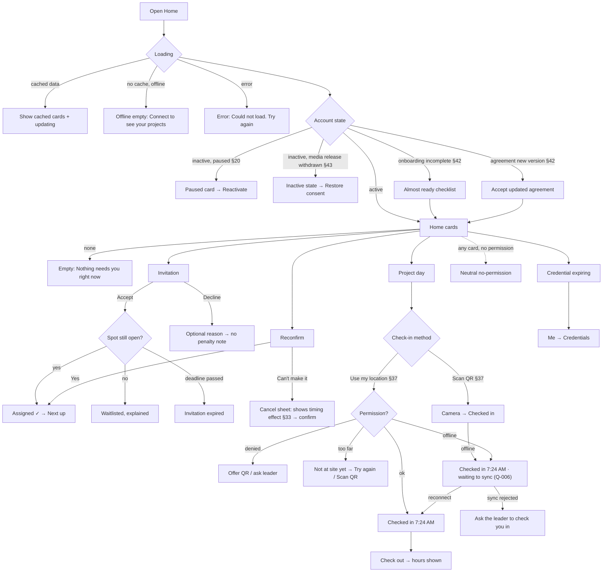
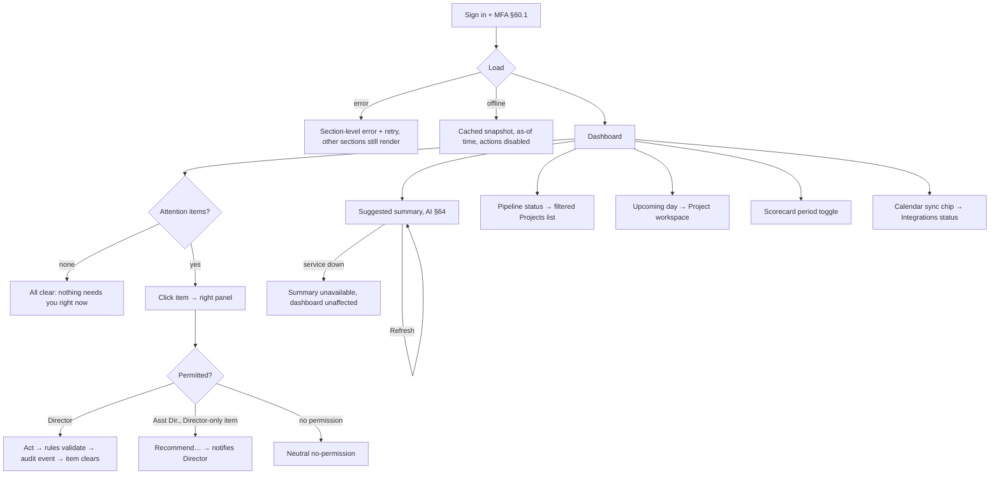

# HAM information architecture & navigation

Build-order step 0. Owner: ham-ux-designer. Personas: [personas.md](personas.md). Brand: [brand-notes.md](brand-notes.md).
All sample names, addresses and numbers are fictional. The sample "today" for both screens is **Tuesday, Oct 6, 2026** (America/New_York).
PRD gaps use the official IDs in `docs/prd-open-questions.md`. The product owner decided Q-002 and Q-004 to Q-024 and Q-026 on 2026-09-27; this doc reflects those decisions and cites them as **(Q-NNN)**. Still open: Q-001 (reliability numbers), Q-003 (stack) and Q-025 (requesters without email); anything depending on them is marked **pending Q-NNN**. Choices with no official Q are marked **proposal (no Q yet)**.
HAM is single-church in V1 (Q-026). Church name, logos, colors, mission line and contact info come from the church profile, so product copy uses `{church.name}` / `{church.shortName}`. "Miami Temple" appears only as sample data.

Contents
1. Principles
2. Sitemap
3. Role-based navigation (mobile, tablet, desktop, combined roles)
4. Notifications
5. Requester secure-link experience
6. Global states
7. Screen spec: Volunteer home, phone
8. Screen spec: HAM Director dashboard, desktop
9. PRD trace & gaps

---

## 1. Principles
- **Home is a to-do list, not a menu.** Each role's Home opens on that person's next action (§64). Everything else is one tap away in the nav.
- **One app, union of permissions, no role switcher** (§4.11: when roles conflict, the higher-privilege permission applies). Relationship to each project is shown as a chip on that project.
- **Nav shows only what you can use.** A destination with no permitted content is hidden, not disabled. Actions inside a screen that are out of reach but relevant (for example, the Assistant Director and scope) are replaced by the permitted alternative ("Recommend…"), never shown as a dead button.
- **Privacy by surface.** Each surface is classed as *PII-allowed* (leadership screens, the project workspace for authorized roles, the requester's own page) or *PII-free* (Google Calendar, member scoreboard, aggregate reports, AI summaries, notifications to volunteers, push/email subject lines) (§51.1, §63, §68). Specs mark PII fields with `[PII]`.
- **Status names are the PRD's exact names** (§52 project, §15.5 task, §29 Pending Confirmation, §37.2 attendance) on staff screens. Requester-facing wording is translated into plain words (§5 below).

---

## 2. Sitemap

```mermaid
flowchart TB
  subgraph PUB["Public / no account"]
    RF["Request help form (§6)"] --> VER["Verify by email code (§7.1, Q-019; no email: pending Q-025)"] --> RCONF["Request received"]
    RLINK["Secure request page (§7.2)"]
    REXP["Link expired: verify by email code to get new link (§7.3; no email: pending Q-025)"]
    SURV["Completion survey, one-time link (§54)"]
    SCORE_PUB["Public scoreboard embed on church website, no login, aggregates only (§63, §68, Q-005)"]
    SIGNIN["Sign in: magic link / MFA (§60)"]
  end

  subgraph APP["Signed-in app (role-aware)"]
    HOME["Home: next actions"]
    REQ["Requests: queues by status (§8–§10)"]
    PROJ["Projects: list & pipeline (§52)"]
    PW["Project workspace"]
    SCHED["Schedule: HAM-internal calendar"]
    VOL["Volunteers: directory, credentials queue, mentors (§22–§24)"]
    CON["Contractors (§40)"]
    MEDIA["Media: review, consent, publish (§47–§49)"]
    INC["Incidents (§56)"]
    TPL["Templates (§19)"]
    RPT["Reports & scoreboard (§63, §72)"]
    INBOX["Inbox: notifications (§35)"]
    ME["Me: profile, skills, tools, availability, credentials, agreements, reliability, notification prefs, deactivate (§20–§26, §34, §42)"]
    ADM["Admin: users & roles, integrations, agreement versions, settings, audit log, impersonate (§4.11, §58, §59)"]
  end

  PROJ --> PW
  PW --> PWO["Overview & scope (§12, §13)"]
  PW --> PWA["Assessment (§11)"]
  PW --> PWT["Tasks (§15, §18)"]
  PW --> PWS["Team & staffing (§27–§33)"]
  PW --> PWD["Project day: safety checklist, check-in QR, attendance (§37, §38)"]
  PW --> PWB["Budget (§14)"]
  PW --> PWM["Media (§45, §46)"]
  PW --> PWG["Agreement (§41)"]
  PW --> PWC["Comments (§57)"]
  PW --> PWL["Activity / audit (§58): Director and Admin only; no PL access (Q-021)"]
  PW --> PWF["Survey & feedback (§54, §55)"]
  SIGNIN --> HOME
```



Who reaches what (V = view, A = act, own = own records only, asg = assigned projects/tasks only). §67 is the source. Server-side authorization is the actual control.

| Destination | Req. | Board | Pastor | Dir. | Asst Dir. | PL | TL | Vol. | Contr. | SMS | Admin |
|---|---|---|---|---|---|---|---|---|---|---|---|
| **Public scoreboard embed** (church website, no login) | V | V | V | V | V | V | V | V | V | V | V (anyone, incl. the public) |
| Secure request page | own | – | – | – | – | – | – | – | – | – | – |
| Requester name, address, phone, hazards `[PII]` | own | per §8 Board route | per §8 pastoral route | V, reveal not logged | V, reveal logged | V asg, reveal logged | V asg, reveal logged | – (address only once Assigned, Q-004) | address + contact asg (§4.9) | – | – |
| Requests | – | A (Board route) | A | A | A | – | – | – | – | – | V |
| Projects / workspace | – | V (Board info) | V (oversight) | A | A (no scope) | A asg | A asg task | V asg/inv | V asg | V media-only | V |
| Schedule | – | V | V | V | V | V asg | V asg | own | own | – | V |
| Volunteers | – | – | – | A | A | V asg team | V task crew | – | – | – | A |
| Media | – | – | A (publish) | A (publish) | review, upload (no publish, §47.4) | upload/review asg | – | – | – | A (publish) | V |
| Incidents | – | if notified | serious | A | A | report + V own proj | report | report | – | – | V |
| Templates | – | – | – | A approve | A propose | A propose / per-project | – | – | – | – | – |
| Reports & scoreboard | – | V | V | A export | A | scoreboard | scoreboard | scoreboard | – | scoreboard | A |
| Audit log | – | – | – | V + export | – | – (Q-021: No) | – | – | – | – | V + export |
| Admin | – | – | – | – | – | – | – | – | – | – | A |
| Inbox, Me | – | ✓ | ✓ | ✓ | ✓ | ✓ | ✓ | ✓ | ✓ | ✓ | ✓ |

Notes on the table:
- **Public scoreboard embed (Q-005).** The same aggregates as the signed-in member scoreboard, published as an embed on the {church.name} website with no sign-in. Privacy rule: **no names, and no breakdown small enough to identify a family** (§63, §68). In practice: no requester, volunteer or leader names; no addresses, streets or neighborhoods; no per-project rows; any category, area or period slice below the suppression threshold is folded into "Other" or hidden. The threshold is a fixed rule in the rules module, not an admin setting (PRD-GAP: the number itself is not decided; ham-rules-engineer to propose). The embed must keep working, or fail quietly, if HAM is down (§70.3).
- **Requester details (Q-009).** Project Leaders and Task Leaders both see requester name, address, phone and hazards, only on projects/tasks they are assigned to. Neither sees requester circumstances beyond that. Pastor and Board rep access follows what their approval route needs (§8, §67); the table doesn't expand it.
- **PII reveal logging (Q-024).** On leadership screens (hover card, side panel), each reveal of requester name or address writes an audit event for every role **except the HAM Director**. The reveal label reads "Leadership only · viewing is logged" for logged roles and "Leadership only" for the Director (see §8.6).

---

## 3. Role-based navigation

### 3.1 Mobile (< 768px): bottom nav, at most 5 items
The nav set comes from the person's **highest** role. Anything left over lives in *More* (leadership) or *Me*.

| Highest role | Tab 1 | Tab 2 | Tab 3 | Tab 4 | Tab 5 |
|---|---|---|---|---|---|
| Volunteer / Task Leader | **Home** | Projects ("My projects") | Inbox | Me | – |
| Project Leader | **Home** (Today) | Projects | Inbox | Me | – |
| Contractor | **Home** (Assigned work) | Inbox | Me | – | – |
| Social Media Specialist | **Media** | Projects | Inbox | Me | – |
| Pastor / Board rep | **Home** (Decisions) | Requests | Projects | Inbox | Me |
| Director / Asst Director | **Home** (Attention) | Requests | Projects | Inbox | More |
| Administrator | **Home** (System) | Admin | Inbox | More | – |

- *More* (leadership): Schedule, Volunteers, Contractors, Media, Incidents, Templates, Reports & scoreboard, Audit log (Director), Me.
- **No bottom-nav item for "Check in".** On a project day, check-in is the top card on Home and inside Project workspace → Project day. It's contextual, so it doesn't cost a tab all year.
- **Report an incident** is a secondary action inside the project (visible on project day). It is not a tab (§56).
- Tab labels are always shown under icons (no icon-only tabs). Touch targets are at least 48×48 px.

### 3.2 Tablet (768–1023px)
A left icon rail with labels on long-press/hover plus the same destinations as desktop. It collapses to the bottom nav in portrait if the width is under 768px.

### 3.3 Desktop (≥ 1024px): left sidebar
```
┌──────────────────────┐
│ [{church.shortName}  │
│  logo]               │
│ HAM                  │
│──────────────────────│
│ WORK                 │
│  ◉ Home              │
│  ○ Requests      (3) │
│  ○ Projects          │
│  ○ Schedule          │
│ PEOPLE               │
│  ○ Volunteers    (2) │  ← (n) = items needing action by me
│  ○ Contractors       │
│ MINISTRY             │
│  ○ Media             │
│  ○ Incidents     (1) │
│  ○ Templates         │
│  ○ Reports           │
│ ADMIN (Admin/Dir.)   │
│  ○ Audit log         │
│  ○ Users & roles *   │  * Administrator only
│  ○ Integrations *    │
│  ○ Settings *        │
│──────────────────────│
│  ○ Me                │
└──────────────────────┘
```
- The top bar holds global **Search** (§71; scope follows the user's permissions, and address search appears only where authorized), the **Inbox** bell with an actionable-count badge, and the account menu (Me, notification preferences, sign out).
- Sidebar groups with no permitted items are hidden entirely.
- Desktop uses the width well. Home is two columns (attention on the left, pipeline and schedule on the right). Lists open detail in a right-hand panel so people can triage without losing their place.

### 3.4 Combined roles
1. **Union, not switching.** Nav is computed from all roles. Example: Director + Volunteer gets the Director nav, and Home adds a "Your service" section (next commitment, invitations, reconfirmations) *below* the attention items. Me includes the full volunteer profile.
2. **Per-project relationship chip** on the project header and project cards:
   `You're leading` · `You lead: Drywall patch` · `You're volunteering` · `Invited` · `Waitlisted` · `Oversight`. When several apply, the chip shows the strongest and lists the others in its tooltip or sheet. Example: Luis leads project #038 and also leads the "Frame & deck" task there.
3. **Task Leader is per task** (§17). It never changes a person's nav. Tasks they lead show on Home as "Your task today" on project days and in Projects with the chip.
4. **The Project Leader scope is per project** (§67). On a project Luis only volunteers on, he sees the volunteer view, not leader controls.
5. **Conflicts resolve to higher privilege** (§4.11), with two exceptions that follow the PRD:
   - Legal/safety rules still bind everyone (§3.5, §27.1).
   - **Impersonation never grants extra privilege** (§59).
6. **Personal records stay personal.** A Director who volunteers sees their own reliability score in Me like any volunteer. Leadership views of *other* volunteers are in Volunteers.

---

## 4. Notifications (§35)
- **Home is the to-do list and Inbox is the log.** Every actionable notification (invitation, reconfirmation, waitlist promotion, 48-hour assignment, credential expiry, approval needed, incident) appears on Home as a card *and* in Inbox under **Needs response**. Resolving it anywhere clears it everywhere.
- The Inbox has two sections: **Needs response** (with a badge count) and **Updates** (schedule changes, replacements, confirmations; no badge).
- **Email mirrors in-app** for users who choose email (§35). Each email carries one deep link. A magic-link sign-in returns the person to that exact item.
- **Urgent** (§10, §56): an app-wide banner stays until acknowledged. Delivery uses all supported channels regardless of preference, which in V1 means email + in-app.
- **PII-free notification text.** Email subject lines, previews and volunteer notifications carry project ID, category, date and general area only, never the requester's name or circumstances (§68). Example: "Invitation: HAM #041 Exterior painting, Sat Oct 17".
- **Preferences** live in Me → Notifications. The choices are Email and In-app. SMS is hidden in V1 (§35, §75).

---

## 5. Requester secure-link experience (§6, §7, §41, §45, §46, §48, §54)
- **No nav, no account, one page.** The church logo and "Home Assistance Ministry, {church.name}" (both from the church profile, Q-026) appear at the top so the page feels like part of the church (brand-notes).
- **Page order (mobile):**
  1. Greeting with the request number
  2. Plain-language status and what happens next
  3. **Things we need from you** (0–n action cards: verify contact, upload photos (batch n), answer questions, sign agreement, approve cost change, media consent per item, survey)
  4. Schedule (date and arrival window, once scheduled)
  5. Your request (read-only summary)
  6. How to reach us: the ministry phone (tap to call) and email (tap to write), admin-configured in the church profile (Q-007). Copy: "Questions? Call {church.hamPhone} or email {church.hamEmail}. We're glad to help."
- **Cost-share increase (Q-008):** either way works and both are audited. (a) An "Approve new cost" card on this page with the old and new share and one button; or (b) the Project Leader records her verbal approval (who, when, how she was told). If (b) happens first, the card disappears and the page shows "You approved the new cost with Luis on {date}."
- **Flow:** Church site "Request help" → form (§6.1, with property-authority certification §6.2) → verify by email code (§7.1; email only in V1, Q-019) → "We received your request" with the link also sent by email → secure page.
- **Link expired** (more than 7 days after completion, or superseded): the page says "For your privacy, this link has expired. We can send you a new one." The person verifies by email code, gets a new 14-day link, and the old link dies. This is logged (§7.3).
- **Requesters without email: pending Q-025 (open).** How someone with no email address verifies for media upload or gets a new link is not decided. Whether email is a required field on the request form is left unresolved until Q-025 is decided. The verify and link-expired screens must always show the ministry phone as a way to get help ("No email? Call us at {church.hamPhone}."). That fallback copy is a way to reach a person, not a verification method. Step 2 (Intake) will propose the flow.
- **Survey** (§54) arrives on its own one-time link that expires after 30 days, and also appears as a card on the secure page while that is valid.

Requester-facing status wording (staff screens keep the §52 names):

| §52 status | Requester sees |
|---|---|
| Submitted, Awaiting Approval | "We've received your request. Our pastors or Board are reviewing it." |
| Approved, Assessment Required | "Good news, your request is approved. Next, someone from HAM will visit to look at the work." |
| Assessment Completed, Planning | "We visited and are now planning the work." |
| Recruiting, Ready | "We're organizing volunteers for your project." |
| Scheduled | "Your project is scheduled for {date}, arriving {window}." |
| In Progress | "Our team is working on your home today." |
| Completed – Follow-Up Required | "The main work is done. We have a little follow-up left: {n} item(s)." |
| Completed | "Your project is complete. Thank you for letting us serve you." |
| On Hold | "Your project is paused for now. {plain reason if shareable}. We'll let you know when it moves again." |
| Rejected | Compassionate explanation + reason + "Ask us to reconsider" (once) (§8.3) |
| Reconsideration Pending | "We're taking another look at your request." |
| Not Executable | "We're very sorry. After visiting, we aren't able to do this work safely or within what HAM can offer. {reason}." |
| Cancelled | "This request has been closed. {reason}. You're always welcome to submit a new request." |

---

## 6. Global states

| State | Behavior | Copy |
|---|---|---|
| **Loading** | Skeletons in the final layout. Show cached content first if there is any. Target around 2 s (§70.2). | — |
| **Offline** | Persistent thin banner. Cached screens are read-only. Actions that need the server are disabled with the reason given. **Exception: check-in and check-out work offline** (Q-006). They are stored with device time, shown as "waiting to sync", and sent automatically on reconnect. The Project Leader can correct them (§37.2). | "You're offline. Showing what was saved at 12:02 PM. We'll update when you reconnect." · Check-in: "✓ Checked in 7:24 AM · waiting to sync. We'll send it when you have signal." · After sync: "✓ Checked in 7:24 AM" |
| **Waiting to sync** (queued check-in/out) | A small clock icon + "waiting to sync" beside the time, on the project-day card and in Luis's attendance list ("Kevin T. · 7:24 AM · waiting to sync"). Never shown as an error. If sync is rejected (for example, not assigned), the card says so and asks him to see the leader. | "We couldn't record your check-in. Please ask Luis to check you in." |
| **Save failed** | Keep the user's input and retry automatically once, then show an inline Retry. Never lose typed text. | "That didn't go through. Your changes are still here. **Try again**" |
| **No permission / not found** | The same neutral screen for both, so the existence of a project isn't leaked (§68). No project title is shown. | "This page isn't available to your account. If you think you should have access, ask the HAM Director." · **Go home** |
| **Session expired** (volunteer, PL, contractor) | Enter email → magic link returns to the same page. Drafts are kept locally. | "For your security, please sign in again. We'll bring you right back here." |
| **MFA** (Admin, Director, Asst Dir., Pastor, Board rep; §60.1) | Required at sign-in. A trusted device is remembered for 30 days; audit export and role changes always re-check (Q-010). | "Enter the 6-digit code from your authenticator app." · Checkbox (unchecked by default, since HAM can't tell a shared computer): "Trust this device for 30 days" · Re-check: "Please confirm it's you before exporting the audit log." |
| **Impersonating** (§59) | Non-dismissable high-contrast banner on every screen showing both identities and the reason. After 15 minutes idle it returns to the admin's own account. Blocked actions show a reason instead of the control. | "You're acting as **Kevin Thompson** (reason: can't see invitation). **Return to my account**" · Blocked: "Role and permission changes aren't allowed while acting as someone else." |
| **Integration down** (§70.3) | Leadership only: a small status chip ("Calendar sync delayed"). HAM keeps working and nothing blocks. | "Google Calendar sync is delayed. HAM is working normally and will catch up." |
| **Inactive volunteer, paused** (§20) | Home shows one card, "Your profile is paused", with **Reactivate** (immediate). | "You're paused, so you won't get new invitations. Come back anytime." |
| **Inactive volunteer, media release withdrawn** (§43) | This is an inactive state, not a blocking card. Home shows only this state with **Restore consent**. Once restored, the profile is active again (agreement rules still apply). | "Your profile is inactive because the media release was withdrawn. HAM participation requires it. You can restore consent anytime." · **Restore consent** |
| **Agreement update required** (§20, §42) | A top card on Home. Participation is blocked until accepted (§42). Held future spots are **kept**; check-in is blocked until he accepts, and the Project Leader is alerted 48 h before the project if he still hasn't (Q-014). | See §7 below. |
| **Empty** | Every list has a helpful empty state with the next step. | See screen specs. |

---

## 7. Screen spec: Volunteer home, phone (390px)

### 7.1 Job, persona, context
- **Job:** "Tell me what I need to do for HAM right now, and let me do it in one tap."
- **Persona:** Kevin Thompson, volunteer (personas.md). Also used by anyone whose Home includes "Your service".
- **Device/context:** Phone, one hand, often opened from an email link. Outdoors on project day with sunlight, gloves and weak signal.

### 7.2 Journey
Email "You're invited: HAM #041" → tap → (sign in by magic link if needed) → Home with the invitation at the top → reads when, where and why he was invited → **Accept** → confirmation with "Added to your projects" → done.
- *Hesitation points:* "Can I make that date?" (the date, time and duration are right there) · "How far?" (area + distance) · "What will I do?" (task + what to bring) · "Why me?" (match factors, §27).
- *Wait points:* after accepting, he may be **waitlisted** if spots filled first (§28, §29). Say so plainly and explain what happens next.
- *Give-up points:* sign-in friction (magic link lands on the item) · a hidden agreement block (shown first, explained) · decline guilt (declining an invitation carries no penalty, and the screen says so).

### 7.3 Card priority (top to bottom)
Ordering is deterministic and testable. Within a group, the earliest deadline comes first.
1. **Project-day card** (only from 2 hours before start until check-out). Check in / Check out, working offline as "waiting to sync" (Q-006).
2. **Blocking items:** onboarding incomplete (§42), agreement new version (§42). A withdrawn media release is *not* a card: it makes the profile inactive (§43, see §6 Global states).
3. **Needs response, with deadline:** waitlist promotion (24 h, §29/§32) → 48-hour direct assignment (§30) → reconfirmation (§32) → invitation (§28).
4. **Next up:** the next confirmed commitment.
5. **Heads-up:** credential with an **Expiring Soon** badge (§24.1, alerts at 60/30/7 days), post-project feedback due (§55).
6. **Later:** the rest of the upcoming commitments (collapsed to 3) → link to Projects.
7. **Ministry impact line:** aggregate only (§63).

### 7.4 Screen flow



### 7.5 Wireframe (390 × ~1400, scrolling). Sample state: Tue Oct 6, 12:15 PM

```
┌──────────────────────────────────────┐
│ [logo] HAM                     (🔔 3)│
│ Hi Kevin                              │
│ 3 things need you this week.          │
├──────────────────────────────────────┤
│ ⚠ BEFORE SAT, OCT 10                  │
│ Our Safety Agreement was updated      │
│ Please review and accept version 3    │
│ so you can serve on Saturday.         │
│ ┌──────────────────────────────────┐ │
│ │     Review & accept  (2 min)     │ │  ← primary, full width
│ └──────────────────────────────────┘ │
├──────────────────────────────────────┤
│ STILL COMING? · 7 days out            │
│ HAM #039 · Bathroom grab bars         │
│ Tue, Oct 13 · 9:00 AM – 12:00 PM      │
│ ┌───────────────┐ ┌────────────────┐ │
│ │Yes, I'll be   │ │ I can't make it│ │
│ │there          │ │                │ │
│ └───────────────┘ └────────────────┘ │
├──────────────────────────────────────┤
│ INVITATION · reply by Wed 6:00 PM     │
│ ⏱ 29 hours left · 3 of 5 spots filled │
│ HAM #041 · Exterior painting          │
│ Sat, Oct 17 · 8:00 AM – 2:00 PM       │
│ Little River area · about 6 mi        │
│ Your task: Prep & prime trim          │
│ Bring if you can: extension ladder    │
│ ▸ Why you were invited                │
│   ✓ Painting (you: experienced)       │
│   ✓ You have an extension ladder      │
│   ✓ You're free Saturdays             │
│   ✓ Within your 10-mile limit         │
│ ┌───────────────┐ ┌────────────────┐ │
│ │    Accept     │ │   Decline      │ │
│ └───────────────┘ └────────────────┘ │
├──────────────────────────────────────┤
│ NEXT UP · in 4 days                   │
│ HAM #038 · Wheelchair ramp            │
│ Sat, Oct 10 · 7:30 AM – 1:00 PM       │
│ 1400 NW Example Ave, Miami (Allapattah)│  ← full address once assigned (Q-004)
│ [ Directions ↗ ]                      │
│ Your task: Frame & deck               │
│ Task Leader: Tom N. · Leader: Luis R. │
│ Bring: drill/driver, safety glasses   │
│ Status: Confirmed ✓                   │  ← state names (Q-017)
│ ▸ Project details                     │
├──────────────────────────────────────┤
│ HEADS-UP                              │
│ EPA Lead-Safe (RRP) Renovator         │
│ Verified · [Expiring Soon]            │
│ Expires Nov 3 (28 days).              │
│ Tasks that need it will be unavailable│
│ after that. Other HAM work isn't      │
│ affected.          [ Update it › ]    │
├──────────────────────────────────────┤
│ LATER                                 │
│ Sat, Oct 24 · HAM #044 · Yard cleanup │
│   Waitlisted (#2) · we'll tell you    │
│   if a spot opens                     │
│ See all my projects ›                 │
├──────────────────────────────────────┤
│ This year, HAM served 38 families     │
│ with 1,246 volunteer hours. Thank you.│
├──────────────────────────────────────┤
│  ⌂ Home   ▦ Projects  ✉ Inbox  ◯ Me   │
└──────────────────────────────────────┘
```

**Project-day variant** (Sat Oct 10, 7:05 AM). This card replaces the header area and pins above everything:
```
┌──────────────────────────────────────┐
│ TODAY · HAM #038 · Wheelchair ramp    │
│ Starts 7:30 AM · 1400 NW Example Ave  │
│ ┌──────────────────────────────────┐ │
│ │     ▣  Scan site QR to check in  │ │  ← primary, 56px tall
│ └──────────────────────────────────┘ │
│ [ Check in with my location ]         │
│ Leader: Luis R.  [ Call ]             │  ← [Call]: assigned volunteers, day before + day of only (Q-023)
│ Report a safety problem or injury ›   │
└──────────────────────────────────────┘
After check-in:  ✓ Checked in 7:24 AM   [ Check out ]
Offline check-in: ✓ Checked in 7:24 AM · ⏲ waiting to sync   [ Check out ]
After check-out: ✓ 5 h 41 min recorded. Thanks, Kevin!
```

**Leader [Call] button (Q-023).** Shown only to volunteers assigned to that project, and only on the calendar day before and the day of the project (local time). On the day before it sits on the *Next up* card ("Leader: Luis R. [ Call ]"); on the day it sits on the project-day card. At any other time, and for invited or waitlisted people, the card shows "Leader: Luis R." with no number and no button. The number is never shown as text on shared or public surfaces, and the server only returns it inside that window. Accessible name: "Call Luis R., Project Leader".

**Other card variants** (same slot as "Needs response"):
- *Waitlist promotion* (§29, §32): "A spot opened on HAM #044 Yard cleanup, Sat Oct 24. **Confirm by Wed 3:10 PM** (24 h) or we'll offer it to the next person." [Confirm] [No thanks]
- *48-hour direct assignment* (§30): "Luis R. added you to HAM #038 for Saturday; they're short-handed. You don't need to accept, but if you can't make it, let us know. **Declining won't affect your reliability score.**" [Got it] [I can't make it]. Per §30, no acceptance is needed and nothing is tracked: *Got it* only dismisses the card, and silence means assigned.
- *Onboarding incomplete* (§42): "You're almost ready to serve. 4 of 6 done: ✓ Profile ✓ Contact info ✓ Liability waiver ✓ Safety agreement · ○ Media release · ○ Emergency contact" [Finish (about 3 min)]
- *Feedback* (§55): "How did HAM #036 go? 3 quick questions. Only HAM's Director and Assistant Directors will see your answers."

### 7.6 Screen details
- **Primary action:** whichever action sits on the top card. There is only one filled (primary) button per card, and the top card's is the screen's primary action.
- **Required vs optional:** Decline reason is optional. Cancel reason is optional; it helps a leader mark the cancellation **Excused** but is never required. Excused is a flag with a reason on a cancellation or No-Show, not a status (§33, Q-022). A No-Show corresponds to attendance **Absent** (§37.2).
- **Prefill/remember:** check-in remembers the last method used (QR or location). The "Why you were invited" disclosure state is remembered per device.
- **Location detail:** invitation = general area + approximate distance. Assigned = full street address + Directions (Q-004). Requester name, phone and circumstances are never shown to plain volunteers (§67, §68). If Kevin is Task Leader on that project, the task view also shows requester name, phone and hazards (Q-009).
- **Credentials:** verification status is one field, Unverified / Verified / Could Not Verify (Q-018). Expiry is computed from the expiration date, and **Expiring Soon** is a badge, not a status.
- **Commitment labels** use the Q-017 names: Invited, Accepted, Declined, No Response, Waitlisted, Pending Confirmation, Confirmed, Reconfirmation Needed, Released, Cancelled, No-Show.
- **Invitation deadline:** 48 hours from sending (Q-002). **Reconfirmation reminders:** daily on days 7, 6 and 5 (Q-011).
- **Cancel sheet** (§33) is honest and not scolding. It shows the timing effect *before* confirming. With 7 or more days to go: "No effect on your reliability score." Inside 7 days the line follows the §33/§34.1 tiers (numbers are Q-001, kept in the rules module):
  - 4–6 days: "Canceling now lowers your reliability score slightly."
  - 2–3 days: "Canceling now lowers your reliability score moderately."
  - 1 day before: "Canceling the day before lowers your reliability score more, because a spot is hard to fill this late."
  - Same day: "Canceling on the day of the project lowers your reliability score substantially. It's still less than not showing up."
  - Every tier ends with: "Your score recovers as you serve on future projects. If something serious came up, tell us and a leader can mark it Excused, which doesn't affect your score."
  - Exception: declining an unsolicited 48-hour assignment has no effect (§30).
  - Buttons: [Cancel my spot] [Keep my spot]

### 7.7 Microcopy
| Where | Copy |
|---|---|
| Header, with items | "Hi Kevin · {n} things need you this week." |
| Header, empty | "Hi Kevin · Nothing needs you right now. We'll let you know when a project fits your skills." |
| Accept → success | "You're in! HAM #041 is on your list. We'll remind you a week before." |
| Accept → filled | "Those spots filled just before you. You're **#1 on the waitlist**, and we'll tell you right away if one opens." |
| Accept → expired | "This invitation closed Wed at 6:00 PM. Thanks for looking. More projects are coming." |
| Decline | "No problem, thanks for letting us know. Declining an invitation doesn't affect your reliability score." |
| Reconfirm yes | "Thanks, see you Tuesday, Oct 13 at 9:00 AM." |
| Location denied | "We couldn't use your location. That's OK: scan the QR code from Luis, or ask him to check you in." |
| Too far | "You don't seem to be at the site yet. Try again when you arrive, or scan the site QR code." |
| Agreement blocked | "Please accept the updated Safety Agreement before Saturday. Until then we can't check you in." |

### 7.8 Accessibility (WCAG 2.2 AA, §70.4)
- Countdown text is literal ("29 hours left", "reply by Wed 6:00 PM"). No live-updating timers are announced to screen readers.
- Cards are `<section>` elements with headings (h2 = card type, h3 = project). Buttons name the project ("Accept invitation to HAM #041").
- Targets are at least 48 px. Primary check-in is 56 px (gloves; exceeds 2.5.8). There are no swipe-only actions (2.5.7). Accept and Decline are separated by 8 px or more.
- Status never relies on color alone: icons plus words ("Assigned ✓", "Waitlisted (#2)").
- High-contrast / sunlight: body text contrast of at least 7:1 on the project-day card is recommended, and text is legible at 200% zoom without horizontal scroll.
- The QR scanner offers a text alternative: "Can't scan? Enter the 6-character site code" (proposal, no Q yet; it works offline like QR check-in, Q-006).
- When a queued check-in syncs, the "waiting to sync" text changes to the plain time and is announced politely (`role="status"`), not as an alert.
- Focus goes to the result message after Accept/Decline (4.1.3 status messages). There are no timeouts on forms (2.2.1).

### 7.9 Success measure
- Accepting an invitation from the email takes **1 tap** after landing (2 with sign-in) in under 20 s.
- Reconfirming takes 1 tap. Check-in takes 2 taps (Scan → auto-confirm) in under 10 s.
- Zero required text fields on Home.
- Target: 90% of invitation responses happen before the deadline (§80 "commitment/no-show visibility").

---

## 8. Screen spec: HAM Director dashboard, desktop (1440px)

### 8.1 Job, persona, context
- **Job:** "In 10 minutes, show me what only I (or leadership) must handle today, then let me see the whole ministry at a glance."
- **Persona:** Marcus Bell, HAM Director. Andre (Assistant Director) gets the same screen. His Director-only actions become "Recommend…".
- **Device/context:** Desktop 1440px, evenings. The screen may be projected in leadership meetings. A "hide names" mode is deferred.

### 8.2 Journey
Sign in (MFA) → Home → scan **Needs your attention** (grouped, highest risk first) → open an item in the right-side panel → act (decide, clear hold, open staffing) → item leaves the list → glance at the pipeline, the next 14 days and the scorecard → done.
- *Hesitation:* "Is this mine or Andre's?" Each item shows its owner or who can act.
- *Give-up:* too many items. Groups collapse to counts after 3 rows, and "Show all" is a filtered list.

### 8.3 Attention groups (fixed order; items within a group ordered by deadline/age)
1. **Safety & incidents:** new or unreviewed incidents (§56); On Hold for safety (§39).
2. **Staffing near the 48-hour line:** understaffed projects where the automatic-staffing cutoff (48 h before start) is within 48 hours, i.e. 96 h before start (Q-013); reconfirmation problems (§32).
3. **Decisions only the Director can make:** feasibility after Assessment Completed (§12); scope changes (§13), including those awaiting payor approval.
4. **Requests & assessments:** Awaiting Approval (info only, owned by pastor/Board); Approved or Assessment Required awaiting assessment (§11, §64).
5. **Credentials & qualifications:** projects with missing qualifications (§64: a task's required skill or credential isn't covered by an assigned volunteer); a required credential expiring before an assigned project (§24.1); credentials Unverified and waiting for a manual check (§24; status values per Q-018).
6. **Tasks, follow-up & budget:** Blocked tasks (§15.5), Completed – Follow-Up Required (§53), budget risks (§64; actual spend over estimate + contingency, Q-015).

Items that are only for awareness (not actionable by the Director) are shown in muted style with the owner named. They never carry a primary button, and they are **excluded from the header count and the group counts**. The header count equals the number of actionable rows listed.

### 8.4 Screen flow



### 8.5 Wireframe (1440 × ~1100). Sample state: Tue Oct 6, 7:40 PM
Main area is 1200 px wide: an attention column (≈ 700 px) and a context column (≈ 460 px). A detail panel slides over the context column on click.

```
┌──────────┬─────────────────────────────────────────────────────────────────────────────────────────────┐
│ SIDEBAR  │ 🔍 Search projects, requests, volunteers…                  ● Calendar synced   🔔 7   Marcus ▾│
│ (§3.3)   ├─────────────────────────────────────────────────────────────────────────────────────────────┤
│          │ Good evening, Marcus · Tuesday, Oct 6                                                         │
│ ◉ Home   │ 13 items need attention · 2 are safety                                                        │
│ ○ Reqs(3)│┌──────────────────────────────────────────────────┐┌────────────────────────────────────────┐│
│ ○ Proj.  ││ NEEDS YOUR ATTENTION                              ││ SUGGESTED SUMMARY · AI draft           ││
│ ○ Sched. ││                                                  ││ Generated 7:38 PM. Check before acting.││
│ ○ Vols(2)││ ■ SAFETY & INCIDENTS                          (2) ││ "Two safety items first: a minor       ││
│ ○ Contr. ││ ┌──────────────────────────────────────────────┐ ││ injury on #036 needs review, and #040  ││
│ ○ Media  ││ │ ⚠ Incident INC-0112 · Injury · Not reviewed  │ ││ is still on safety hold for mold.      ││
│ ○ Inc.(1)││ │ HAM #036 Roof tarp · reported by Luis Romero │ ││ #038 is 2 volunteers short with auto-  ││
│ ○ Templ. ││ │ Sat Oct 3, 3:12 PM · minor cut, first aid    │ ││ invites ending Thu 7:30 AM. #042 is    ││
│ ○ Reports││ │                         [ Review incident ]  │ ││ waiting on your feasibility decision." ││
│ ○ Audit  ││ ├──────────────────────────────────────────────┤ ││ [Refresh]          [Hide summary]      ││
│          ││ │ ⛔ HAM #040 Kitchen sink leak · On Hold        │ │└────────────────────────────────────────┘│
│          ││ │ Mold behind cabinet (found at assessment)     │ │┌────────────────────────────────────────┐│
│          ││ │ Held since Oct 2 · Andre W. assessed          │ ││ PIPELINE (§52)              View all › ││
│          ││ │              [ Open hold ]  [ Clear hold… ]   │ ││ Awaiting Approval ............ 2       ││
│          ││ └──────────────────────────────────────────────┘ ││ Approved ...................... 1       ││
│          ││                                                  ││ Assessment Required ........... 3       ││
│          ││ ■ STAFFING NEAR THE 48-HOUR LINE              (2) ││ Assessment Completed .......... 1       ││
│          ││ ┌──────────────────────────────────────────────┐ ││ Planning ...................... 2       ││
│          ││ │ HAM #038 Wheelchair ramp · Sat Oct 10 7:30 AM │ ││ Recruiting .................... 3       ││
│          ││ │ ▓▓▓▓░░ 4 of 6 · 1 reconfirmation pending      │ ││ Ready ......................... 1       ││
│          ││ │ Auto-invites stop Thu 7:30 AM (in 36 h), then │ ││ Scheduled ..................... 2       ││
│          ││ │ Luis R. (Project Leader) staffs directly      │ ││ In Progress ................... 0       ││
│          ││ │                             [ Open staffing ] │ ││ Completed – Follow-Up Required  1       ││
│          ││ ├──────────────────────────────────────────────┤ ││ Completed (this month) ........ 4       ││
│          ││ │ HAM #039 Bathroom grab bars · Tue Oct 13 9 AM │ ││ ───────────────────────────────        ││
│          ││ │ ▓░ 1 of 2 · Kevin T. hasn't reconfirmed;      │ ││ On Hold 1 · Reconsideration Pending 1  ││
│          ││ │ slot releases Thu Oct 8 (5 days out)          │ ││ Rejected 1 · Cancelled 0 ·             ││
│          ││ │                             [ Open staffing ] │ ││ Not Executable 0 (this month)          ││
│          ││ └──────────────────────────────────────────────┘ │└────────────────────────────────────────┘│
│          ││                                                  │┌────────────────────────────────────────┐│
│          ││ ■ YOUR DECISIONS                              (2) ││ NEXT 14 DAYS                           ││
│          ││ ┌──────────────────────────────────────────────┐ ││ Sat 10 · #038 Wheelchair ramp · 4/6 ⚠  ││
│          ││ │ Feasibility · HAM #042 Exterior stairs repair │ ││ Tue 13 · #039 Bathroom grab bars 1/2 ⚠ ││
│          ││ │ Assessment Completed Oct 5 · est. $1,850      │ ││ Thu 15 · #045 Outlet & GFCI repair 2/2 ││
│          ││ │ Andre recommends: Feasible, re-scope to steps │ ││ Sat 17 · #041 Exterior painting 3/5    ││
│          ││ │ only (railing by licensed contractor)         │ ││ Open schedule ›                        ││
│          ││ │                                [ Decide… ]    │ │└────────────────────────────────────────┘│
│          ││ ├──────────────────────────────────────────────┤ │┌────────────────────────────────────────┐│
│          ││ │ Scope change · HAM #035 Drywall & paint       │ ││ SCORECARD   [Month|(•)Year|All]       ││
│          ││ │ Add hallway ceiling · +$180 requester share   │ ││ Families Served      38                ││
│          ││ │ Waiting on requester approval since Oct 3     │ ││ Volunteer Hours   1,246                ││
│          ││ │ (church share unchanged; church informed)     │ ││ ─────────────────────────              ││
│          ││ │            [ View ]  [ Resend request ]       │ ││ Projects Completed 41                  ││
│          ││ └──────────────────────────────────────────────┘ ││ Active Volunteers  57                  ││
│          ││                                                  ││ Satisfaction  4.7 / 5 (29 surveys)     ││
│          ││ ■ REQUESTS & ASSESSMENTS                      (1) ││ Cost of Assistance $23,480             ││
│          ││  3 approved requests waiting for assessment;       ││  church $15,900 · requester $7,580     ││
│          ││    oldest #047 waited 6 days    [ Schedule › ]    ││ Open reports ›                         ││
│          ││  (muted) Urgent · #046 No power to kitchen ·       │└────────────────────────────────────────┘│
│          ││    waiting for pastor certification (3 h) · owner: │                                            │
│          ││    pastors · awareness only, not counted           │                                            │
│          ││                                                  │                                            │
│          ││ ■ CREDENTIALS & QUALIFICATIONS                (3) │                                            │
│          ││  Missing qualification · #041 Exterior painting    │                                            │
│          ││    "Lead-safe prep" needs EPA RRP; 0 of 1 assigned │                                            │
│          ││    volunteers hold it           [ Open staffing ›] │                                            │
│          ││  Carlos Diaz · FL electrical license expires      │                                            │
│          ││    Oct 12, before #045 (Oct 15) where required    │                                            │
│          ││    → Luis R. alerted            [ Open #045 › ]    │                                            │
│          ││  2 credentials Unverified (manual check) [Verify ›]│                                            │
│          ││                                                  │                                            │
│          ││ ■ TASKS, FOLLOW-UP & BUDGET                   (3) │                                            │
│          ││  #037 Install water heater · Blocked, materials    │                                            │
│          ││    (backordered) since Oct 1                       │                                            │
│          ││  #033 Completed – Follow-Up Required · 1 task,     │                                            │
│          ││    open 12 days                                    │                                            │
│          ││  #037 Actual $1,310 vs estimate + contingency      │                                            │
│          ││    $1,265 (over by $45)                            │                                            │
│          │└──────────────────────────────────────────────────┘                                            │
└──────────┴─────────────────────────────────────────────────────────────────────────────────────────────┘
```

**Detail panel** (click "Decide…" on #042): slides in from the right (560 px) and holds assessment summary, photos, safety concerns, estimated cost, required licenses/skills, Andre's recommendation, and the requester `[PII]` (name, address), shown **only here**. For Marcus the PII block is labeled "Leadership only" and opening it writes no audit event; for Andre (or anyone else who reaches it) it is labeled "Leadership only · viewing is logged" and opening it writes a view event (Q-024). Options come from §12: Feasible · Place On Hold · Not Executable · Re-scope… Not Executable and Re-scope require a short reason. There is one primary button, *Record decision*, and on success: "Decision recorded · 7:52 PM · Marcus Bell" (the audit event, §58).

### 8.6 Content & privacy rules
- **Attention rows identify projects by ID + category** (as in the calendar title format, §51.1). The requester `[PII]` appears in the detail panel, and on hover of the ID, not in the list. This keeps the attention list shareable in a leadership meeting while the Director still has full access (§67). A "hide names" presentation mode is deferred.
- **Reveal logging (Q-024).** Revealing `[PII]` (hover card on the ID, or opening the detail panel) writes a view event (actor, UTC time, project ID, fields revealed) for every role **except the HAM Director**. The hover card label follows the viewer:
  - HAM Director: "[lock icon] Leadership only"
  - Everyone else (Assistant Director, pastors, Board rep, Project and Task Leaders on their assigned projects, Administrator): "[lock icon] Leadership only · viewing is logged"
  - The label is text plus an icon, and is part of the hover card's accessible name. One event per reveal per item per page view, so hovering back and forth doesn't flood the log.
- **Never on shared surfaces** (Calendar, member scoreboard, the public scoreboard embed, aggregate reports, AI summary): requester name, address, contact, circumstances ("widowed", "fixed income", "mold in bedroom"), incident narrative, and individual volunteer reliability scores. The AI summary above uses IDs and categories only (§68).
- Volunteer names (Kevin T., Carlos Diaz) are allowed on leadership screens. Reliability scores are not shown on the dashboard. They live in Volunteers (§34).
- The scorecard shows aggregates only and is the same component as the member scoreboard and the public embed (§63, Q-005). Its headline metrics are Families Served + Volunteer Hours (§80). Cost of Assistance is actual money spent, church share + requester share (Q-012). On the public embed, the small-group suppression rule applies (see §2 notes).

### 8.7 Microcopy
| Where | Copy |
|---|---|
| Header | "{n} items need attention · {k} are safety" ({n} = actionable rows only; awareness rows excluded) / "All clear. Nothing needs you right now." |
| AI panel label | "Suggested summary · AI draft. Generated {time}. Check before acting." |
| AI down | "The suggested summary isn't available right now. Everything else on this page is current." |
| Asst Dir. on feasibility | [ Recommend… ] → "Your recommendation goes to Marcus. Only the HAM Director can decline execution or change scope." |
| Clear hold | "Clear safety hold on HAM #040? Volunteers can be scheduled again." (a reason field is optional, §39) |
| 48-hour line | "Auto-invites stop {day time} (in {h} h), then {PL} staffs directly." |
| Awareness-only item | "Owner: pastors. Shown so you know it's coming." |
| Section error | "This section didn't load. [Try again]. The rest of the dashboard is current." |

### 8.8 Accessibility
- Landmarks: `nav` (sidebar), `main`, and `complementary` (context column). Each attention group is an h2 region with its count in the heading ("Safety & incidents, 2 items").
- Severity uses an icon **and** a word (Incident, On Hold), never color alone. Progress bars carry text ("4 of 6").
- The detail panel is a non-modal region: focus moves into it and Esc returns focus to the originating row. It is keyboard reachable in reading order.
- Pipeline counts are links with full accessible names ("Recruiting, 3 projects"). The scorecard period toggle is a radio group.
- Reflow at 1280px keeps two columns. Below 1024px the context column stacks under attention.
- The AI panel has `aria-live="off"` so a refresh doesn't interrupt the screen reader.

### 8.9 Success measure
- Every Director action item is reachable in 1 click from Home. A decision takes 3 clicks or fewer (open → choose → record).
- Time from a Director item appearing to action is under 24 h (median), measured from audit events.
- First-screen paint in about 2 s (§70.2).
- Dashboard review of 10 minutes or less for a typical week (§80 "leaders can quickly see what needs attention").

---

## 9. PRD trace & gaps

**Trace:** roles and permissions §4, §67; auth §60; requester access §6, §7, §41, §45, §48, §54; statuses §52, §15.5; staffing §27–§33; reliability §33, §34; attendance and safety §37, §38; credentials §24.1; onboarding §20, §42, §43; holds §39; incidents §56; comments §57; audit §58; impersonation §59; notifications §35; calendar privacy §51.1; dashboards §63, §64; AI §61, §79; privacy §68; NFR §70.2–§70.5.

**Design decisions made here (within PRD latitude):**
- No role switcher; union nav plus a per-project relationship chip.
- Home is the to-do list and Inbox is the log.
- Requester-facing status wording.
- Neutral 403/404.
- Attention rows are ID-first with PII in the detail panel.

**PRD questions these docs depend on** (official IDs; full text, options and decisions are in `docs/prd-open-questions.md`):

| ID | Status | Where it affects these docs |
|---|---|---|
| Q-001 | **Open** | Cancel-sheet tier numbers (§7.6); copy uses words, not numbers |
| Q-002 | Decided: 48 h | Invitation deadline on the invitation card (§7.6) |
| Q-004 | Decided: area + distance on invite, full address once assigned | §7.5, §7.6 |
| Q-005 | Decided: signed-in + public embed, aggregates only, no identifying breakdowns | Sitemap, access table + notes (§2), scorecard (§8.6) |
| Q-006 | Decided: offline check-in queued as "waiting to sync"; PL can correct | §6, §7.3, §7.4, §7.5, §7.8 |
| Q-007 | Decided: ministry phone + email from the church profile | §5 |
| Q-008 | Decided: secure-page approval or PL-recorded verbal approval, both audited | §5; Director scope-change row |
| Q-009 | Decided: PL and TL both see name, address, phone, hazards on assigned work | Access table (§2), §7.6, personas |
| Q-010 | Decided: trusted device 30 days; re-check for audit export and role changes | §6, personas |
| Q-011 | Decided: daily on days 7, 6, 5 | §7.6 |
| Q-012 | Decided: actual money spent (church + requester share) | Scorecard (§8.6) |
| Q-013 | Decided: 96 h before start | §8.3 group 2 |
| Q-014 | Decided: keep spot, block check-in, alert PL 48 h before | §6 |
| Q-015 | Decided: actual over estimate + contingency | §8.3 group 6, §8.5 sample row |
| Q-016 | Decided: light only in V1 | Sunlight contrast handled in the light theme |
| Q-017 | Decided: proposed state names | §7.5, §7.6 |
| Q-018 | Decided: Unverified / Verified / Could Not Verify + computed Expiring Soon badge | §7.6, §8.3 group 5 |
| Q-019 | Decided: email codes only in V1 | §5, sitemap, personas |
| Q-020 | Decided: late after a 15-min grace period | Project Leader attendance (future spec) |
| Q-021 | Decided: no PL activity history | Access table, sitemap |
| Q-022 | Decided: flag + reason | §7.6 |
| Q-023 | Decided: Call button for assigned volunteers, day before + day of | §7.5, personas |
| Q-024 | Decided: PII reveals logged for everyone except the HAM Director | Access table notes (§2), §8.5, §8.6, personas |
| Q-025 | **Open** | Requesters without email (§5, sitemap, personas) |
| Q-026 | Decided: single church, branding from the church profile | Header note, §3.3 sidebar, §5 |

**Still undecided and not logged as a Q:** the public-embed suppression threshold (the minimum group size below which a breakdown is hidden, §2 notes); the site-code check-in fallback (§7.8); what the requester sees of volunteer names (personas). Raised for the coordinator to log.

**Hand-off to ham-ui-designer:** `docs/ux/screens/director-dashboard-desktop.html` shows the hover label "Leadership only · viewing is logged" for Marcus. Per Q-024 the Director's label should read "Leadership only" (no logging). Both screens also hard-code "Miami Temple Seventh-day Adventist" as logo alt text; per Q-026 that should come from `{church.name}`.
